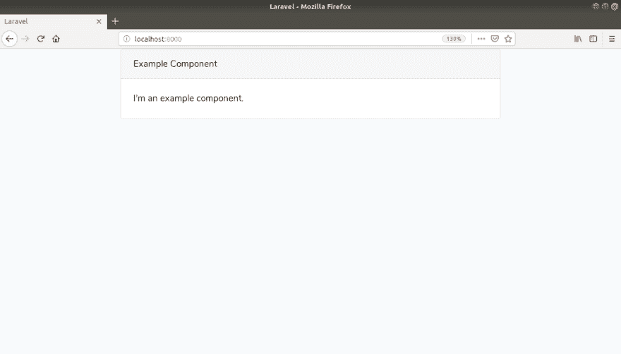

# 将 Svelte.js 用于 Laravel 第 1 部分:用 Svelte 设置 Laravel 应用程序

> 原文：<https://dev.to/shuv1824/using-svelte-js-with-laravel-part-1-setting-up-laravel-application-with-svelte-36p4>

Svelte 是构建用户界面的一种全新方法。它不是一个前端框架。它是轻量级的，语法简单，可以编译成普通的 JavaScript。在这篇文章中，我们将整合 Svelte.js 和 laravel，并构建一个小应用程序。

在第一部分中，我们将在本地建立一个新的 Laravel 项目，并用 Svelte.js 脚手架替换 Laravel 附带的 Vue.js 脚手架。我们可以按照以下步骤来做。

### 安装 Laravel

为了安装一个新的项目，我们需要[作曲家](https://getcomposer.org/download/)。确保我们首先安装了 PHP 7.2 和`composer`。我不打算安装 PHP、composer、Node.js、npm 等等。并为 Laravel 设置本地服务器。我假设我们已经设置好了所有的初始设置，并准备好了。你可以使用`XAMPP` / `WAMPP` / `MAMPP`或者任何你喜欢的开发服务器。

为了通过`composer`创建一个新的 Laravel 项目，我们需要在我们想要存储项目的目录中使用下面的命令。

```
$ composer create-project --prefer-dist laravel/laravel project_name 
```

Enter fullscreen mode Exit fullscreen mode

这将在我们的本地机器上安装一个新的 Laravel 项目。让`cd`进入我们的新项目目录并运行项目。

```
$ cd project_name
$ php artisan serve 
```

Enter fullscreen mode Exit fullscreen mode

我们将得到以下输出。

```
Laravel development server started: <http://127.0.0.1:8000> 
```

Enter fullscreen mode Exit fullscreen mode

我们的项目于`http://127.0.0.1:8000`送达。浏览这个链接，我们会看到 Laravel 5 的欢迎页面。

### 安装苗条预置

现在我们将通过 [We Wow Web](https://github.com/wewowweb) 安装`laravel-svelte-preset`。为此，运行以下命令。

```
$ composer require wewowweb/laravel-svelte-preset 
```

Enter fullscreen mode Exit fullscreen mode

现在运行下面的代码来获得项目的初始框架。

```
$ php artisan preset svelte 
```

Enter fullscreen mode Exit fullscreen mode

现在来安装 JavaScript 依赖项。

```
npm install && npm run dev 
```

Enter fullscreen mode Exit fullscreen mode

该软件包将为我们提供初始文件集。

*   `/js/app.js`
*   `/js/components/App.svelte`
*   `webpack.mix.js`

现在，我们的 Svelte 已经完全安装了 Laravel 项目，而不是 Vue。

### 苗条应用程序设置

现在，要在我们的 Laravel blade 文件中安装苗条的应用程序，我们需要在我们首选的编辑器中打开`resources/views/welcome.blade.php`文件，并用以下内容替换页面中的所有内容。

```
 <!doctype html>
<html lang="{{ str_replace('_', '-', app()->getLocale()) }}">
    <head>
        <meta charset="utf-8">
        <meta name="viewport" content="width=device-width, initial-scale=1">

        Laravel

        <!-- Fonts -->
        <link href="https://fonts.googleapis.com/css?family=Nunito:200,600" rel="stylesheet">
        <link rel="stylesheet" href="{{ asset('css/app.css') }}">
    </head>
    <body>
        <script src="{{ asset('js/app.js') }}"></script>
    </body>
</html> 
```

Enter fullscreen mode Exit fullscreen mode

这将把我们苗条的应用程序从`resources/js/components/App.svelte`文件安装到`welcome.blade.php`。现在，如果我们检查我们的浏览器，我们将得到以下页面，而不是 Laravel 5 欢迎页面。
T3T5】

这是用`laravel-svelte-preset`集成 Svelte.js 和 Laravel 5.8 的一个简短而简单的方法。在这个系列中，我们将构建一个简单的前端和 Laravel API 的应用程序。我们将在本系列的下一部分开始我们的项目。让我知道你对它的看法，以及我们可以在这里建立什么类型的项目。干杯。

**更新:**这个预置只在 Laravel 5.8 中起作用。但现在 Laravel 6 已经发布，这在 Laravel 6 中不起作用。为了让这个在 Larvel 6 上工作，我们必须自己做一些小的调整。我将在下一部分解释它。