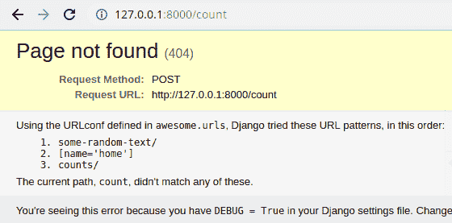

# 视图-第 3 课

> 原文：<https://dev.to/jonathanfarinloye/views-lesson-3-3gc6>

在本课中，我们将讨论 views.py 文件的进一步用途，而不仅仅是返回一个 HTML 页面。为了做到这一点，我们将建立一个小的应用程序，同时我们对当前主页的显示方式做了一些改变。

## 修改使

目前，我们的主页是由 ***博客*** 应用程序提供的，但我们应该诚实地离开 ***博客*** 仅用于与博客相关的事情。这意味着我们必须把我们的主页移出来，可能是移到根目录。我们要做的第一件事是在***awesome-project***目录下创建一个名为 ***templates*** 的文件夹。其次，将***home.html***文件移动到这个新创建的文件夹中。

接下来，进入 ***settings.py*** 。围绕 ***行 55*** ，我们看到 ***模板*** 。在*列表内添加 ***【模板】*** ，这是我们创建的模板文件夹的名称。因此，我的第 58 行看起来像:* 

```
 58.        'DIRS': ['templates'], 
```

Enter fullscreen mode Exit fullscreen mode

接下来，我们在 ***牛逼*** 目录下创建一个 ***views.py*** 文件。并从 ***博客*** 目录内的 ***views.py*** 中复制内容。您可以删除我们在之前的 ***视图中创建的函数。并对*目录内的 ***views.py*** 进行适当修改。**** 

```
 1. from django.shortcuts import render
    2.
    3. # Create your views here.
    4. def home(request):
    5.     return render(request, 'home.html') 
```

Enter fullscreen mode Exit fullscreen mode

> 这里面应该是 ***牛逼/views.py***

假设我没有遗漏什么，我们应该做的另一个改变是对 ***awesome/urls.py*** 文件的修改。而不是拥有:

```
 18. from blog import views 
```

Enter fullscreen mode Exit fullscreen mode

我们现在有:

```
 18. from . import views 
```

Enter fullscreen mode Exit fullscreen mode

> 这意味着从这个目录中导入视图。

保存所有文件，运行您的服务器，并确保您的主页仍然显示。如果是的话，我们继续。

<figure>[](https://res.cloudinary.com/practicaldev/image/fetch/s--1sQaJYkJ--/c_limit%2Cf_auto%2Cfl_progressive%2Cq_auto%2Cw_880/https://thepracticaldev.s3.amazonaws.com/i/72hrh1si56fayr17t83m.png) 

<figcaption>还不到胡萝卜的时候😏。</figcaption>

</figure>

## Views.py

因此，为了深入研究这个问题，我们将在主页上添加一个表格，计算一些文本中元音的数量。突出什么是需要的是一个好习惯。考虑到这个问题和我们到目前为止学到的知识，我们需要:

1.  我们用来收集用户输入的表单；
2.  计算元音的函数；
3.  我们返回元音数的页面。

所以让我们从第一点开始。添加表单。为了简单起见，我们将把它添加到主页上。

```
 <form method="POST" action="">
        <textarea name="input-stuff" rows="10" cols="30"></textarea>
        <button type="submit">Check vowel count</button>
    </form> 
```

Enter fullscreen mode Exit fullscreen mode

这是我的表格的样子。注意，我在 form 标签上有一个方法和动作，在 textarea 标签上有一个名称。方法是 ***POST*** 因为这是一个 ***POST*** 的请求。动作是点击按钮时应该触发的 ***url*** 。我们会回来的。让我们去创建我们的函数。
第二点
我们将命名我们的函数计数器。它看起来像这样:

```
 # awesome/views.py
    8. def counter(request):
    9.     if request.method == 'POST':
    10.         vow = 0
    11.         for i in request.POST['input-stuff']:
    12.             if i in 'aeiou':
    13.                 vow += 1 
```

Enter fullscreen mode Exit fullscreen mode

除了第 9 行和第 11 行，大部分代码看起来可能很熟悉。第 9 行检查请求方法是否是一个 ***POST*** 。一个 ***POST*** 请求基本上是在向服务器发送某些信息时使用的。通常来自一种形式。另一方面，第 11 行用于访问文本区域中输入的信息。记得我们把 textarea ***命名为 input-stuff*** 。嗯，这有助于接近它。我们不能忘记的一件事是，我们的函数必须总是返回一些东西。如果没有，我们很可能会得到错误 500。所以问题是:我们回报什么？简单。显示结果的页面。
No. 3
我们在 ***模板*** 目录下创建一个名为 ***count*** 的 HTML 文件。我们会在几分钟内回到它应该有的样子。行...很多事情都搁置了。

1.  表单标记中的操作。
2.  计数器函数中的 return 语句。
3.  count.html 文件的内容
4.  指向计数器函数的 url。

让我们先处理一下 ***view.py*** 。我们需要一份退货单。我们的 return 语句将返回页面和一些额外的信息:计算元音的数量。我们如何做到这一点？嗯:

```
 8.  def counter(request):
    9.      if request.method == 'POST':
    10.         vow = 0
    11.         for i in request.POST['input-stuff']:
    12.             if i in 'aeiou':
    13.                 vow += 1
    14.         return render(request, 'count.html', {'count': vow}) 
```

Enter fullscreen mode Exit fullscreen mode

好吧。等一下。我们将最后一部分 ***{'count': vow}*** 识别为 python 字典。所以我们可以用它将额外的信息传递回我们也要返回的页面；在这种情况下，【count.html】*页。
有一件事我们也应该注意，如果有人试图不通过主页就访问***count.html***页面。我们就把它设置成把它们发送到主页吧。为此，我们需要导入重定向。* 

```
 1.  from django.shortcuts import render, redirect
    ...
    ...
    8.  def counter(request):
    9.      if request.method == 'POST':
    10.         vow = 0
    11.         for i in request.POST['input-stuff']:
    12.             if i in 'aeiou':
    13.                 vow += 1
    14.         return render(request, 'count.html', {'count': vow})
    15.     return redirect('home') 
```

Enter fullscreen mode Exit fullscreen mode

第 15 行给出了我们正在寻找的东西。也就是说，如果请求不是一个 ***POST*** 请求，它就不会遇到第一个 return 语句，而是会转到下一个语句。第 15 行的 return 语句说:将用户重定向到一个名为 ***home*** 的 url。我们使用 url 名称，而不是 html 文件。注意。

现在，让我们来创建 url。移动到你的 ***awesome/urls.py*** 文件，让我们添加另一个路径。

```
 20. urlpatterns = [
    21.     path('some-random-text/', admin.site.urls),
    22.     path('', views.home, name='home'),
    23.     path('count/', views.counter),
    24. ] 
```

Enter fullscreen mode Exit fullscreen mode

> 新路径在第 23 行。如果第 23 行末尾的逗号丢失，我们将面临问题。

这应该不奇怪。记得在每个右括号后面加一个逗号。你可能也注意到了，我没有给 ***count*** url 添加一个名字，我们很快就会看到。
现在让我们转到***home.html***文件，做一个小的添加。我们将添加动作，这将是 url，即 ***/count/*** 。然后我们去 count.html 添加一些奇怪的东西到身体上:

```
 <h3> Vowels Counted - {{ count }}</h3> 
```

Enter fullscreen mode Exit fullscreen mode

这绝对不是普通的 html。然而，Django 允许我们使用这个语法访问我们返回的字典的内容

```
{{ dictionary_key_name }} 
```

Enter fullscreen mode Exit fullscreen mode

现在运行您的服务器并检查您的代码是否运行。我的没有😫😩。但由于 ***settings.py*** 中 DEBUG = True，我们看到的错误与 ***CRSF 验证失败*** 有关。Django 要求每个表单都有一个

```
 
```

Enter fullscreen mode Exit fullscreen mode

> CSRF 代表跨站点引用伪造。你应该读一点这方面的书。

为了防止 CSRF 攻击，每次提交表单时都会生成一个令牌。所以我们去补充一下:

```
 <form method="POST" action="">
        
        <textarea name="input-stuff" rows="10" cols="30"></textarea>
        <button type="submit">Check vowel count</button>
    </form> 
```

Enter fullscreen mode Exit fullscreen mode

现在保存，再试一次。丁！丁！！丁！！🛎🛎🛎😁😄
我的作品！如果你的有，🍓🍓草莓给你。

<figure>

[](https://res.cloudinary.com/practicaldev/image/fetch/s--gNmvPFWv--/c_limit%2Cf_auto%2Cfl_progressive%2Cq_auto%2Cw_880/https://thepracticaldev.s3.amazonaws.com/i/i07kj0rkndx11syelol4.png)

<figcaption>Awesome work, . You're the best</figcaption>

</figure>

最后一件事是测试当我们将 url 从 ***urls.py*** 文件中的 ***count*** 改为***count***时会发生什么。

```
 20. urlpatterns = [
    21.     path('some-random-text/', admin.site.urls),
    22.     path('', views.home, name='home'),
    23.     path('counts/', views.counter),
    24. ] 
```

Enter fullscreen mode Exit fullscreen mode

<figure>[](https://res.cloudinary.com/practicaldev/image/fetch/s--DI1YkHyZ--/c_limit%2Cf_auto%2Cfl_progressive%2Cq_auto%2Cw_880/https://thepracticaldev.s3.amazonaws.com/i/2fjscyhxiv5umae5sbti.png) 

<figcaption>404 错误只是通过将 count 改为 counts

<figcaption>
再次尝试，我们得到一个 404 错误，因为 url 改变了。为了解决这个问题，e 可以使用 url 的名称。所以给 ***计数*** url 添加一个名称。
T12</figcaption>

T14】</figcaption>

</figure>

```
 20. urlpatterns = [
    21.     path('some-random-text/', admin.site.urls),
    22.     path('', views.home, name='home'),
    23.     path('count/', views.counter, name='count-vowels'),
    24. ] 
```

Enter fullscreen mode Exit fullscreen mode

现在转到*，让你的开头表单标签类似于:* 

```
9\. <form method="POST" action=""> 
```

Enter fullscreen mode Exit fullscreen mode

只有动作变成了所谓的**模板标签**。这基本上是说:搜索我们拥有的所有网址，看看是否有名字为**的元音字母**。如果有，那就是我们想要的 url。这是可行的。

正如我们已经看到的， ***views.py*** 文件控制着许多东西。这不是我们唯一能用的。我们还会谈论**模型**以及我们如何上传图像，也许是个人资料图片。今天的文章到此结束。我知道我们一直在吃水果，但在这里🍩🍿🍫🍪，如果你愿意，给自己一份美味的款待。干杯。

我差点忘了胡萝卜，在这里🥕🥕。
<small>项目可以在这里找到</small>
<small>封面图片由[哑巴耶](https://pixabay.com/users/yabayee-907690/?utm_source=link-attribution&utm_medium=referral&utm_campaign=image&utm_content=705412)转自 [Pixabay](https://pixabay.com/?utm_source=link-attribution&utm_medium=referral&utm_campaign=image&utm_content=705412)</small>****