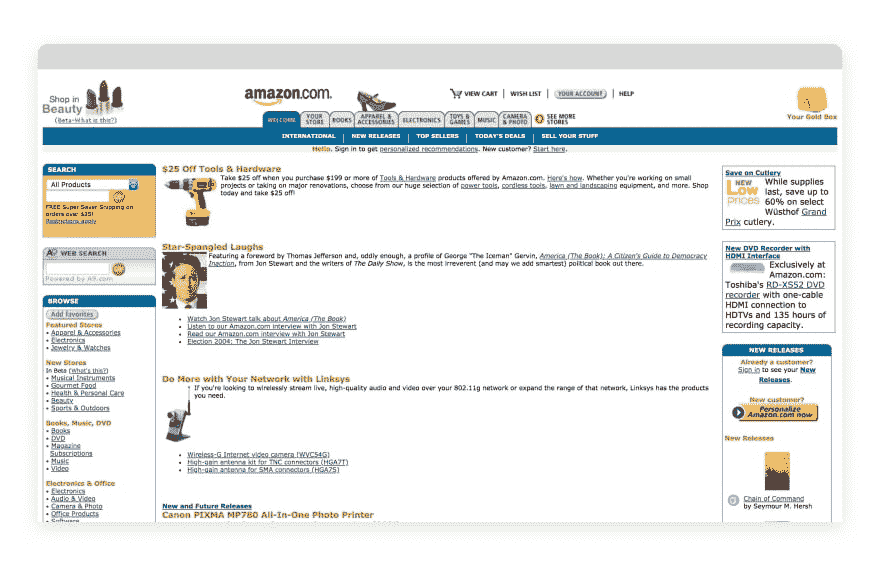
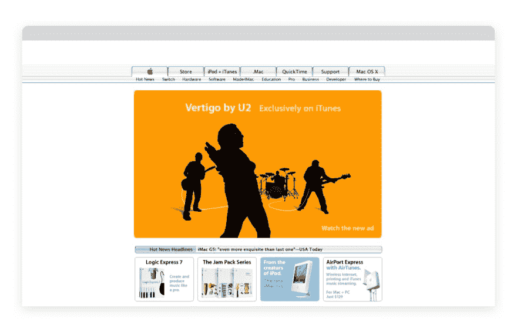
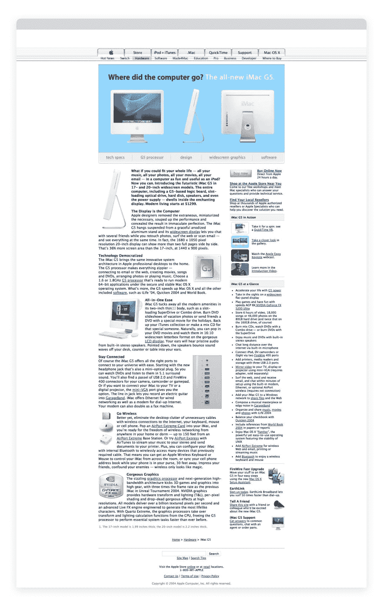
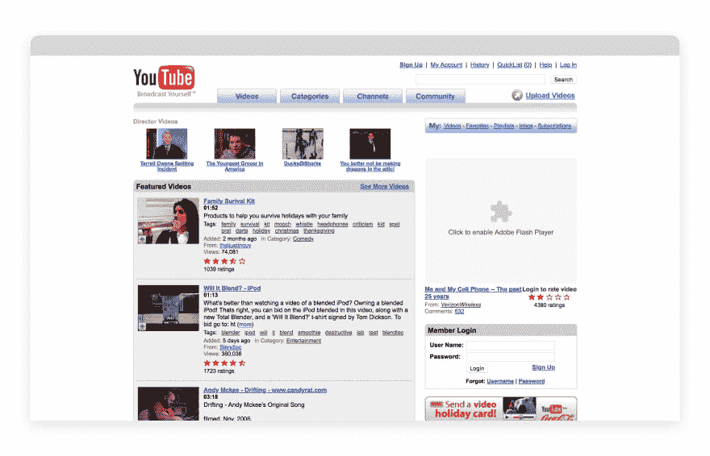
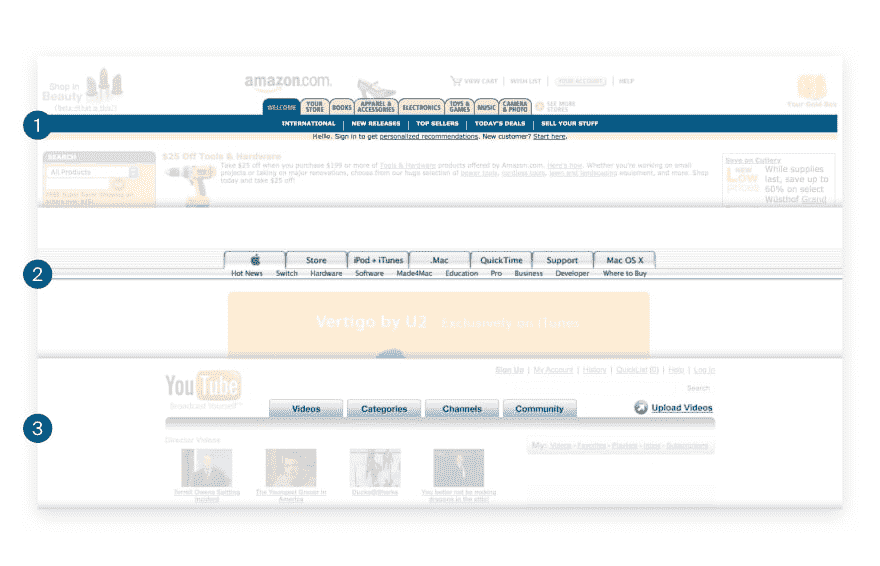
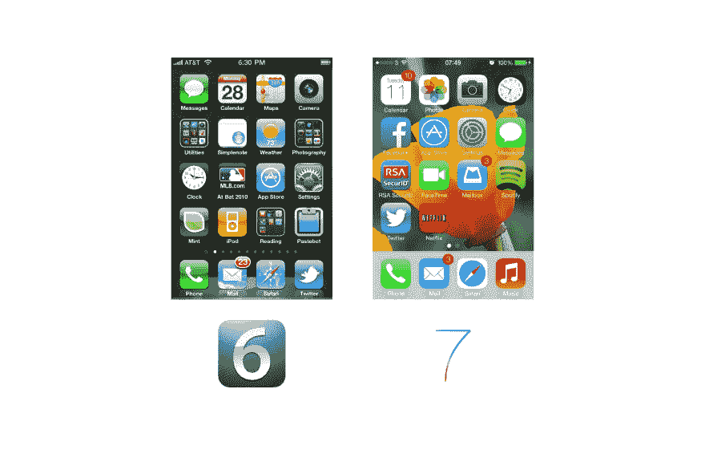
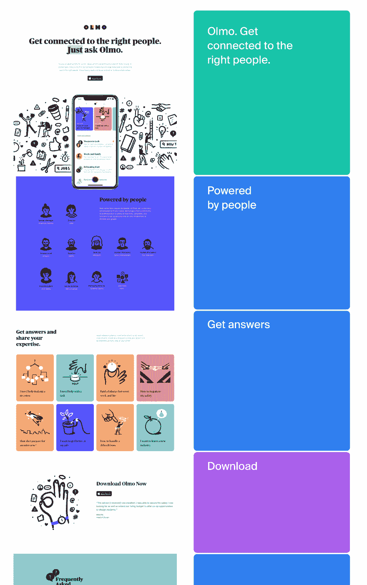

# 视觉网站地图是网页设计统一思想的进化

> 原文：<https://dev.to/octopusdohq/visual-sitemaps-as-the-evolution-of-web-design-unification-ideas-5ob>

让我们回忆一下 10-15 年前网站的样子，并确定它们与今天互联网上的网站有什么联系。一些读者甚至没有想到或者根本没有目睹 21 世纪初的互联网。这篇文章通过几个例子帮助我们还原了那个时代的网络面貌。并找出如何从今天的角度来设计和原型网站。

比如 2004 年 10 月 4 日 Amazon.com 长这样:

结构简单的布局。拉伸中心柱——当时的“响应式”理念。注意留白的数量。在那个时候，效率的问题似乎并不那么重要。

这是纽约时报网站的样子:

没什么不寻常的——固定的列和传统的带下划线的链接。请注意，位于标识左侧的广告横幅看起来多么感人。

如果没有苹果网站，这些怀旧的记忆将是不完整的。把产品设计的价值提升到绝对的公司:

紧凑而有逻辑的导航，大胆的英雄形象，精准的组织宣传资料。设计师会在主导航菜单中注意到表面的光泽效果 skeuomorphism 的一个生动例子。

让我们仔细看看 Mac G5 页面。很明显，内容的组织继承了经典在线报纸文章的结构:文本换行、大小适中的标题、内容密度。今天看到这个，你会不由自主地开始思考网页设计者和程序员当时面临的网络限制。请记住，这不仅是因为编程标准，也是因为显示器的分辨率。
[T3】](https://res.cloudinary.com/practicaldev/image/fetch/s--Iy3CH_ZT--/c_limit%2Cf_auto%2Cfl_progressive%2Cq_auto%2Cw_880/https://thepracticaldev.s3.amazonaws.com/i/7vq6l8qdel862tnuppox.jpg)

在 2005-2006 年，互联网的质量和速度已经允许在线观看视频。于是 14 年前，YouTube 出现了，2006 年 12 月，流媒体视频未来巨头的主页面是这样的:

Blendtec 和汤姆·迪克森已经在积极地粉碎 iPod。一个简单且结构良好的布局，其中服务的规模尚未被感受到。下载视频和观看视频的数量已经数以千计。

请注意将上述网站结合在一起的显著细节——导航菜单。苹果、亚马逊和“年轻”的 YouTube 使用相同的链接组织原则和类似书签的设计。简化用户体验的可理解的机制。公平地说，这是用户体验的统一和标准化。
[T3】](https://res.cloudinary.com/practicaldev/image/fetch/s---vuP6SwI--/c_limit%2Cf_auto%2Cfl_progressive%2Cq_auto%2Cw_880/https://thepracticaldev.s3.amazonaws.com/i/87pqybxt15grospjay3d.jpg)

1.  亚马逊(2004 年 10 月 4 日)
2.  苹果公司(2004 年 10 月 16 日)
3.  YouTube(2006 年 12 月 19 日)

简而言之，网页设计进化了，成为了设定标准的框架。所以，统一，作为一个持续的过程和理念，在互联网上是一直存在的。当程序员在与标准作斗争的时候，设计师正在试图定义和建立视觉规范。

让我们回忆一个相对最近的例子，当 skeuomorphism 的时代在界面设计中结束，扁平化设计的时代已经到来。这也是标准化，它促进了设计过程和随后的开发。
[T3】](https://res.cloudinary.com/practicaldev/image/fetch/s--o0Wk2QIG--/c_limit%2Cf_auto%2Cfl_progressive%2Cq_auto%2Cw_880/https://thepracticaldev.s3.amazonaws.com/i/xq35nuwuecxavno845ao.jpg)

因此，在编程和用户体验方面的统一过程，统一了 15 年前的 web 外观和我们今天可以使用的版本。互联网上大多数流行的网站都使用熟悉的、用户友好的机制和逻辑。这就是为什么我们生活在一个界面的时代，已经有了熟悉的导航结构和原则。我们必须花更少的精力去理解网站是如何设计和运行的。

现在想想怎么做一个页面的视觉草图或者未来项目的 sitemap？可能在你的想象中，你会开始设计水平的方块来形成一个完整的页面。这就是 2019 年互联网上一个“普通”页面的样子。
[T3】](https://res.cloudinary.com/practicaldev/image/fetch/s--I9hf75dB--/c_limit%2Cf_auto%2Cfl_progressive%2Cq_auto%2Cw_880/https://thepracticaldev.s3.amazonaws.com/i/axj8ewmoyb192zaoq2rw.png)

这些层中的每一层都执行信息或功能角色。

由于这些网站方法和组织的标准，客户和开发者之间的交流变得更加容易。用户了解我们这个时代的互联网是如何形成的:我们觉得“添加到购物车”按钮应该位于在线商店的什么位置，以及它看起来会是什么样子。

但是看似简单，客户和 web 开发人员都需要提前计划和讨论项目。毕竟，高质量的网站或应用程序需要在原型制作的非常早期阶段进行详细的研究。

作为一个行业，几十年的网络发展没有白费——用户更快地理解网站的结构。这不仅仅是关于专业人士。今天，现代工具允许在早期阶段非常快速地设计项目。因此，一旦专有技术行业转变为一个开放和无障碍的环境。对于我们这些开发者和设计者来说，将我们的时间和知识投入到对行业有潜在用途的服务中是非常重要和令人着迷的。

阅读关于在线设计可视化网站地图的完整文章。