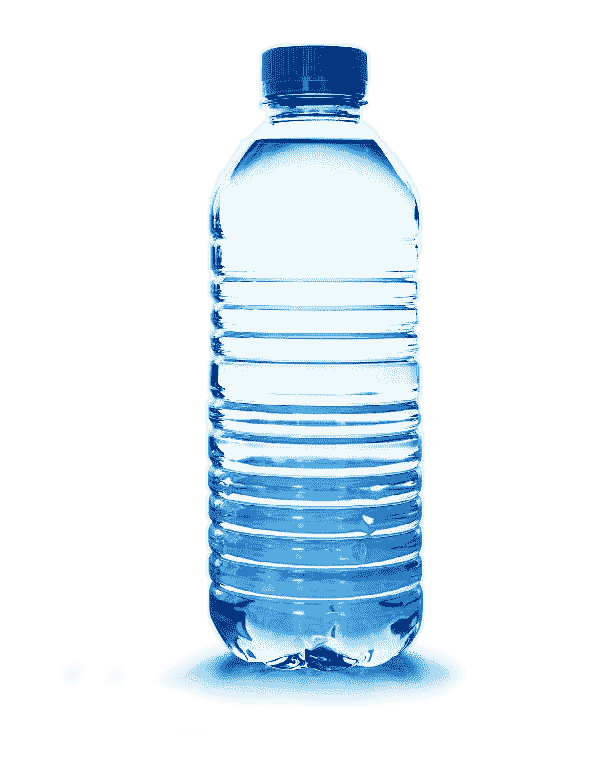

# 1 > 1000

> 原文：<https://dev.to/oieeaaaa/water-bottle-example-43dg>

> 1 例大于 1000 字。
> 
> *   w3 学校

我相信，解释某个事物的最好方式，无论是生命周期、组件、道具还是状态，都是在你的武库中有很多你的观众能看到或能理解的例子。

示例:

从下面给出的图片。这里我们可以看到一瓶水，里面的水由两种成分组成。第一个部件是用来盖住*容器*的*盖子*，第二个部件是防止里面的水从容器中掉出。我提到“组合”是因为盖子和容器组件不需要相互依赖。我这是什么意思？

很简单，这两个组件可以在整个应用程序中重复使用，而不相互依赖，这意味着它们是独立的组件。这就是 React 最酷的地方！

[](https://res.cloudinary.com/practicaldev/image/fetch/s--mvkim1i6--/c_limit%2Cf_auto%2Cfl_progressive%2Cq_auto%2Cw_880/https://thepracticaldev.s3.amazonaws.com/i/zd6xbgvk6vlpr39ig9vb.png)T3】

```
// Lid.js
const Lid = () => <div>I am a Lid Component.</div> 

// Container.js
const Container = () => <div>I am a Container Component.</div> 
```

Enter fullscreen mode Exit fullscreen mode

我们仍然可以扩展上面的例子来解释 props & state。

假设我们已经完成了上述两个组件的组合，创建了一个水瓶容器。

```
// WaterBottleContainer.js
class WaterBottleContainer extends React.Component {
  render() {
    return (
      <div>
        <Lid />
        <Container />
      </div>
    )
  }
} 
```

Enter fullscreen mode Exit fullscreen mode

我们现在可以在容器中加入一些水，现在我们可以把这些水当作某人经过的道具。

```
// WaterBottleContainer.js
class WaterBottleContainer extends React.Component {
  render() {
    return (
      <div>
        <Lid />
        <Container water="50 liters" />
      </div>
    )
  }
} 
```

Enter fullscreen mode Exit fullscreen mode

使用 props 的过程是，您需要有一个父组件(WaterBottleContainer)和一个子组件(Container)关系，其中父组件将把 props 传递给子组件。

现在*状态*，嗯...
我们可以把这个应用到水瓶容器的盖子上。如果水瓶容器是打开的，那么*是打开状态*将为真。

```
// WaterBottleContainer.js
class WaterBottleContainer extends React.Component {

  state = {
    isLidOpen: true
  }

  render() {
    return (
      <div>
        <Lid open={isLidOpen} />
        <Container water="50 liters" />
      </div>
    )
  }
} 
```

Enter fullscreen mode Exit fullscreen mode

否则*处于打开状态*将被设置为假。这里的好处是我们可以使用`{}`花括号将状态作为道具传递，现在不要搞混了，这里我们不是传递一个对象，我们只是简单地告诉 React 我们想要传递除 string 之外的其他数据类型，所以我们使用`{}`花括号。

记住这两个(*道具&状态*)可以是搭档。

```
// WaterBottleContainer.js
class WaterBottleContainer extends React.Component {

  state = {
    isLidOpen: false
  }

  render() {
    return (
      <div>
        <Lid open={isLidOpen} />
        <Container water="50 liters" />
      </div>
    )
  }
} 
```

Enter fullscreen mode Exit fullscreen mode

现在，我们可以重写 Lid.js 文件，从 WaterBottleContainer 组件接收道具。

```
// Lid.js
const Lid = props => {
  let isOpenText = "Yes, You can add water.";

  if(!props.open) {
    isOpenText = "Nope, You can't add water.";
  }

  return (
    <div>
      {isOpenText}
    </div>
  );
} 
```

Enter fullscreen mode Exit fullscreen mode

这里需要注意的是，我们使用的道具名称应该与父组件中的道具名称相匹配。对了，为了从 water bottle 组件中获得道具，我们使用了 props 对象。也就这样了！

如果你有问题、建议、澄清或者只是想谈谈，请告诉我。

只需将它放在下面的评论部分，或者您可以在这里发送聊天消息 [@Dev](https://dev.to/) 只需点击屏幕右上角的纸质 airplaine 图标，并使用过滤器文本框搜索我的用户名 *oieeaaaa* 。

Phheww！，希望有道理。英雄联盟

萨拉马特。