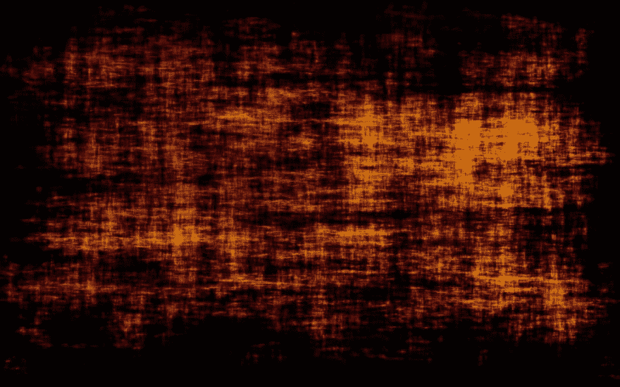

# 面向数据科学家的 Web 抓取(没有 Web 编程背景)

> 原文：<https://dev.to/valerybriz/web-scraping-for-data-scientists-with-no-web-programming-background-1j3a>

<figure>[](https://res.cloudinary.com/practicaldev/image/fetch/s--Rb0S-Jdh--/c_limit%2Cf_auto%2Cfl_progressive%2Cq_auto%2Cw_880/https://cdn-images-1.medium.com/max/1024/1%2AFHkHfj5dzH5NY88FTGqHuA.jpeg) 

<figcaption>图片来自 [Pixabay](https://pixabay.com/illustrations/background-texture-abstract-scuffed-1418618/)</figcaption>

</figure>

*最初发布于:*[*https://icode mag . com/web-scraping-for-data-scientists-with-no-web-programming-background/*](https://icodemag.com/web-scraping-for-data-scientists-with-no-web-programming-background/)

如今，数据在工业中具有非常重要的作用，并且获取这些数据的需求变得越来越高。这些信息的很大一部分可以通过互联网获得。例如，一些数据表示为社交网络上的评论或标签，另一些可以在网页上找到纯文本，还有一些可以是“旧”网站上的表格，其格式不超过简单的 HTML。

但不管格式如何，我们真正关心的是我们可以从这个来源获得的信息，我们可以分析这些信息以了解我们的客户，或者增加我们数据库中的数据量以供进一步使用。有时，网站通过 API 或通过提供我们可以轻松下载的文档向我们提供信息，但有时除了直接从网站上查看和复制这些信息之外，没有其他方法可以获取这些信息。

到目前为止，一切都是快乐的，但当我们需要获取的信息分布在成百上千个不同的页面或路径中，并且都是混乱的时，会发生什么呢？

这就是数据检查和提取自动化出现的时间！

#### 网页抓取

> 基本上，抓取是一种从网站获取数据并将其存储到机器中的技术。T3】

我们可以通过 get 请求获得网页的完整代码，然后手动检查、排序并将其存储在数据库中，但 Python 为我们提供了一些有用的解决方案，使这变得更容易。其中一个选项是网络爬行框架 [Scrapy](https://scrapy.org/) 。它的一个主要优势是它是建立在[扭曲](https://twistedmatrix.com/trac/)之上的，这使得它异步且更快。另一方面，我们有[美丽的汤](https://www.crummy.com/software/BeautifulSoup/)它的名字来自于“标签汤”这个表达，描述了一个混乱和无组织的 HTML。我们会使用这个库，因为它非常方便，而且当我们试图清理的网站非常混乱时(很多情况下都是这样)，它也很有帮助。

[美汤](https://www.crummy.com/software/BeautifulSoup/)可以获取页面的整个 HTML 代码，并将其存储为更容易按标签、id 和 DOM 过滤的对象。

但是首先你可能不知道什么是 DOM，所以让我们从一个基本的 HTML 类开始。

DOM 是一个 W3C(万维网联盟)标准。它基本上是一个文档对象模型，可以定义 HTML 元素的属性、方法和事件。所以 DOM 看起来像这样:

 **如前所述，在一个 DOM 中我们可以有类似于 id T1、T2 类 T3 或 T4 href T5 的属性，一个真正基本的 HTML 页面应该是这样的:T6

```
<!DOCTYPE html>
<html>
  <body>
    <h2>Finding HTML Elements by Tag Name</h2>
    <div id=”main”>
      <p>The DOM is very useful.</p>
      <p>This example demonstrates the <b>getElementsByTagName</b> method.</p>
    </div>
    <p class=”demo”>demo</p>
  </body>
</html> 
```

Enter fullscreen mode Exit fullscreen mode

DOM 非常有用。因此，对于这个 HTML 页面，标签或属性应该是:

*   id = "main "
*   class = "演示"

我们的 DOM 应该是:

*   超文本标记语言
*   身体
*   氘
*   差异
*   p
*   b

这些 DOM 及其指定属性的组合将使我们的搜索更容易。

如果你想学习更多关于 HTML 的知识，你可以在网站上找到很多信息。

现在我们准备编码了！

首先，我们需要安装[漂亮的汤](https://www.crummy.com/software/BeautifulSoup/)库和一个 HTTP 请求库，在这种情况下，我们将使用 **urlib3** :

```
pip install bs4

pip install urllib3 
```

Enter fullscreen mode Exit fullscreen mode

举例来说，我们将使用下面的站点进行抓取:

`**page\_url = “http://example.webscraping.com/”**`

在开始对网页进行请求之前，我们将手动导航到站点的**根**，并查找**robots . txt**(【https://example.webscraping.com/robots.txt】)。

每个网站都应该有一个文件，让机器人知道哪些页面可以检查，哪些不可以。它还可以指定一个爬虫每秒可以在站点上处理多少请求。这是合乎道德的遵循这些指示，而不是不必要的打击服务器，而刮它。

我们首先需要的是获得整个页面的源代码。建议在一个请求中完成所有操作，关闭连接，然后根据需要多次迭代，以找到我们想要的信息。对于我们正在抓取的服务器来说，它不仅更快，而且更好。

```
from bs4 import BeautifulSoup
import urlib3
http = urllib3.PoolManager() #instanciate the http requests library response = http.request(‘GET’, page\_url) #make the request to the page soup = BeautifulSoup(response.data, ‘html.parser’) #store the code as a soup object 
```

Enter fullscreen mode Exit fullscreen mode

这个 Soup 对象有所有的页面 HTML 代码，所以让我们试着做一些搜索。为了知道要查找什么，我们可以在页面上进行一次动态检查，右键单击，然后选择“**检查元素**”。几乎所有的网络浏览器都有这个选项。我们可以看到，包含第一个国家的整个 HTML 代码块有一个名为 **span12** 的标签类，现在将它应用到我们的代码中，我们有:

```
dom_name = “div”

tag_name = “class”

tag_value = “span12”

span12_object_array = soup.find_all(dom_name, attrs={tag_name: tag_value}) 
```

Enter fullscreen mode Exit fullscreen mode

这段代码将返回一个数组，该数组包含在一个 **span12** 类中找到的所有**div**以及其中的所有子 DOM，这些子 DOM 在视觉上会是国旗和国名。

如果我们想要得到旗帜图像的链接，我们可以对已经过滤的" **div span12** "数组应用下面的搜索:

```
img_dom_name = “img”

img_attr_name = “src”

for div_item in span12_object_array:

img_object_array = div_item.find_all(img_dom_name)

img_src_array = [current_item.get(img_attr_name) for current_item in img_object_array] #This is a list comprehension to simply get each found image source url in order 
```

Enter fullscreen mode Exit fullscreen mode

现在我们可以打印出来，看看每个图片链接是什么:

```
print(img_src_array) 
```

Enter fullscreen mode Exit fullscreen mode

最后，您可以将信息存储到数据库或直接下载图像。

#### 见解

做得好的抓取不会给存储我们需要的信息的服务器带来问题，这主要是出于道德原因。在同一行中，我们可以优化我们的代码，以在本地执行更快的操作，并在未来通过小的更改来请求不同的信息。

此外，一个有效的和可重用的代码将更容易维护，并在未来将我们的代码时间减到最少。

这是抓取方法的一个基本途径，理解了这一点之后，即使我们发现一些包含信息的杂乱无序的 HTML 代码，抓取任何网站都会变得更加容易。

*最初发布于:*[*https://icode mag . com/web-scraping-for-data-scientists-with-no-web-programming-background/*](https://icodemag.com/web-scraping-for-data-scientists-with-no-web-programming-background/)**