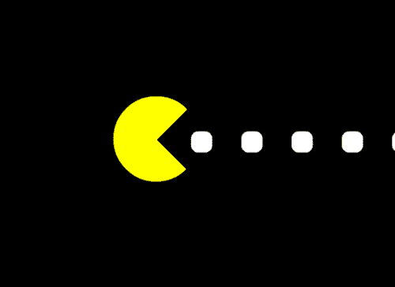

# WebHook -简介

> 原文：<https://dev.to/ogwurujohnson/webhook-an-introduction-3a7d>

大多数人讨厌被微观管理，我们大多希望被允许做我们最好的工作，而不是不断被提醒，或者被反复问我们是否完成了，而显然我们没有。直接经理和同事的这种行为已经迫使一些工程师脱帽辞职。

但是，当你知道你的服务器端应用程序在 AWS 或 Azure 上运行和冷却的感觉完全相同时，你会有什么感觉，当你反复向它发送请求，要求数据，而数据显然没有准备好或不存在？我确信我们不会希望我们的服务器端应用程序在无法承受来自我们和客户端的反复调用和请求时放弃自己的位置。不足为奇的是，像 GitHub 这样的产品对你可以向他们的服务器发出的请求数量进行了限制，只是为了安全和确保他们的服务器端应用程序保持良好状态，不会退出🎩不受控制的访问可能会产生数十亿个请求。

现在，每个人心中的问题是，如果我们不需要反复询问服务器是否有新的东西给我们，我们如何知道服务器上的变化？还是我们期望我们的用户每 10 分钟刷新一次浏览器来获取新内容？

如果我们运行需要读取大量数据的产品，比如 Twitter 和 GitHub，我们肯定不会期望我们的用户在每次想要接收最新信息或提要时都刷新浏览器，至少在我们这个 SPA 和 Ajax 时代不会。那么我们该如何解决这个问题呢？

* * *

> **介绍大人物...🥁🥁🎉🎉🎊🎊**

WebHooks 的引入导致了客户端应用程序和服务器端应用程序之间一种新的通信形式。在此之前，客户端和服务器端之间存在的通信形式是客户端在向服务器请求资源时使用服务器。

使用 WebHook，服务器端这次从客户端消耗资源，而不是相反(资源是客户端应用程序提供的端点 URL)，这就是为什么 WebHook 通常被称为“**反向 API** ”。

WebHook 的概念很简单。WebHook 是一个`HTTP callback`或`HTTP POST`，当某事发生时发生；一个简单的事件通知通过`HTTP POST`。
通过 WebHooks，我们避免了客户端应用程序在搜索特定资源时不断轮询服务器端应用程序的需要，而是在客户端感兴趣的资源发生变化时提醒客户端。

因此，不是客户端应用程序不断地轮询服务器端应用程序来检查新事件，而是服务器端应用程序在服务器端有新的东西要报告给客户端时调用客户端应用程序(通过调用客户端提供的 webhook URL)。

WebHook 不仅能够将服务器端的变化通知给客户端，还可以接收有效负载，有效负载可以是关于新资源的信息，但是虽然可以在 webhook 的主体内传递有效负载数据，但是为了提高可伸缩性和可靠性，保持 web hook 轻量级是一个好的做法。Webhooks 虽然在技术上可以承载负载，但它只是一种回调机制，主要应该作为状态变化的信号。

一旦接收到状态改变的通知，可以对服务器进行单独的 API 调用，请求新的资源。这种关注点的分离提高了 API 集成的可伸缩性和可靠性。这正是 Twitter 和 LinkedIn 所做的，它们允许你更新你的时间表，但只有在有新资源(tweet 或 post)时才会显示一个按钮

因此，webhook 只不过是一个简单的客户端提供的端点 URL。客户端应用程序必须在服务器端调用 webhook 之前的某个时间点将这个端点 URL 传递给服务器端应用程序。

**资源**:

1.  下面的网站允许你测试网页挂钩的概念[https://webhook.site/](https://webhook.site/)。它生成一个惟一的测试 webhook URL，您的应用程序可以调用它来测试 webhook 的回调(通知)特性。您可以进一步测试它，方法是在 GitHub repo 的 webHook 设置中添加作为 webhook 生成的链接，并推送至该 repo，然后从 webhook.site 查看 webhook 的出色之处

2.  关于 webhook 是否应该有一个有效载荷的争论，看看 jsneddles 在 [medium 上的这篇文章](https://medium.com/@jsneedles/your-webhooks-endpoint-should-do-almost-nothing-d246378a85e5)

3.  如需进一步阅读，请查看[https://codeburst.io/whats-a-webhook-1827b07a3ffa](https://codeburst.io/whats-a-webhook-1827b07a3ffa)

**结论** :
由于这是一个我刚刚理解的概念，所以它是可能的，我没有触及它的所有方面，并且希望得到您的友好反馈、问题和贡献。谢了。