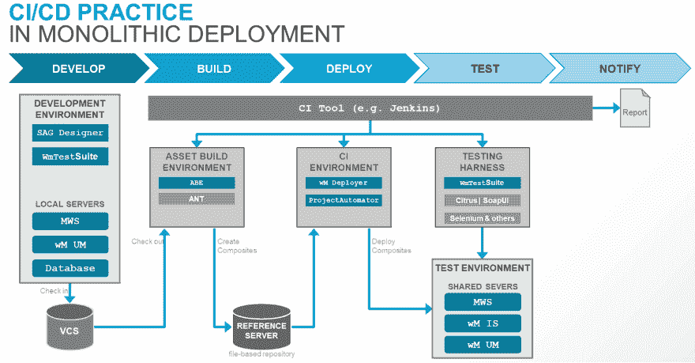
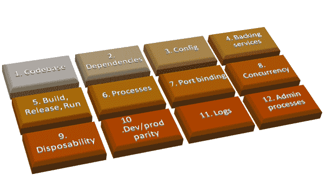
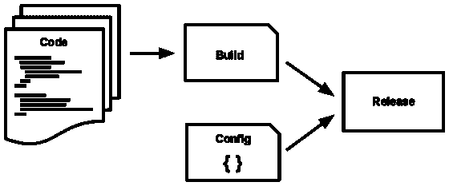
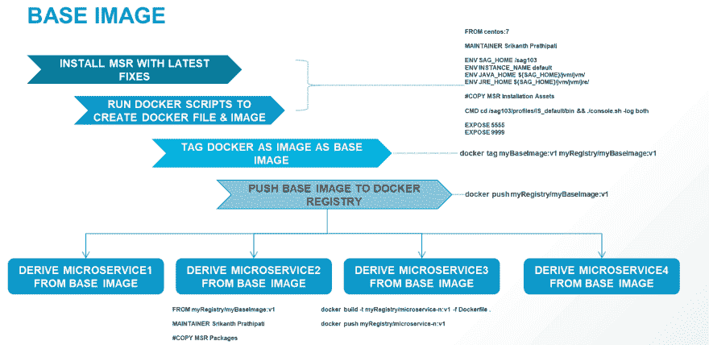
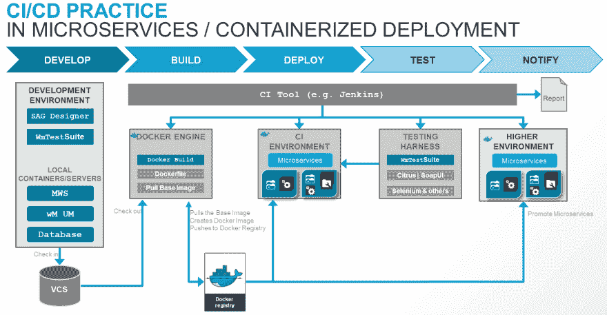

# webMethods 微服务运行时-持续集成和交付 1.5

> 原文：<https://dev.to/techcommunity/webmethods-microservices-runtime-continous-integration-delivery-1-5-ihk>

* *免责声明:本文基于我的专业经验。我承认他人拥有的商标和知识产权。**

**本文描述了使用 webMethods 微服务运行时**持续集成的基本概念。

**先决条件**

*   您对 Docker、Kubernetes/OpenShift 有些熟悉
*   相当理解与 webMethods 产品相关的 CI/CD 概念。

## CI/CD -容器化与非容器化部署

webMethods Integration Server 的常规部署需要资产构建环境来创建构建(称为组合)、部署器和部署器 CLI 来将组合部署到 CI、目标环境和 webMethods 单元测试框架以运行单元测试。下图描述了该模型的 CI/CD 流程。

容器的 CI/CD 实践不同于常规部署。容器在过期时会失去状态，因此不应该部署到正在运行的容器上。

12 因素应用原则([https://12factor.net/](https://12factor.net/))在这种实践中会有所帮助。

尽可能保持流程(原则#6)的无状态将有助于在需要时动态伸缩(向上或向下)。原则# 5-[https://12factor.net/build-release-run](https://12factor.net/build-release-run)是集装箱 CI/CD 实践的基础。

webMethods 微服务运行时遵循实现云原生微服务的 12 因素 app 原则。特定于应用程序的配置可以在阶段升级(开发/测试/生产)的 CI/CD 过程中传递到 webMethods MSR，并传递到同一个 Docker 映像。参考[https://documentation . software ag . com/web methods/micro services _ container/MSC 10-3/10-3 _ MSC _ PIE _ web help/index . html # page/integration-server-integrated-web help % 2f to-configuration _ variables _ for _ docker _ 2 . html % 23](https://documentation.softwareag.com/webmethods/microservices_container/msc10-3/10-3_MSC_PIE_webhelp/index.html#page/integration-server-integrated-webhelp%2Fto-configuration_variables_for_docker_2.html%23)更好地了解这个特性。

应用程序特定的参数，如适配器连接、JMS/本机消息端点、WS 端点别名、扩展设置、全局变量、JDBC 池等，可以作为配置映射或机密传递给 webMethods MSR。

容器的一般 CI/CD 实践不需要从头开始创建 Docker 映像，而是可以在程序级别创建基础映像，然后可以导出微服务的映像。

从 9.12 版本开始，webMethods 提供了用于创建 Docker 文件和 Docker 图像的脚本。这些脚本位于 <sag_installation_dir>/IntegrationServer/docker/目录中，将有助于创建基本 docker 映像。下图描述了集装箱化部署的 CI/CD 实践。</sag_installation_dir>

**样品**

[https://github . com/software ag/web methods-MSR-okd-sample-build pack](https://github.com/SoftwareAG/webmethods-msr-okd-sample-buildpack)提供示例 Jenkins 管道和脚本，用于使用 open shift(OKD 或 OCP)练习 CI/CD。