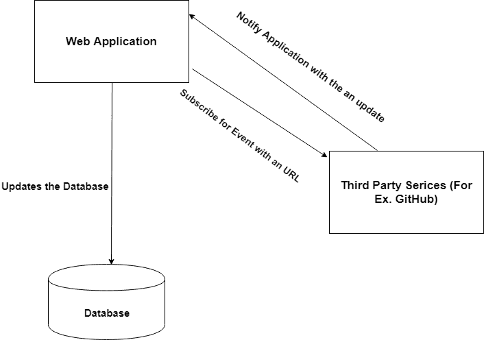
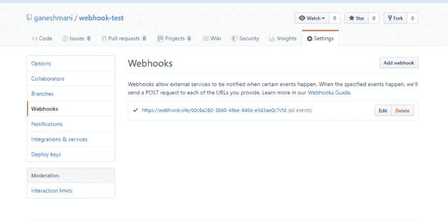
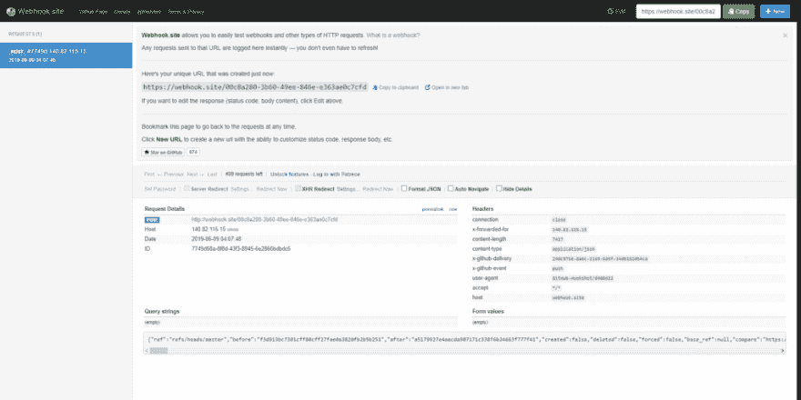

# 什么是网页挂钩？Web Hook 是如何工作的？

> 原文：<https://dev.to/ganeshmani/what-are-web-hooks-how-web-hook-works-4ghn>

在这篇文章中，我们将看到什么是 web 钩子以及 web 钩子是如何工作的

根据维基百科，

```
A webhook is a method of augmenting or altering the behavior of a web page, or web application, with custom callbacks. These callbacks may be maintained, modified, and managed by third-party users and developers who may not necessarily be affiliated with the originating website or application
```

混乱的..对吗？

我们用一个类比来理解这个概念。让我们假设你是一名银行经理，你正在雇用一名助理来为你更新银行的信息和事件

两个人报名面试；两个截然不同的人。

*   还有 A 先生(又名 API)，一个非常高效的助手，当你问他时，他会给你答案。所以如果你打电话给他，问他“嘿！今天有什么更新？谢谢！”你会得到你想要的号码。
*   然后是 B 先生(又名 Webhooks)，他做事有点不同。一有事，他就自动给你发消息说:“嘿！这就是今天发生的事情！。这里有更多的信息！。还有哦，不客气！”，不用你开口。

问题:你会雇佣谁？

答案很明显，不是吗？。这就是网络钩子的目的

## 网络钩子是如何工作的？

*   

想象一个门铃系统——在门边有一个按钮，在你的起居室里有一个铃。

当来访者按下门边的按钮时，你可以听到门铃响，这告诉你有人在门口，这不过是按钮向门铃发出的信号。

Webhooks 的工作原理是一样的。入口门是一个第三方应用程序(web hook provider)，当特定事件发生时，它会发送一个信号，而您客厅中的铃声就是所谓的“监听器”。侦听器是接收 webhooks 并在此之后执行预定义操作的 URL。

Web 挂钩基本上是用户定义的 HTTP 回调。它由特定事件触发。每当第三方服务中发生触发事件时，webhooks 就会看到事件，收集数据，并以 HTTP 请求的形式发送到您指定的 URL。

### Web Hooks 现实生活中的例子:

让我们举一个实时的例子，在这里我们可以使用 Web 钩子。假设您希望在提交 GitHub 存储库时获得更新或通知。

为了测试 WebHooks 的概念，我们将使用一个名为 [https://webhook.site](https://webhook.site) 的站点。一旦你访问了这个网站，你就可以得到一个 URL，你可以把它作为一个 WebHook URL 添加到你的 GitHub 库

在 GitHub 页面的 Web 挂钩中添加 URL。

*   

现在，无论何时提交到特定的存储库，您都会在站点中得到响应。

*   

这就是网络钩子的工作原理..非常简单..对吗？。

但是这个强大的概念解决了软件工程中的一些重要问题。

好的。让我们在另一篇文章中赶上。直到那时，**快乐黑客:-)**

最近的文章:

*   【React 开发人员的不变作业
*   [面向前端开发者的 Nginx】](https://cloudnweb.dev/2019/05/nginx-for-front-end-developers/)