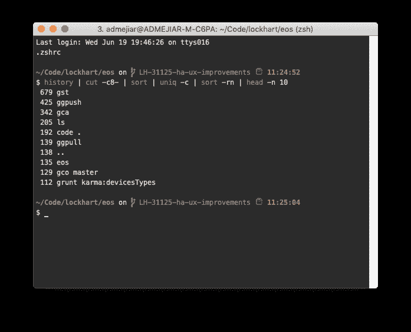

# 你的十大命令行是什么？

> 原文：<https://dev.to/amejiarosario/what-are-your-top-ten-command-lines-1nn5>

运行下面的命令列表来找出答案！

```
history | cut -c8- | sort | uniq -c | sort -rn | head -n 10 
```

Enter fullscreen mode Exit fullscreen mode

我的如下:

[](https://res.cloudinary.com/practicaldev/image/fetch/s--Ba6ov2as--/c_limit%2Cf_auto%2Cfl_progressive%2Cq_auto%2Cw_880/https://user-images.githubusercontent.com/418605/59861137-44a66b00-934e-11e9-899a-4ff6d9169df7.png)

由于我使用了很多别名，以下是扩展版:

1.  `git status`(别名商品及服务税)
2.  `git push`(别名 gg push = ' git push origin " $(git _ current _ branch)" ')
3.  `git commit`(别名 gca='git commit -v -a ')
4.  `ls`(列出文件当前目录)
5.  `code .`(在当前文件夹中打开 visual studio)
6.  `git pull`(别名 gg pull = ' git pull origin " $(git _ current _ branch)" ')
7.  `..`(返回上一个导演)
8.  `grunt serve`(别名 EOS = ' CD " $ LOCKHART "/EOS&&git pull origin " $(git _ current _ branch)"；咕哝发球’)
9.  `git checkout master` (alias gco='git checkout')
10.  `grunt karma:...`(运行单元测试)