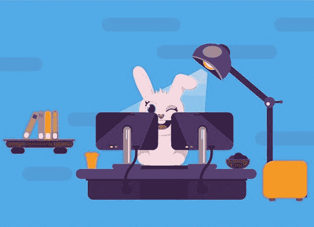

# 土木工程教会我如何成为一名优秀的软件开发人员

> 原文：<https://dev.to/bhekanik/what-civil-engineering-taught-me-about-being-a-good-software-developer-5ge4>

这篇文章最初发表在 [Offerzen 博客](https://www.offerzen.com/blog/what-civil-engineering-taught-me-about-being-a-good-software-developer)上。

9 个月前，我是一名土木工程师，并获得了奖学金，完成了化学和环境工程的博士学位。今天，我是一名地理信息系统(GIS)软件开发人员。有趣的是，我发现我可以将作为工程师学到的很多东西应用到我的新角色中。以下是我作为一名工程师的四个关键收获，它们给了我在软件开发领域的优势。

## 上下文

从我记事起，我就热爱计算机和编程。我 14 岁的时候自学了 VB6 编程，从那以后我就爱上了它。然而，由于这样或那样的原因，我上大学时没有选择那条路，最终学习成为一名土木工程师。

当我毕业时，我开始作为一名工程师工作，但我对计算机的热情仍然存在。作为一名土木工程师，选择从事 GIS 工作使我能够与计算机进行高度互动，在空闲时间，我努力进一步积累软件开发人员的知识。我使用了大量的在线资源，甚至接了一些自由职业项目来练习技能和积累经验。越来越清楚，和计算机打交道是我真正想做的事情。

在过去的几个月里，我决定辞去工程师的工作，将我的热情转化为事业。虽然我真的很喜欢开发，但我仍然关心工程的许多方面，并且从中我学到了许多宝贵的经验。

进行这种转变时，我意识到这些课程让我大开眼界，了解了我作为一名新开发人员所经历的许多事情。我发现意识到某些事情给了我独特的视角，并真正帮助我在新的角色中成长。以下是它们的内容。

## 你应该永远对学习保持开放的态度

### 一个好的工程师永远不会停止学习

许多工程都是基于基础科学的，有特定的标准来帮助工程师简化该科学的应用。尽管如此，它仍然是一个非常有创造性的领域，因为人们会不断遇到新的问题，促使你以新的方式思考现有的科学和标准。

> 工程师需要思考如何挑战现有的东西，以实现更高的效率。

这就需要不断学习以跟上实践的变化。

例如，我曾经参与了一项水需求管理研究，在这项研究中，我们必须制定一项减少水需求和改善水资源保护的战略。我们的一个重要发现是，当时使用的需求管理策略是基于 20 多年前的一项研究。因为它在工作——尽管效率很低——自从它投入使用以来，没有人费心去更新它。在这一领域已经进行了大量的研究，因此有很多机会可以显著降低系统中水分流失的需求。这意味着，由于负责人没有不断学习和应用该领域的先进技术，电力公司每年都会损失巨额收入。

因此，我清楚地认识到，如果没有对进步的深刻理解，就很难自信地制定出应对经常出现的挑战的解决方案。

### 一个好的开发者不断学习，学得更快

我很快发现开发是非常相似的，因为也有基础科学，以及应用于技术和框架的标准。然而，软件开发的变化要快得多，这意味着旧的想法和方法也会更快地过时。作为一名开发人员，你必须不断学习以保持相关性。如果你松懈了，你所珍视的技能很快就会过时。

> 软件开发人员总是瞄准一个移动的目标，这是令人兴奋的一部分。

作为一名开发人员，我经常遇到这种情况。我目前的大部分工作是使用 Python 编写 GIS 处理脚本。我开发了一些定制模块，我的许多工具集都引用这些模块来完成各种任务。每当我需要为一个新问题编写工具时，我都会为此做一些研究。在研究该工具时，我通常会学到很多东西，以至于我需要回到我以前工作过的工具，将我新发现的知识应用于它们，以便它们可以更好地工作。因此，我的工具在不断改进，因为我在不断学习。

#### 作为一名软件开发人员，这是如何影响我的

我从自己的经历中了解到，你永远不应该满足于你所知道的。

*   我总是寻求学习更多，拓展我的能力，即使我一直在处理同样的老问题。
*   我努力继续阅读。我发现学习新的东西可以开阔我的视野，给我一个更好的视角，这可以揭示我以前看不到的方面。

## 学习是一个渐进的过程——你需要采取措施才能达到目的

### 一个好的工程师应该在开始工作之前证明他们知道如何去做。

工程师通常需要在开始任务之前，详细地计算出每个项目将如何完成。是的，在前进的道路上有一些学习的空间，但所有这些都发生在与计划的微小偏差之内。

这一点很重要，因为在大多数情况下，这关系到很多东西，包括人们的生命和相当高数额的公共资金。纠正错误是非常困难和昂贵的。因此，利益相关者想知道他们合作的工程师是否能够设计和建造一个污水处理厂，在他们允许他们使用他们的资金之前，这个污水处理厂可以使用 50 年。虽然工程师有一点回旋的余地，但客户还是想知道，更详细地说，他们打算如何建造这座工厂。他们需要知道工程师具备所有必要的知识，然后才允许他们承担任务。

### 相比之下，一个好的开发人员应该乐于在工作中学习

软件开发的工作方式略有不同:它允许更大的回旋余地。在工程领域，客户希望在签订合同之前确定你的实践技能是扎实的，而在开发领域，他们通常想知道你是否具备所需的能力，明白需要什么。

因为作为一名工程师，我已经习惯了从一开始就必须证明这个计划，这种思维模式的转变是很困难的。然而，随着时间的推移，很明显，作为一名开发人员，我不需要证明一个计划，我需要证明我自己。毕竟，该计划可能会在过程中发生变化。

我第一次编写地理处理 Python 脚本时，在没有任何地理处理库知识的情况下接受了这个项目。我以前使用过 Python，但从未用于任何 GIS 工作。我接受了它，因为我明白我所拥有的知识是一个足够好的起点，我有足够的时间学习我需要的技能。在浏览了一些文档和教程后，我找到了一个开始的方法，并在必要时获得了其余的知识。

> 重要的是相信你的总体能力。如果你可以开始，那么你可以采取下一步措施来加强你对不熟悉的话题的理解。

#### 作为一名软件开发人员，这是如何影响我的

虽然研究很重要，但我知道你不应该被它困住。

*   我已经开始让项目的需求来指导我的学习。我将项目工作分解成我所知道的，并以此开始。
*   当我接近不知道的部分时，我会研究它们，这样我就可以继续前进。我试图记住，一些改变世界的解决方案就是从这种任务驱动的学习方法中诞生的。
*   我提醒自己，我并不总是需要知道如何做每一件需要做的事情。直到今天，我在旅途中遇到的任务是我学习的方向。如果我因为不了解所有需要的细节而放弃，我可能仍然会努力获取知识，让我有足够的信心开始。

## 做好这件事需要时间和承诺

### 一个好的工程师在第一次尝试中就满足了所有的要求

当承担建造桥梁的任务时，工程师需要设计和建造一座完整的桥梁，并且第一次就能正常工作。在规划过程中，工程师们会考虑各种可能性，考虑各种选择，并得出最终的解决方案。

> 当工程师设计和建造时，他们是在做最终产品。这就是为什么工程项目通常采用瀑布方法来进行项目管理:在进入下一步之前，流程的每一步都要完成。

当重做某件事变得必要时，通常会付出很高的代价。这意味着工程师通常希望第一次就构建出最终的解决方案，而不是几十年后才回来。最好的情况是，他们只需要回到 it 部门进行拆除，这已经在最初的实施过程中考虑到了。

### 然而，一个好的开发人员会接受这样一个事实，即他们会边做边学

开发的工作方式不同:在很多情况下，开发人员和客户都不清楚最终产品会是什么样子。在大多数情况下，所需要的只是一个部分工作的原型，以了解添加什么和删除什么。

因此，开发通常采用项目管理的循环方法，在每一个周期中，我们尽我们当时的能力、知识和资源产生一个工作解决方案。使用该解决方案，我们学习、调整并在下一个周期使用该知识来改进产品。这意味着拥有一个从未完全完成的产品是完全可以接受的。

> 换句话说，它永远不会完成，但对于那个周期来说，它总是完成的。

通常，当 GIS 技术人员向我提出问题时，没有人真正理解解决方案应该是什么样的:我们努力关注的只是对问题有一个非常好的理解。我过去常常花几个小时试图找出解决方案，直到因为时间的原因，我不得不重新开始。

随着时间的推移，我意识到在达成解决方案的第一个版本后，我对最终版本应该如何运行有了更多的了解，因此我可以更快地工作。我发现，在我前进的过程中，我的眼睛睁开了，看到了潜在的可能性和陷阱，事实证明，这比在构建任何东西之前花时间试图找出它们要有用得多。

#### 作为一名软件开发人员，这是如何影响我的

最重要的是，我已经意识到，作为一名开发人员，你不应该拘泥于细节。

*   我已经开始关注拥有一个部分工作的整体，以帮助优先考虑最需要关注的细节。我已经接受，有时我需要看到一些东西是如何破碎的，以了解如何确保它不会再次破碎。

## 要在游戏中生存，你必须保持警觉

### 一个好的工程师会考虑到这个领域的变化相对缓慢

在工程中，问题变异的速度比解决方案发展的速度快并不少见。创新只是发生得不够快，而且，即使在大量资金投入研究以保持高创新速度的情况下，这些创新也没有被足够快地采用。

例如，一个多世纪以来，用于处理废水的技术基本保持不变，而在此期间，被处理的废水的成分发生了巨大变化。这给环境带来了很多问题，我们现在被迫做出反应，这种反应早就应该做出了。

所有这一切的原因是巨大的基础设施网络导致自然垄断，在这种情况下，拥有一个参与者比拥有多个参与者更具成本效益。不幸的是，这也意味着这个玩家没有竞争对手，因此没有创新的动力。因此，废水处理设施几乎没有推动他们创新的动力。只要环境能够接受污水，就没有理由做出改变。

### 相比之下，一个好的开发人员会努力跟上快速的创新

因为激烈的竞争推动了软件开发中的快速创新和不断变化的方法，任何人都没有多少空间在相当长的时间内形成可持续的垄断。虽然不是没听说过，但很少见。在某些时期变得无处不在的最受欢迎的技术不会保持很长时间，直到有人提出下一个大东西。没有人能长期舒适地拥有自己的空间，除非他们明白他们需要保持警觉以保持相关性。

我在去年开始学习 React 和 React Native 时就经历过这种情况。仅在 2018 年，这些程序就发布了如此多的版本，每一个都带来了新功能，修复了错误，改进了旧功能。一切都在不断变化和改进！

因此，虽然我可以创建一些非常复杂的 React 组件，但我从未真正了解 React 的来龙去脉。起初我对此感到不舒服，但我已经学会接受它。当我努力跟上创新的步伐时，总是知道有些东西我还不知道，这让我不断学习。

#### 作为一名软件开发人员，这是如何影响我的

*   我认识到，在软件开发中没有真正完整的解决方案——总有一些可以改进的地方。
*   我的想法是，一旦我们达到了目标并交付了产品，是时候重新审视我们的解决方案并思考我们可以创新的地方了。
*   我已经意识到需要不断地改进性能、提高效率、提供更好的用户体验等等。在开发中，一旦某个东西完成了，就该把它拆开来重新思考。
*   知道我周围的技术总是在变化，让我每天都对软件开发感到兴奋。

## 你的想法？

我相信我们可以学到很多东西，不仅仅是从成为软件开发人员的土木工程师身上，也可以从律师、医生、出租车司机和许多其他职业身上学到。你是从一个完全不同的背景进入软件开发的吗？你学到了什么？我很乐意收到你的来信。