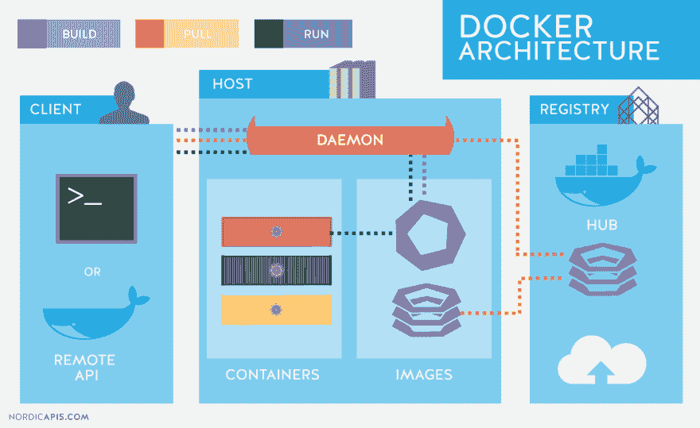

# 什么是云原生软件工程师？

> 原文：<https://dev.to/loujaybee/what-is-a-cloud-native-software-engineer-ejk>

仅仅知道软件工程的基本知识是不足以在当今市场上取得成功的。许多软件工程师需要比现在更多的云平台知识。

为什么？这就是今天的问题。我们将讨论什么是云原生软件工程师，他们为什么存在，他们的技能是什么，以及最终这对软件工程师来说意味着什么。

到本文结束时，你应该确切地知道什么是云原生软件工程师，以及为什么这对你的软件工程职业至关重要。

## 什么是云原生软件工程师？

先说一个定义。

但我不会简单地给你一个定义，让你无所适从，因为我们要一起探索和分解细节。

> 云原生软件工程师具有典型的软件工程技能，如编写代码、测试、设计、架构等。但他们的不同之处在于，他们(关键地)拥有特定的技能和知识来构建应用程序，以利用云平台服务实现最大的影响。

当我们在这里谈论云时，我们指的是采用另一家公司的代码，并按需在自己的服务器上运行它的公司。

听起来很有趣，但是我们所说的原生云到底是什么意思呢？是什么让一名工程师成为云原生工程师，而不仅仅是云工程师？

## 云原生概念源自哪里？

为了从整体上理解云原生的重要性，我们需要了解这个术语的来源。云原生作为一个术语，指的是公司在采用云平台技术时的积极性。他们越有侵略性，就越是云原生的。云原生公司将会大规模采用新的云技术，尽管成本高昂。

但是我所说的成本是什么呢？成本，如厂商锁定，公司变得非常依赖云提供商。

由于一些公司非常害怕与供应商锁定相关的成本和风险，我们也有一个不同的思想流派:云不可知公司。云不可知的公司仍然在云上运行工作负载，但他们会尽一切可能放松与云提供商的联系，这一点有所不同。使用像[容器](https://thedevcoach.co.uk/category/containers/)这样的软件或者像 [Kubernetes](https://kubernetes.io/) 这样的抽象平台可以帮助实现不可知论。

但是，与云原生平台一样，这也是有成本的。成本，如放弃一些云本地公司能够利用的功能的机会成本。或者开发和维护服务和底层云平台之间的抽象层的额外成本。

现在我们知道了这两种策略，自然下一个问题是:哪一个是最好的？

[资料来源:北欧 API 的](http://nordicapis.com)

## 云原生或云不可知:哪个最好？

要回答这个问题，我们需要仔细检查每一种立场的成本/收益。通过成为云原生用户，公司可以使用尖端工具，如[无服务器](https://thedevcoach.co.uk/category/serverless/)和它们的配套服务，如[步骤功能](https://aws.amazon.com/step-functions/)、[集成日志](https://aws.amazon.com/cloudwatch/)、[更简单的备份](https://aws.amazon.com/rds/details/backup/)...不胜枚举，真的。

最终，云提供商给云工程师提供了他们所能提供的最无缝的体验。他们的工作是让软件工程尽可能简单。AWS 以他们的格言而闻名，他们消除了软件工程中的“无歧视的重担”。

但是，当一家公司接受在云中运营的想法时，当然会有成本...如果你大量使用一家公司的云服务，你很容易受到你所做的紧密耦合的影响。这就产生了这样的问题:

*   云提供商能很好地支持他们的服务吗？
*   他们的 SLA(基本上是:正常运行时间)能满足我们的 SLA 吗？
*   如果他们选择弃用某项服务，我们会有多少时间？
*   他们成本结构的变化会对我们的业务产生负面影响吗？
*   如果我们将来想迁移云提供商，该怎么办？
*   如果他们倒闭了怎么办！？

这些只是公司在决定是否进行云原生时问自己的一些问题。实际上，这归结于公司对风险的偏好。如果一家公司的方法风险更大，他们可以获得云原生方法的许多好处。

因此，哪种策略更好的答案是:视情况而定。

公司应解决云原生化的风险，以及为保持其解决方案与云无关而可能产生的成本。

你也会发现很多诋毁者说云不可知论是谬论。因为使服务保持云中立的成本远远超过了从单一云提供商迁移出去的成本。但这个问题还没有定论，最终还是要归结到一家公司的独特地位。

## 云原生公司有何不同？

[资料来源:MNN](https://www.mnn.com/money/green-workplace/blogs/why-are-tech-company-offices-so-weird)

好了，我们已经讨论了云原生的立场以及它是什么。但这只是基础，所以我们可以讨论这对你意味着什么。

因为，作为一名软件工程师，我们希望根据未来雇主的需求来调整自己的技能。如果未来是云原生的，那么作为一名软件工程师，我们需要培养技能组合来满足需求。但是，为了做到这一点，我们需要了解云原生公司的情况。云原生公司运营方式的主要区别是什么？现在让我们进入这个问题。

让我们从一个受云原生组织影响的大领域开始，那就是:**架构**。

在典型的内部企业架构中，企业架构是集中管理的。这意味着建筑师做出决定，然后交给工程师，工程师严格按照这些指示去做。然而，在大多数云本地公司中，决策是分散的，并在团队之间共享，团队可以更自由地设计自己的解决方案。中央架构的转移要求单个团队承担更大的架构负担，这既是解放，也是额外的工作量。这意味着软件工程师需要编写代码，但也需要设计代码，因为有大量的云资源可供选择。

另一个受影响的大领域是:**运营。**

在云原生公司中，团队更有可能遵循“[你构建它，你运行它](https://queue.acm.org/detail.cfm?id=1142065)”的理念。这基本上意味着编写代码的工程团队也要对他们的应用程序负责并随叫随到。随叫随到是额外的时间负担，但这也意味着你需要了解[监控工具](https://thedevcoach.co.uk/serverless-error-monitoring-strategies/)，拥有可靠的沟通和广泛的技能组合来解决生产问题。

正如你所看到的，不仅有一些文化差异，而且关键是技能不同。云原生软件工程师需要了解更多。他们不得不与他们选择的编程语言、他们的问题领域和所有最新的云技术相抗衡。

## 你想成为云原生软件工程师吗？

今天就到这里。我希望这能让您深入了解成为云原生软件工程师意味着什么，以及云原生公司与其不可知论者或本地同行之间的差异。无论你是否想拥抱云技术，重要的是要意识到时代的变化，这样你才能做出适合自己的决定。

在你离开之前还有最后一件事...我创建这个网站是为了帮助软件工程师理解和驾驭云原生软件工程的前景。如果那对你有用，确保你[注册了电子邮件列表](http://thedevcoach.co.uk/newsletter)。

上榜意味着你每周都会在收件箱里收到新文章。该列表旨在让您了解云原生软件工程的最新趋势和动向。

**问题:你在考虑成为一名云原生软件工程师吗？如果是这样，我很乐意在下面的评论中听到你的想法和问题！**