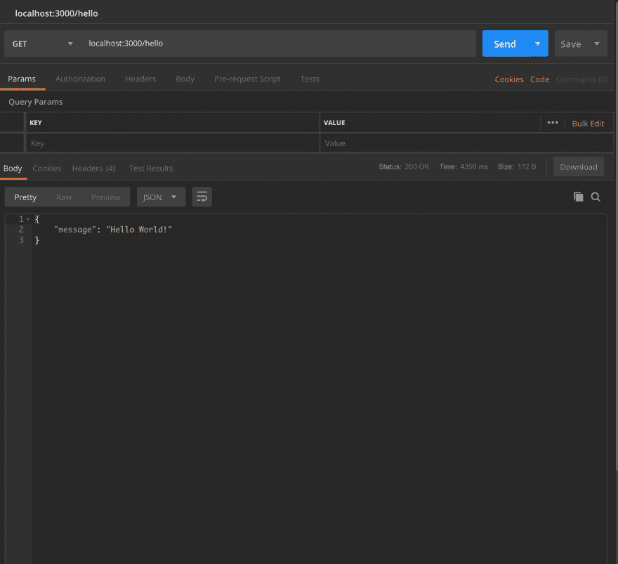
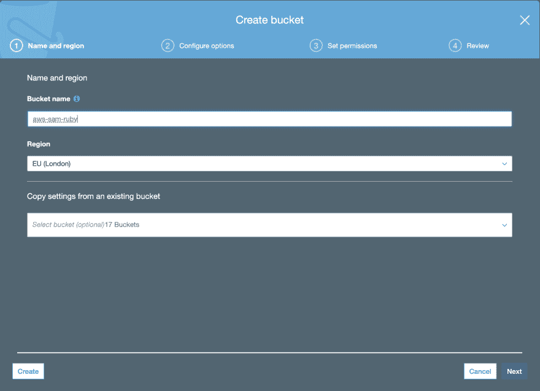
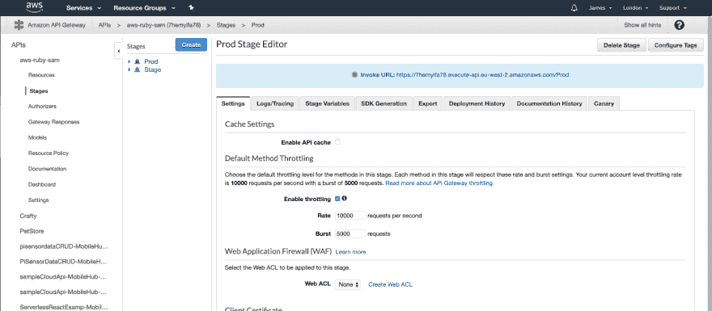
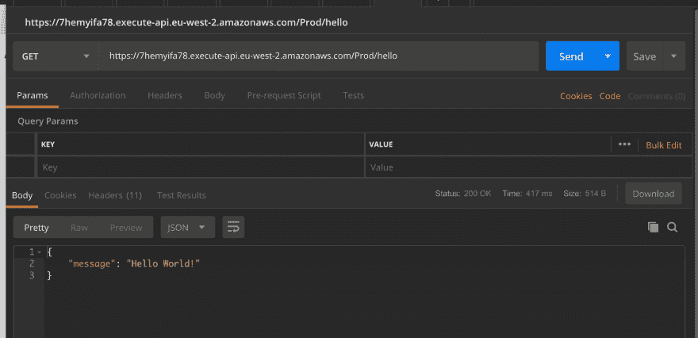

# AWS 山姆和鲁比

> 原文：<https://dev.to/jameshamann/what-is-aws-sam-1cmn>

AWS SAM 代表无服务器应用程序模型，作为在 AWS 上构建无服务器应用程序的框架。这是 Lambda 函数和其他 AWS 资源的集合，它们共同组成了一个应用程序。

虽然您可以上传 lambda 函数，并将 lambda 控制台专用于简单的应用程序，但 SAM 为开发、构建和部署应用程序提供了标准化的模板和流程。

当我发现自己不得不在 docker 容器中使用与 Lambda 相同的映像来捆绑和构建我的 ruby 函数以确保它的兼容性时，我就不再只使用 Lambda 了。随着项目复杂性的增加，这被证明是一件痛苦的事情。SAM 提供了一个更简单的构建和部署解决方案，并提供了一个有助于本地开发的 CLI。

#### 要求

*   AWS 帐户
*   AWS CLI
*   命令行的基本经验
*   ruby 的基本经验
*   码头工人
*   邮递员(不严格要求，但有助于加速开发)

#### 入门

首先，我们需要安装 AWS SAM CLI。我将使用 Homebrew，一个用于 macOS 和 linux 的软件包管理器，如果你在这里使用 windows head 来获得其他说明。

```
#bash
$ brew install aws/tap
[...]
$ brew install 
```

安装完成后，我们可以使用 SAM CLI 来初始化我们的项目。

```
#bash
$ sam init — runtime ruby2.5 — name aws-sam-ruby
[+] Initializing project structure...
Project generated: ./aws-sam-ruby
Steps you can take next within the project folder
===================================================
[*] Invoke Function: sam local invoke HelloWorldFunction --event event.json
[*] Start API Gateway locally: sam local start-api
Read aws-sam-ruby/README.md for further instructions
[*] Project initialization is now complete This would be a good time to commit and push your project, assuming you’ve got a repo setup. It’s always a good idea to commit regularly, with meaningful messages. It helps provide a history of your project and will prove useful later down the line.
#bash 
$ git add .
$ git commit -m 'initialises aws sam ruby project using sam cli'
[master (root-commit) 8b7733d] initialises aws sam ruby project using sam cli
 8 files changed, 697 insertions(+)
 create mode 100644 .gitignore
 create mode 100644 Gemfile
 create mode 100644 README.md
 create mode 100644 event.json
 create mode 100644 hello_world/Gemfile
 create mode 100644 hello_world/app.rb
 create mode 100644 template.yaml
 create mode 100644 tests/unit/test_handler.rb
$ git push origin master 
```

浏览项目目录，注意 CLI 如何生成一个简单项目所需的几乎所有文件和文件夹。它提供了遵循最佳实践的良好基础。

```
# Project Structure
├── Gemfile
├── README.md
├── event.json
├── hello_world
│ ├── Gemfile
│ └── app.rb
├── template.yaml
└── tests
 └── unit
 └── test_handler.rb 
```

现在，使用 SAM CLI，我们能够在本地开发和测试我们的功能。

```
#bash 
$ sam local start-api 
```

一旦完成，服务器将在 localhost:3000 上运行。
这是使用 docker 完成的，CLI 旋转出一个 docker 实例，匹配在 *template.yml* 文件中指定的 lambda 运行时。这确保了您的函数是在与 AWS Lambda 当前使用的 linux 完全相同的版本和构建上进行测试的。捆绑依赖关系时，确保版本正确尤其重要；如果应用程序不是在运行它的平台上构建的，兼容性问题就会出现，你的功能就不会工作。

打开 Postman 并尝试向 localhost:3000 发送一个请求。什么都不对？

[](https://res.cloudinary.com/practicaldev/image/fetch/s--2d-WzG99--/c_limit%2Cf_auto%2Cfl_progressive%2Cq_auto%2Cw_880/https://thepracticaldev.s3.amazonaws.com/i/mpn7klznoctrmuawlti7.png)

这是因为我们的框架应用程序已经设置了一些默认设置。打开 *template.yml* 文件看一下。

```
#template.yml
AWSTemplateFormatVersion: '2010-09-09'
Transform: AWS::Serverless-2016-10-31
Description: >
  aws-sam-ruby
Sample SAM Template for aws-sam-ruby
# More info about Globals: https://github.com/awslabs/serverless-application-model/blob/master/docs/globals.rst
Globals:
  Function:
    Timeout: 3
Resources:
  HelloWorldFunction:
    Type: AWS::Serverless::Function # More info about Function Resource: https://github.com/awslabs/serverless-application-model/blob/master/versions/2016-10-31.md#awsserverlessfunction
    Properties:
      CodeUri: hello_world/
      Handler: app.lambda_handler
      Runtime: ruby2.5
      Events:
        HelloWorld:
          Type: Api # More info about API Event Source: https://github.com/awslabs/serverless-application-model/blob/master/versions/2016-10-31.md#api
          Properties:
            Path: /hello
            Method: get
Outputs:
  # ServerlessRestApi is an implicit API created out of Events key under Serverless::Function
  # Find out more about other implicit resources you can reference within SAM
  # https://github.com/awslabs/serverless-application-model/blob/master/docs/internals/generated_resources.rst#api
  HelloWorldApi:
    Description: "API  Gateway  endpoint  URL  for  Prod  stage  for  Hello  World  function"
    Value: !Sub "https://${ServerlessRestApi}.execute-api.${AWS::Region}.amazonaws.com/Prod/hello/"
  HelloWorldFunction:
    Description: "Hello  World  Lambda  Function  ARN"
    Value: !GetAtt HelloWorldFunction.Arn
  HelloWorldFunctionIamRole:
    Description: "Implicit  IAM  Role  created  for  Hello  World  function"
    Value: !GetAtt HelloWorldFunctionRole.Arn 
```

首先你会注意到这个函数叫做 *HelloWorld* 。你还会看到我们只定义了一条路线，*/你好*。

让我们打开我们的 *app.rb* 文件，看看当我们访问我们的路线 */hello* 时会发生什么。

```
#hello-world/app.rb
# require 'httparty'
require 'json'
def lambda_handler(event:, context:)
  # Sample pure Lambda function
# Parameters
  # ----------
  # event: Hash, required
  #     API Gateway Lambda Proxy Input Format
  #     Event doc: https://docs.aws.amazon.com/apigateway/latest/developerguide/set-up-lambda-proxy-integrations.html#api-gateway-simple-proxy-for-lambda-input-format
# context: object, required
  #     Lambda Context runtime methods and attributes
  #     Context doc: https://docs.aws.amazon.com/lambda/latest/dg/ruby-context.html
# Returns
  # ------
  # API Gateway Lambda Proxy Output Format: dict
  #     'statusCode' and 'body' are required
  #     # api-gateway-simple-proxy-for-lambda-output-format
  #     Return doc: https://docs.aws.amazon.com/apigateway/latest/developerguide/set-up-lambda-proxy-integrations.html
# begin
  #   response = HTTParty.get('http://checkip.amazonaws.com/')
  # rescue HTTParty::Error => error
  #   puts error.inspect
  #   raise error
  # end
{
    statusCode: 200,
    body: {
      message: "Hello World!",
      # location: response.body
    }.to_json
  }
end 
```

看起来很大，但大多是评论。实际的方法非常小，正如你所注意到的，我们应该期待看到 *Hello World* ！在回应中。将来需要注意的一点是，响应必须始终采用上面列出的相同格式和结构，否则在部署函数时会出现一些错误。

让我们试一试。

[](https://res.cloudinary.com/practicaldev/image/fetch/s--hyIFIJhF--/c_limit%2Cf_auto%2Cfl_progressive%2Cq_auto%2Cw_880/https://thepracticaldev.s3.amazonaws.com/i/y61imcv7q90mrwdb5bfd.png)

有用！现在，您可以在本地开发和使用您的应用程序了。

#### 打包和部署

准备就绪后，您将需要部署应用程序。假设您使用过 gems，那么您将希望确保使用带有 lambda-ruby 映像的 docker 容器构建您的应用程序。这是使用 SAM CLI 中的一个命令实现的。

```
#bash 
$ sam build --use-container
2019-06-27 06:37:55 Starting Build inside a container
2019-06-27 06:37:55 Building resource 'HelloWorldFunction'
Fetching lambci/lambda:build-ruby2.5 Docker container image......
2019-06-27 06:37:57 Mounting YOUR_FILE_PATH as /tmp/samcli/source:ro,delegated inside runtime container
Build Succeeded
Built Artifacts  : .aws-sam/build
Built Template   : .aws-sam/build/template.yaml
Commands you can use next
=========================
[*] Invoke Function: sam local invoke
[*] Package: sam package --s3-bucket <yourbucket>
Running RubyBundlerBuilder:CopySource
Running RubyBundlerBuilder:RubyBundle
Running RubyBundlerBuilder:RubyBundleDeployment 
```

现在，我们将创建一个 S3 存储桶来存储我们的部署。这非常有用，因为它可以作为所有不同应用程序版本的日志，如果某个部署出现问题，可以非常快速轻松地恢复到您的 S3 存储桶中存储的先前版本。

[](https://res.cloudinary.com/practicaldev/image/fetch/s--KakCFHb_--/c_limit%2Cf_auto%2Cfl_progressive%2Cq_auto%2Cw_880/https://thepracticaldev.s3.amazonaws.com/i/8jeawy6z1431o3yx25az.png)

要创建 bucket，请到 AWS 控制台搜索 S3。点击*创建 Bucket* ，默认设置就可以了，只要确保给你的 Bucket 起个有用的名字就行，比如你的 app/函数的名字。

[](https://res.cloudinary.com/practicaldev/image/fetch/s--xOd88eGH--/c_limit%2Cf_auto%2Cfl_progressive%2Cq_auto%2Cw_880/https://thepracticaldev.s3.amazonaws.com/i/ejir5bsiaj63wu1cbw8w.png)

完成所有设置后，我们现在将打包我们的应用程序，将其上传到 bucket，然后进行部署。

```
#bash 
$ sam package \
    --template-file template.yaml \ # This is our template file
    --output-template-file serverless-output.yaml \ # This is the template file used with our package, SAM CLI creates a new file based on our template.yml.
    --s3-bucket aws-sam--ruby # Where we upload our package
Successfully packaged artifacts and wrote output template to file serverless-output.yaml.
Execute the following command to deploy the packaged template
aws cloudformation deploy --template-file /Users/jameshamann/Documents/Development/aws-sam-ruby/serverless-output.yaml --stack-name <YOUR STACK NAME> 
```

您将会注意到，一旦 package 命令完成，它将为我们提供运行部署的命令。您可以使用此命令或 sam 的 deploy 命令来完成部署。

```
#bash 
$ sam deploy \
    --template-file serverless-output.yaml \ #Template file generated by our package command.
    --stack-name aws-ruby-sam \ #This is the name of the stack we'll be creating. It creates a cloudformation stack, allowing for easy and quick deployment.
    --capabilities CAPABILITY_IAM
Waiting for changeset to be created...
Waiting for stack create/update to complete Successfully created/updated stack - aws-ruby-sam 
```

现在您的应用程序已上线！打开 AWS API 网关控制台，您应该会看到新的 API！

[](https://res.cloudinary.com/practicaldev/image/fetch/s--vZzZ1iUx--/c_limit%2Cf_auto%2Cfl_progressive%2Cq_auto%2Cw_880/https://thepracticaldev.s3.amazonaws.com/i/qs0pyqhfgurbohhm9mj4.png)

让我们测试一下我们的 API。首先，我们需要端点，打开 API 并单击其中一个阶段,“生产”或“暂存”都可以。您的端点链接将清楚地列在页面的顶部。

[](https://res.cloudinary.com/practicaldev/image/fetch/s--3IOHHoEy--/c_limit%2Cf_auto%2Cfl_progressive%2Cq_auto%2Cw_880/https://thepracticaldev.s3.amazonaws.com/i/gf80ssordgh95h1tuhpr.png)

打开 Postman，向你的 URL 发送一个请求。不要忘记添加您的路径 */hello* 。

[](https://res.cloudinary.com/practicaldev/image/fetch/s--nD-e5j28--/c_limit%2Cf_auto%2Cfl_progressive%2Cq_auto%2Cw_880/https://thepracticaldev.s3.amazonaws.com/i/elgkhjspnjrhblijjjle.png)

现在你知道了！一个全功能的 Ruby 无服务器应用程序，按照最佳实践部署在 AWS 上。现在你可以考虑扩展你的功能，或者使用 React、Vue 或任何你喜欢的框架为它创建一个前端。

所有源代码都可以在[这里](https://github.com/jameshamann/aws-sam-ruby)找到。