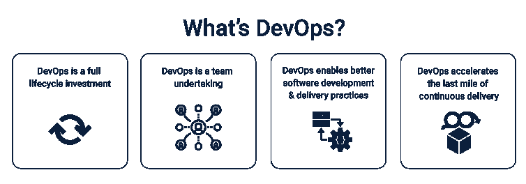

# Devops 是什么？| devo PS 完全指南(带示例)

> 原文：<https://dev.to/cuelogic/what-is-devops-the-complete-guide-to-devops-with-examples-5014>

像亚马逊、塔吉特、Esty、网飞、谷歌和沃尔玛这样的公司有什么共同点？除了他们是非常成功的公司这一事实之外，他们都在日常工作中使用一种叫做 DevOps 的方法来提高效率和缩短交付时间。在本 DevOps 指南中，我们将尝试解释什么是 DevOps，以及它如何为您的企业带来益处。

# **什么是 DevOps，为什么应用这么广泛？**

那么 DevOps 到底是什么？我们举一个假设的小例子来说明。比方说，有一家小型创业公司，生产人工智能清洁机器人。有 3 名开发人员(让我们称他们为团队 D)编写并执行代码来创建机器人，还有两名操作人员(当然是团队 O)维护现实世界环境中的机器人基础设施并为机器人用户提供支持。

D 组刚刚花了 8 个月时间创造了最新的机器人。它可以识别人，接受 Alexa 设备的命令，当然还像老板一样打扫卫生。D 组花了时间在他们的受控开发环境中创建这个机器人，一切似乎都很顺利。他们无比自豪。

他们把他们的作品交给 O 小组，O 小组立即把它带到现实世界。这就是问题开始的时候。原来完美的清洁机器人终究不是那么完美的。它不能识别每个人，当 Alexa 的命令由不同的人发出时，它执行命令的能力就会下降，而且它不能到达和真空处理棘手的货架。

O 队愤怒又沮丧。他们已经等这个机器人很久了，他们无法相信这是一个彻头彻尾的灾难。另一方面，D 队现在处于守势。他们认为，在受控的测试条件下，一切都运行得很好，现在皇家的混乱一定是因为 O 队的糟糕执行。

总之，市场上有一种次优产品，看起来修正和改进需要的时间几乎和产品推出的时间一样长，两个非常有能力的团队现在互相憎恨，憎恨他们的工作。

简而言之，这就是 DevOps 诞生的原因，也是 2016 年超过 70%的 SMB(中小型企业)在其公司中采用 [DevOps 服务](https://www.cuelogic.com/devops-solutions-services)的原因。如果团队 D 和团队 O 从概念、执行到交付和支持都相互合作，那么许多令人心痛、沮丧和低效的事情都可以避免。相反，他们在筒仓里工作，中间隔着一堵虚构的墙。

当机器人进入现实世界并打扫许多不同的房子时，O 组没有参与编写代码和实际建造机器人，而 D 组则完全没有参与。结果是一个没有为市场做好准备的机器人和一个仍然不知道如何解决问题的开发团队。

你可以想象，机器人最终上市还需要很长时间。随着 D 组做出一些改变，O 组将机器人发送到现实世界，将会有许多迭代。不仅仅是在[产品开发](https://www.cuelogic.com/product-development)期间，当机器人需要维护和升级时，同样的问题还会继续。因此，即使是一个小的创业公司最终也会变得低效和缓慢，并且很有可能会输给其他能更快将优质产品推向市场的公司。

这是公司开始看到的问题，尤其是随着技术变得越来越先进。保持他们的操作和开发团队相互隔离导致交付速度变慢，产品和服务效率降低。此外，公司运营中的许多流程本来可以很容易地实现自动化以提高效率，但却没有实现自动化，因为开发人员根本没有意识到这一点。

那时，DevOps 的概念脱颖而出，并开始被广泛采用。DevOps 只不过是一套哲学、实践和工具，通过促进开发和操作功能的集成，帮助组织更快地交付更好的产品。这使得像我们例子中这样的公司能够以更好的方式服务于他们的客户和市场，并具有竞争优势。

这从设计开始，到整个开发过程，直到生产支持。

T3】

## DevOps 是如何进化的？

DevOps 现已进入第 10 个年头。像大多数具有实际应用的哲学和工具一样，DevOps 已经经历了一段旅程，从仅仅是一堆想法和原则一起扔进一个具有自己的过程和工具的成熟学科。

早在 2007 年，一位名叫 Patrick Debois 的项目经理就与比利时政府合作，帮助进行数据中心迁移。他发现整个过程非常令人沮丧，因为开发人员和运营团队之间的障碍使他的工作更加困难，交付速度也更慢。

Debois 是敏捷方法的忠实信徒，敏捷方法在整个开发生命周期中促进开发和测试的持续迭代，这有助于开发团队更快地交付更好的产品。他认为类似的原则应该适用于同步工作的开发和运营团队。

2008 年，安德鲁·斯查费(后来被称为 DevOps 福音传播者)和德博伊斯在一次会议上聚在一起，讨论他们当时称为“敏捷系统管理”的最初想法和原则。他们还在 google 上成立了一个敏捷管理员小组，这是 DevOps 的真正开端。

DevOps 发展史上的另一个里程碑事件是 Flickr 员工 John Allspaw(当时的技术运营副总裁)和 Paul Hammond(当时的工程总监)在 2009 年的 O'Reilly Velocity 大会上的著名演讲。Hammond 和 Allspaw 通过一个有趣而有力的角色扮演，让人们认识到这样一个事实:由于开发和运营之间的障碍，导致了重大的业务损失，唯一的出路是两者之间的无缝集成。

这个演示被称为 DevOps 的“决定性时刻”，因为技术世界很快意识到了这种集成的需要。这次演讲激发了德波在比利时组织了一个名为 Devopsdays 的 DevOps 会议，其余的，正如他们所说的，都是历史了。

DevOps 发展的另一个重要时刻是在美国举行的第一届 DevOps 大会。它于 2010 年在技术圣地加州的山景城举行。这是一个明确的信号，表明 DevOps 已经到了，而且要在这里呆下去。事实上，在 2018 年，全球有超过 30 场 DevOps 会议。

## 使用 DevOps **对组织有什么好处？**

DevOps 看到如此快速的采用的原因是，它确实对一家科技公司如何在非常基础的层面上运营产生了巨大的影响。让我们来看看公司采用 DevOps 方法会带来哪些好处。

**加速创新**

这是 DevOps 存在的主要原因。使用 DevOps 可以让公司更快地开发和部署产品。正如我们在前面的例子中看到的，当开发和运营之间有一堵墙时，周期时间会变得很长。另一方面，当两者集成时，变更集更小，每次要解决的问题也更简单。此外，团队成员可以很容易地修改软件，因为他们只需要查看最新添加的代码，而不是全部。微服务和持续交付之类的东西允许团队完全掌控项目，并更快地交付项目。

**协作**

正如我们的例子所显示的，开发和运营之间的墙经常导致两个团队互不信任，每个团队都有点盲目地四处走动。这对团队的士气以及他们朝着目标努力的积极性有着长期的影响。DevOps 方法导致两个团队之间的协作，他们带着共同的热情工作以实现共同的目标。这创造了一个更加积极的工作环境，可以更快、更有效地取得成果。这也有其他积极的结果，如提高工作满意度和降低流失率。

**可靠性**

在 DevOps 之前，更新应用程序以满足不断变化的用户需求是一场噩梦。更新应用程序总有可能会损害用户要求的质量。有了像持续集成和交付这样的 DevOps 工具，现在测试软件的功能并保持安全性和质量变得很容易。监控和日志记录等其他过程有助于跟踪实时性能指标，从而有助于维护软件的可靠性。

**安全**

如果没有 DevOps，您必须经常在速度和安全性之间做出权衡，这导致交付时间变得更长。借助 DevOps，您可以使用自动化合规性策略、精细控制和配置管理技术来保持速度，而不会影响安全性。

**可扩展性**

随着谷歌、亚马逊和 Youtube 等公司开始发现用一堵墙来分隔开发和运营更难大规模管理他们的技术，DevOps 开始变得越来越重要。DevOps 带来的自动化和一致性允许您更有效地管理和更改复杂的系统。

## **有效开发运维的最佳实践有哪些**

虽然 DevOps 对不同的人来说仍然意味着不同的东西，但是已经出现了一个最佳实践的核心，应该被寻求采用 DevOps 的公司所采纳。

*   **利益相关方的积极参与**

这是 DevOps 的根本指导原则。只有当开发人员、操作和支持人员都真正致力于协作并使用集成方法来实现目标时，开发运维才能成功。

*   **自动化测试**

自动化回归测试是敏捷团队经常采用的东西，因为它有助于立即修复问题并交付更高质量的代码。这在 DevOps 中也工作得很好，因为运营人员的一个迫切需求是交付的代码应该满足一定的质量标准。

*   **集成配置管理**

在 DevOps 环境中，配置管理不仅适用于当前正在处理的解决方案，还适用于解决方案和组织基础设施的其余部分之间的配置问题。集成的配置管理有助于运营团队更清楚地看到新版本的潜在影响，这有助于就何时发布做出更好的决策。

*   **综合变革管理**

有了集成的变更管理，运营和开发团队一起工作，了解使用不同的技术将如何影响整个组织，然后努力管理它。

*   **持续集成**

通过持续集成，每当更新的代码被检入到版本控制系统中时，就对代码进行测试和分析。这提供了对代码缺陷的即时反馈，允许开发人员以很小的风险构建高质量的解决方案。

*   **综合部署规划**

DevOps 方法意味着在按照组织部署时间表规划产品部署时，运营工程师将与开发人员密切合作。

*   **连续部署**

对于连续部署，当一个沙箱中的集成成功时，它会自动提升到下一个沙箱，并在那里开始集成。这种情况一直持续到需要人工验证的时候。这通常发生在从开发到运营的过渡阶段。

*   **生产支持**

使用 DevOps，开发人员不仅可以开发新的版本，还可以用已经投入生产的解决方案解决关键问题。虽然他们是第三个也是最后一个参与解决生产问题的团队，但这是一个相当普遍的现象，并让他们对生产问题有了深入的了解，有助于他们首先设计出更好的解决方案。

*   **应用监控**

这是指在解决方案投入生产后实时监控和记录解决方案的实践。这为我们提供了提高解决方案可靠性和防止故障的性能指标。

*   **自动化仪表板**

DevOps 允许我们为几个关键指标创建自动化仪表板。当然，并非所有指标都是自动化的，但是可以使用自动化仪表板实时查看几个关键指标，它们提供了关键的业务智能。

## **devo PS 工具有哪些？**

为了[实施上述 DevOps 最佳实践](https://www.cuelogic.com/blog/devops-a-team-responsibility-not-just-a-role)，已经开发了某些工具来自动化和促进不同的 DevOps 流程。虽然正确的工具在有效的 DevOps 实施中起着关键作用，但简单地使用工具并不意味着采用 DevOps。工具只有在作为最后一个阶段使用时才是相关的——在组织已经采用了 DevOps 的理念并且承诺执行其最佳实践之后。

虽然 DevOps 不应该是关于工具的，但是随着过去几年的发展，许多不属于最初概念的技术现在已经成为 DevOps 不可或缺的一部分。根据研究公司 Gartner 的说法，如果 DevOps 要带来它想要的变化，一个链接的技术工具链现在已经变得至关重要。近年来，针对不同开发运维实践的开发运维工具激增。这里只是几个例子。

**发布工具**

*   詹金斯
*   特拉维斯
*   TeamCity
*   竹子

**配置管理工具**

*   木偶
*   厨师
*   Ansible
*   Cfengine
*   盐堆

**编排工具**

*   动物园管理员
*   鲨鱼
*   梅索斯

**监控、虚拟化和容器化工具**

*   自动警报系统
*   OpenStack
*   无赖
*   码头工人
*   新遗迹
*   扇子
*   精神
*   纳吉奥斯

**编码工具**

*   吉拉
*   饭桶
*   黯然失色

**测试工具**

*   朱尼特
*   泽法
*   硒
*   无赖
*   索普伊

## **有效采用 DevOps 的关键**

在组织范围内采用 DevOps 是一个危险的过程，因为它需要哲学和文化上的改变，并结合更实际的工具和最佳实践的实现。如果一个组织只是渴望 DevOps 背后的协作和效率哲学，而不做实际执行它的艰苦工作，DevOps 将仍然是一个哲学，仅此而已。

同时，简单地采用 DevOps 实践和工具，而没有贯穿整个组织的哲学和 DevOps 文化也是徒劳的。在您的组织内成功采用 DevOps 的起点应该是让您的开发和运营团队完全致力于这一事业。只有在他们充分参与之后，最佳实践和 DevOps 工具才应该出现。

*最初发表于 [Cuelogic 博客](https://www.cuelogic.com/blog/what-is-devops)T3】*