# 什么是 Python 示例中的动态编程

> 原文：<https://dev.to/brandonskerritt/what-is-dynamic-programming-with-python-examples-420n>

这是动态编程的终极指南。经过数月的提炼，在最短的时间内为您提供最好的知识。
旨在让对算法设计毫无**知识的人阅读。或者谁在算法课上睡着了(拜托，我们都睡着了😉)**

动态规划(DP)是将优化问题分解成更小的子问题，并存储每个子问题的解决方案，以便每个子问题只解决一次。

它既是一种[数学优化](https://en.wikipedia.org/wiki/Mathematical_optimization)方法，也是一种计算机编程方法。

*优化问题*求最大或最小解。动态规划经常用于优化问题。一般规则是，如果你遇到一个初始算法在 2 <sup>n</sup> 时间内解决的问题，使用 DP 可能会更好。
[](https://b.ck.page)

* * *

### 动态编程为什么叫动态编程？

理查德·贝尔曼在 20 世纪 50 年代发明了 DP。[贝尔曼将其命名为动态编程](https://en.wikipedia.org/wiki/Dynamic_programming#History)，因为当时兰德(他的雇主)不喜欢数学研究，也不想资助它。他将其命名为动态编程，以隐藏他实际上是在做数学研究的事实。

贝尔曼在他的自传《飓风之眼:自传》(1984 年，第 159 页)中解释了术语动态编程背后的推理。他解释道:

> “我在兰德度过了(1950 年的)秋季。我的第一个任务是为多阶段决策过程找一个名字。一个有趣的问题是，动态编程这个名字是怎么来的？20 世纪 50 年代不是数学研究的好年头。在华盛顿，我们有一位非常有趣的绅士，名叫威尔逊。他是国防部长，他实际上对研究这个词有一种病态的恐惧和憎恨。我不会轻易使用这个术语；我正在精确地使用它。如果人们当着他的面用“研究”这个词，他会脸红，变红，变得暴躁。你可以想象他对数学这个术语的感受。兰德公司受雇于空军，而空军实际上是以威尔逊为老板的。因此，我觉得我必须做点什么来保护威尔逊和空军，不让他们知道我确实在兰德公司内部做数学研究。我能选择什么头衔，什么名字？首先，我对计划、决策和思考感兴趣。但是规划，由于种种原因，并不是一个好词。因此，我决定使用“编程”一词。我想让大家明白这是动态的，是多阶段的，是时变的。我想，一石二鸟吧。让我们用一个在经典物理意义上有绝对精确含义的词，即动态。作为一个形容词，它还有一个非常有趣的特性，那就是不能用贬义来形容动态这个词。试着想出一些可能赋予它贬义的组合。不可能的。因此，我认为动态编程是一个好名字。这是连国会议员都不会反对的事情。所以我把它当成了我活动的保护伞。”

* * *

## 什么是子问题？

[](https://res.cloudinary.com/practicaldev/image/fetch/s--70trSsdB--/c_limit%2Cf_auto%2Cfl_progressive%2Cq_auto%2Cw_880/https://skerritt.blog/conteimg/2019/06/undraw_process_e90d.svg)

子问题是原始问题的较小版本。让我们看一个例子。用下面的等式:

1 + 2 + 3 + 4

我们可以将其分解为:

1 + 2

3 + 4

一旦我们解决了这两个较小的问题，我们可以将这些问题的解决方案相加，以找到整体问题的解决方案。

请注意这个子问题是如何将原始问题分解成构建解决方案的组件的。虽然这是一个小例子，但它很好地说明了 DP 的妙处。如果我们把问题扩展到把 100 个数字相加，那么我们为什么需要 DP 就变得更清楚了。举个例子:

6 + 5 + 3 + 3 + 2 + 4 + 6 + 5

我们有两次 6 + 5。我们第一次算出 6 + 5 是多少。当我们第二次看到它时，我们对自己说:

> “啊，6 + 5。我以前见过这个。都 11 了！”

在 DP 中，我们将问题的解存储在内存中，因此不需要重新计算。通过找到每一个子问题的解决方案，我们可以解决原始问题本身。

储存溶液的行为叫做*记忆*。

* * *

## 什么是动态编程中的记忆化？

[](https://res.cloudinary.com/practicaldev/image/fetch/s--Ev_I23nt--/c_limit%2Cf_auto%2Cfl_progressive%2Cq_auto%2Cw_880/https://skerritt.blog/conteimg/2019/06/undraw_task_31wc.svg)

首先，让我们看看为什么存储解决方案的答案是有意义的。我们要看一个著名的分而治之问题， *[斐波那契数列](https://www.mathsisfun.com/numbers/fibonacci-sequence.html)* 。[分而治之](https://dev.to/brandonskerritt/a-gentle-introduction-to-divide-and-conquer-algorithms-1ga)是动态编程，但是没有存储解。

[分而治之](https://dev.to/brandonskerritt/a-gentle-introduction-to-divide-and-conquer-algorithms-1ga)有 3 个主要部分:

1.  **把**问题分成同类型的更小的子问题。
2.  **征服**——递归求解子问题。
3.  **合并**——合并所有子问题，创建原问题的解决方案。

动态编程在第二步中增加了一个额外的步骤。这是记忆。

斐波那契数列是一个数列。是最后一个号码+当前号码。我们从 1 点开始。

1 + 0 = 1

1 + 1 = 2

2 + 1 = 3

3 + 2 = 5

5 + 3 = 8

在 Python 中，这通常被编程为:

```
def F(n):
  if n == 0 or n == 1:
    return n
  else:
return F(n-1)+F(n-2) 
```

如果你不熟悉递归，我为你写了一篇博文，你应该先看看。

我们来计算 F(4)。在执行树中，如下所示:

[](https://res.cloudinary.com/practicaldev/image/fetch/s--nVwcEfZi--/c_limit%2Cf_auto%2Cfl_progressive%2Cq_auto%2Cw_880/https://skerritt.blog/conteimg/2019/06/image-8.png)

我们计算 F(2)两次。这可能是一个小例子，但是在更大的输入(例如 F(10))上，重复建立。动态编程的目的是不要两次计算同一个东西。

我们不是计算 F(2)两次，而是把解存储在某个地方，只计算一次。

我们将把解存储在一个数组中。F(2) = 1。我们的数组将看起来像 memo[2] = 1。下面是一些使用 DP 计算 Fibbonacci 序列的 Python 代码。

```
def fibonacciVal(n):
    memo[0], memo[1] = 0, 1
    for i in range(2, n+1):
        memo[i] = memo[i-1] + memo[i-2]
    return memo[n] 
```

这里列出的例子是用 Python 编写的。我会尽最大努力保持代码的不可知论。也就是说，如果你想用 Java 来编程，转换它应该不会太难。

* * *

## 如何识别动态规划问题

[](https://res.cloudinary.com/practicaldev/image/fetch/s--7HLijuGs--/c_limit%2Cf_auto%2Cfl_progressive%2Cq_auto%2Cw_880/https://skerritt.blog/conteimg/2019/06/undraw_file_searching_duff.svg) 
理论上，每一个问题都可以动态解决。接下来的问题是:

> "我应该什么时候用动态编程解决这个问题？"

我们应该使用动态规划来解决处于可处理问题和 T2 问题之间的问题。

*[易处理的问题](https://www.britannica.com/technology/tractable-problem)* 是那些可以在多项式时间内解决的问题。这只是我们可以快速解决问题的一种花哨说法。二分搜索法和排序，都很快。 *[棘手的问题](https://www.umsl.edu/~siegelj/information_theory/classassignments/Lombardo/04_intractableproblems.html)* 是那些以指数时间运行的问题。他们很慢。一般来说，棘手的问题是那些只能通过强行通过每一个组合来解决的问题。

当我们看到这样的术语时:

> 最短/最长、最小化/最大化、最小/最大、最少/最大、最大/最小

我们知道这是一个优化问题。

DP 算法的另一个很酷的地方是它们的正确性证明通常是不言而喻的。其他算法策略通常很难证明是正确的，因此更容易出错。

例如，贪婪算法可能在概念上看起来更简单，并且通常运行得更快，但是它们很难被证明是正确的，因为它们需要对输入的结构做出许多隐含的假设。

当我们看到这些术语时，问题可能会要求一个特定的数字(“找到编辑操作的最小数量”)或者它可能会要求一个结果(“找到最长的公共子序列”)。后一种类型的问题很难被认为是动态规划问题。如果事情听起来像优化，它可以通过 DP 解决。

现在，假设我们已经发现了一个优化问题，但是我们不确定它是否可以用 DP 解决。首先，确定我们在优化什么。一旦我们意识到我们在优化什么，我们必须决定执行优化有多容易。有时，[贪婪方法](https://brilliant.org/wiki/greedy-algorithm/)对于最优解来说是足够的。

动态编程采用强力方法。它识别重复的工作，并消除重复。

在我们开始将问题公式化为动态编程问题之前，我们想一想强力解决方案可能是什么样子。在暴力解决方案中可能有重复的子步骤吗？如果是这样的话，我们尝试把这个问题公式化为一个动态规划问题。

掌握动态编程就是要理解问题。列出所有可能影响答案的输入。一旦我们确定了所有的输入和输出，试着确定这个问题是否可以分解成子问题。如果我们能识别子问题，我们可能会使用 DP。

列出所有影响答案的输入，然后再考虑如何缩小这个集合。一旦我们确定了输入和输出，我们就试图确定这个问题是否可以分解成更小的子问题。如果我们能找出更小的子问题，那么我们就可能应用动态规划来解决问题。然后，搞清楚什么是复发，解决它。当我们试图找出循环时，记住无论我们写什么循环，都有助于我们找到答案。有时答案是递归的结果，有时我们必须通过查看递归的几个结果来获得结果

仅仅因为一个问题可以用动态编程来解决，并不意味着没有更有效的解决方案。用动态编程解决问题就像变魔术一样，但是请记住，动态编程仅仅是一种巧妙的蛮力。有时回报很好，有时帮助很小。
[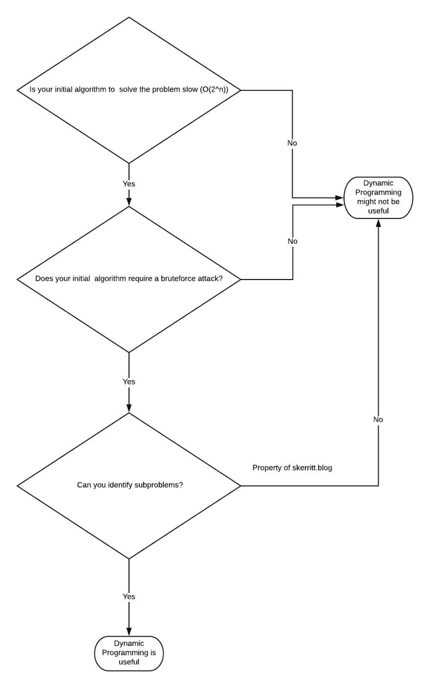T3】](https://res.cloudinary.com/practicaldev/image/fetch/s--By_e2Htv--/c_limit%2Cf_auto%2Cfl_progressive%2Cq_auto%2Cw_880/https://skerritt.blog/conteimg/2019/06/dynamic-Programming-Process.png)

* * *

## 如何利用动态规划解决问题

[](https://res.cloudinary.com/practicaldev/image/fetch/s--jviuFpg7--/c_limit%2Cf_auto%2Cfl_progressive%2Cq_auto%2Cw_880/https://skerritt.blog/conteimg/2019/06/undraw_problem_solving_ft81.svg)

现在我们已经了解了什么是动态编程以及它通常是如何工作的，让我们看看我们将如何创建一个问题的动态编程解决方案。我们将利用 *[加权区间调度问题](https://courses.cs.washington.edu/courses/cse521/13wi/slides/06dp-sched.pdf)* 来探讨动态规划的过程。

假设你是一家干洗店的老板。你有 n 个顾客进来给你衣服让你洗。您一次只能清洗一件顾客衣物(PoC)。每堆衣服 *i* 必须在某个预定的开始时间 s_i 和某个预定的结束时间 f_i 被清洁

每一堆衣服都有一个分配值，v_i，基于它对你的生意有多重要。例如，一些顾客可能会花更多的钱让他们的衣服洗得更快。或者有些人可能是回头客，你希望他们开心。

作为这家干洗店的老板，你必须确定衣服的最佳时间表，使这一天的总价值最大化。这个问题是对*加权区间调度问题*的改写。

现在，您将看到解决 DP 问题的 4 个步骤。有时候，你可以跳过一步。有时候，你的问题已经被很好地定义了，你不需要担心最初的几个步骤。

## 第一步。把问题写出来

[](https://res.cloudinary.com/practicaldev/image/fetch/s--dAe_71e6--/c_limit%2Cf_auto%2Cfl_progressive%2Cq_auto%2Cw_880/https://skerritt.blog/conteimg/2019/06/undraw_typewriter_i8xd.svg)

拿一张纸。把问题写出来。具体来说:

*   有什么问题？
*   有哪些子问题？
*   解决方案大概是什么样的？

在干洗店的问题中，让我们用文字来表达这些子问题。我们要确定的是每堆衣服的最大值时间表，以便衣服按开始时间排序。

为什么按开始时间排序？好问题！我们希望跟踪当前正在运行的进程。如果按完成时间排序，在我们脑子里没多大意义。我们可以有两个相似的结束时间，但完全不同的开始时间。时间以线性方式移动。如果我们有一堆下午 1 点开始的衣服，我们就知道了。如果我们有一堆下午 3 点就完成的衣服，那就有点看反了。没什么意义。

我们可以找到桩 n-1 到 n 的最大值表，然后找到桩 n - 2 到 n 的最大值表，依此类推。通过找到每一个子问题的解决方案，我们可以解决原始问题本身。桩 1 至 *n* 的最大值一览表。由于子问题是原始问题的较小版本，所以子问题可以用来解决原始问题。

对于区间调度问题，我们可以解决它的唯一方法是通过强制问题的所有子集，直到我们找到一个最优子集。我们要说的是，我们不是一个一个地强制，而是把它分开。我们从 n-1 到 n 进行强力运算。然后我们对 n-2 到 n 进行同样的运算。最后，我们有许多小问题，我们可以动态地解决它们。我们希望建立子问题的解决方案，这样每个子问题都建立在前面的问题之上。

## 2。数学递归

[](https://res.cloudinary.com/practicaldev/image/fetch/s--HkcQJcXA--/c_limit%2Cf_auto%2Cfl_progressive%2Cq_auto%2Cw_880/https://skerritt.blog/conteimg/2019/06/undraw_mathematics_4otb.svg) 
我知道，数学烂透了。如果你愿意和我坦诚相待，你会发现这并不难。[数学递归](https://en.wikipedia.org/wiki/Recurrence_relation)用于:

> 定义分治(动态编程)技术的运行时间

但是，在你我之间，它们也可以用来定义一个问题。如果很难把你的子问题转化成数学，那么它可能是错误的子问题。

创建 mathematicla 递归有两个步骤:

### 1:定义基础案例

基本案例是问题的最小可能命名。

创建重复时，问自己以下问题:

> "我在第 0 步做什么决定？"

不一定是 0。基本情况是问题的最小可能命名。我们在斐波那契数列中看到了这一点。碱被洗涤:

*   如果 n == 0 或 n == 1，则返回 1

知道基础案例在哪里很重要，这样我们就可以创建递归。在我们的问题中，我们有一个决定要做:

*   把那堆衣服放上去洗

或者

*   今天不要洗那堆衣服

如果 n 是 0，也就是说，如果我们有 0 个 PoC，那么我们什么也不做。我们的基本情况是:

> 如果 n == 0，则返回 0

### 2:我在第 n 步做什么决定？

现在我们知道基本情况是什么，如果我们在第 n 步，我们做什么？对于到目前为止与时间表兼容的每堆衣服(兼容是指开始时间在当前正在洗的那堆衣服的结束时间之后)，算法选择两个选项。

现在我们知道了基本情况下会发生什么，以及其他情况下会发生什么。我们现在需要找出算法向后(或向前)需要什么信息。

> “如果我的算法在第一步，它需要什么信息来决定在第一步+1 做什么？”

为了在两个选项之间做出决定，算法需要知道下一个兼容的 PoC(一堆衣服)。给定堆 p 的下一个兼容 PoC 是 PoC n，使得 s _ n(PoC n 的开始时间)发生在 for PoC p 的结束时间)之后。s_n 和 f_p 之间的差异应该最小化。

在英语中，想象我们有一台洗衣机。我们在 13:00 放进一堆衣服。我们下一堆衣服从 13:01 开始。我们不能打开洗衣机把它们放进去。我们下一个兼容的衣物堆是在当前正在洗涤的衣物的结束时间之后开始的衣物堆。

> “如果我的算法处于步骤 I，它需要什么信息来决定在步骤 i-1 中做什么？”

算法需要知道未来的决策。为 PoC *i* 到 *n* 制作的，以决定运行或不运行 PoC *i-1* 。

既然我们已经回答了这些问题，也许我们已经开始在脑海中形成一个循环的数学决策。如果不是，那也没关系，当我们接触到更多的问题时，写递归就变得更容易了。

这是我们的重现:

[](https://res.cloudinary.com/practicaldev/image/fetch/s--fMcJO2DY--/c_limit%2Cf_auto%2Cfl_progressive%2Cq_auto%2Cw_880/https://skerritt.blog/conteimg/2019/06/Screenshot_2019-06-23-What-Is-Dynamic-Programming-With-Python-Examples.png)

让我们来详细探讨是什么使得这种数学递归。OPT(i)表示 PoC *i* 到 *n* 的最大值调度，使得 PoC 按开始时间排序。OPT(i)是我们前面的子问题。

我们从基础案例开始。所有的复发都需要一个停止的地方。如果我们调用 OPT(0 ),我们将返回 0。

为了确定 OPT(i)的值，我们考虑两个选项。我们希望最大限度地利用这些选项来实现我们的目标。我们的目标是所有衣服堆的*最大值计划表*。一旦我们在步骤*I*选择了给出最大结果的选项，我们将其值记为 OPT(i)。

运行或不运行 PoC i 这两个选项在数学上表示如下:

v_i + OPT(下一个[n])

这表示决定运行 PoC i。它将从 PoC i 获得的值添加到 OPT(next[n])，其中 next[n]表示 PoC i 之后的下一个兼容衣物堆。当我们将这两个值相加时，我们将获得从 I 到 n 的最大值计划，这样，如果运行 I，它们将按开始时间排序。

这里按开始时间排序因为 next[n]是紧接在 v_i 之后的一个，所以默认情况下，它们是按开始时间排序的。

OPT(i + 1)

如果我们决定不运行 *i* ，那么我们的值就是 OPT(i + 1)。没有获得价值。OPT(i + 1)给出了从 i + 1 到 n 的最大值时间表，因此它们按开始时间排序。

## 3。确定记忆数组的尺寸和填充方向

我们的 DP 问题的解决方案是 OPT(1)。我们可以将解决方案写成 PoC 1 到 n 的最大值时间表，以便 PoC 按开始时间排序。这与“PoC i 到 n 的最大价值计划”密切相关。我们的解可以写成 OPT(1)。

从步骤 2 开始:

[](https://res.cloudinary.com/practicaldev/image/fetch/s--jRx9zQwN--/c_limit%2Cf_auto%2Cfl_progressive%2Cq_auto%2Cw_880/https://skerritt.blog/conteimg/2019/06/image-13.png)

回到前面的斐波那契数列，我们的 DP 解决方案依赖于这样一个事实，即从 0 到 n - 1 的斐波那契数列已经被存储。也就是说，为了找到 F(5)，我们已经记住了 F(0)，F(1)，F(2)，F(3)，F(4)。我们想在这里做同样的事情。

我们的问题是弄清楚如何填写记忆表。在调度问题中，我们知道 OPT(1)依赖于 OPT(2)和 OPT(next[1])的解。由于排序的原因，PoC 2 和 next[1]的开始时间在 PoC 1 之后。我们需要从 OPT(n)到 OPT(1)填充我们的记忆表。

我们可以清楚地看到我们的数组是一维的，从 1 到 n。但是，如果我们不能清楚地看到，我们可以用另一种方法来解决它。数组的维数等于 OPT(x)所依赖的变量的数量和大小。在我们的算法中，我们有 OPT(i) -一个变量，I。这意味着我们的数组将是一维的，它的大小将是 n，因为有 n 堆衣服。

如果我们知道 *n* = 5，那么我们的记忆数组可能是这样的:

memo = [0，OPT(1)，OPT(2)，OPT(3)，OPT(4)，OPT(5)]

0 也是基本情况。memo[0] = 0，根据我们之前的重复。

## 4。编写我们的解决方案

就我个人而言，当我编写动态编程解决方案时，我喜欢阅读递归并尝试重新创建它。我们的第一步是将数组初始化为大小(n + 1)。在 Python 中，我们不需要这样做。但是如果你使用不同的语言，你可能需要这样做。

我们的第二步是设置基本情况。

求包含工作[i]的利润。我们需要找到与 job[i]不冲突的最新工作。这个想法是利用二分搜索法找到最新的不冲突的工作。我从这里复制了[的代码，但稍加编辑。](https://www.geeksforgeeks.org/weighted-job-scheduling-log-n-time/)

首先，我们来定义一下什么是“工作”。正如我们所见，工作由三部分组成:

```
# Class to represent a job class Job: 
    def __init__ (self, start, finish, profit): 
        self.start = start 
        self.finish = finish 
        self.profit = profit 
```

开始时间、完成时间和运行该作业的总利润(收益)。

我们要编程的下一步是时间表。

```
# The main function that returns the maximum possible 
# profit from given array of jobs def schedule(job): 
    # Sort jobs according to start time 
    job = sorted(job, key = lambda j: j.start) 

    # Create an array to store solutions of subproblems. table[i] 
    # stores the profit for jobs till arr[i] (including arr[i]) 
    n = len(job) 
    table = [0 for _ in range(n)] 

    table[0] = job[0].profit; 
```

前面，我们学习了表格是一维的。我们按开始时间对作业进行排序，创建这个空表，并将表[0]设置为作业[0]的利润。因为我们已经按开始时间排序，所以第一个兼容的作业总是作业[0]。

我们的下一步是使用我们之前学过的递归来填充条目。为了找到下一个合适的工作，我们使用二分搜索法。在随后发布的完整代码中，它将包括这一点。现在，让我们担心理解算法。

如果下一个兼容作业返回-1，这意味着索引 I 之前的所有作业都与它冲突(因此不能使用)。Inclprof 表示我们将该项目包含在最大值集中。然后我们将它存储在表[i]中，这样我们以后可以再次使用这个计算。

```
 # Fill entries in table[] using recursive property 
    for i in range(1, n): 

        # Find profit including the current job 
        inclProf = job[i].profit 
        l = binarySearch(job, i) 
        if (l != -1): 
            inclProf += table[l]; 

        # Store maximum of including and excluding 
        table[i] = max(inclProf, table[i - 1]) 
```

我们的最后一步是返回所有项目的利润，直到 n-1。

```
 return table[n-1] 
```

完整代码如下所示:

```
# Python program for weighted job scheduling using Dynamic 
# Programming and Binary Search 
# Class to represent a job class Job: 
    def __init__ (self, start, finish, profit): 
        self.start = start 
        self.finish = finish 
        self.profit = profit 

# A Binary Search based function to find the latest job 
# (before current job) that doesn't conflict with current 
# job. "index" is index of the current job. This function 
# returns -1 if all jobs before index conflict with it. def binarySearch(job, start_index): 
    # https://en.wikipedia.org/wiki/Binary_search_algorithm 
    # Initialize 'lo' and 'hi' for Binary Search 
    lo = 0
    hi = start_index - 1

    # Perform binary Search iteratively 
    while lo <= hi: 
        mid = (lo + hi) // 2
        if job[mid].finish <= job[start_index].start: 
            if job[mid + 1].finish <= job[start_index].start: 
                lo = mid + 1
            else: 
                return mid 
        else: 
            hi = mid - 1
    return -1

# The main function that returns the maximum possible 
# profit from given array of jobs def schedule(job): 
    # Sort jobs according to start time 
    job = sorted(job, key = lambda j: j.start) 

    # Create an array to store solutions of subproblems. table[i] 
    # stores the profit for jobs till arr[i] (including arr[i]) 
    n = len(job) 
    table = [0 for _ in range(n)] 

    table[0] = job[0].profit; 

    # Fill entries in table[] using recursive property 
    for i in range(1, n): 

        # Find profit including the current job 
        inclProf = job[i].profit 
        l = binarySearch(job, i) 
        if (l != -1): 
            inclProf += table[l]; 

        # Store maximum of including and excluding 
        table[i] = max(inclProf, table[i - 1]) 

    return table[n-1] 

# Driver code to test above function job = [Job(1, 2, 50), Job(3, 5, 20), 
    Job(6, 19, 100), Job(2, 100, 200)] 
print("Optimal profit is"), 
print(schedule(job)) 
```

恭喜你。🥳:我们刚刚编写了第一个动态程序！既然我们已经湿了脚，让我们走过一个不同类型的动态编程问题。

* * *

# 背包问题

想象你是一个罪犯。卑鄙的聪明。你闯入比尔盖茨的豪宅。哇，好吧！？！？这是几个房间？他的洗衣机房比我整个房子都大？？？好了，是时候停止分心了。你带了一个小包。一个背包-如果你愿意的话。

你只能装这么多。让我们给它一个任意的数字。这个包只能承重 15 磅，不能再重了。我们想做的是最大化我们能赚多少钱。

贪婪的方法是挑选能装进包里的价值最高的物品。让我们试试那个。我们要偷比尔·盖茨的电视。4000?很好。但是他的电视重 15 磅。因此...我们带着 4000 美元离开。

比尔盖茨有很多手表。假设他有两块手表。每只手表重 5 英镑，每只价值 2250 英镑。当我们两个都偷的时候，我们得到 4500，权重为 10。

在贪婪的方法中，我们不会首先选择这些手表。但是对我们人类来说，选择价值更高的小商品是有意义的。贪婪方法不能最优地解决{0，1}背包问题。{0，1}表示我们要么接受整个项目{1}，要么不接受{0}。然而，动态规划可以最优地解决{0，1}背包问题。

这个问题的简单解决方案是考虑所有项目的所有子集。对于比尔盖茨物品的每一个组合，我们都要计算这个组合的总重量和价值。

我们只考虑重量小于 W_max 的那些。然后，我们选择具有最高价值的组合。这是一场灾难！这需要多长时间？比尔·盖茨会在你还没走完三分之一的路程时就回来了！在大 O 中，这个算法耗时 O(n <sup>2)</sup> 时间。

你可以看到我们已经有了一个粗略的解决方案和问题是什么，而不必用数学写下来！

* * *

## 数学

想象一下，我们有一份比尔·盖茨家里所有东西的清单。也许我们从一些保险文件里偷的。现在，想想未来。这个问题的最优解是什么？

我们有一个子集，L，它是最优解。l 是 S 的子集，S 包含了比尔·盖茨所有的东西。

让我们随机选择一个项目，N. L 要么包含 N，要么不包含。如果不使用 N，问题的最优解与{1，2，...，N-1}。这是假设比尔盖茨的东西是按价值/重量排序的。

假设原问题的最优不是子问题的最优。如果我们有较小问题的次优解，那么我们就有了矛盾——我们应该有整个问题的最优解。

如果 L 包含 N，那么问题的最优解与{1，2，3，...，N-1}。我们知道这个项目在里面，所以 L 已经包含了 n。为了完成计算，我们把注意力放在剩下的项目上。我们找到剩余项目的最佳解决方案。

但是，我们现在有了一个新的最大允许重量 W_max - W_n。如果 N 项包含在解决方案中，则总重量现在是最大重量减去 N 项(它已经在背包中)。

这是两个案例。N 项要么是最优解，要么不是。

如果物品 N 的重量大于 W_max，则它不能被包括在内，因此情况 1 是唯一的可能性。

为了更精确地定义这个递归解，让 S_k = {1，2，...，k}和 S_0 = ∅

设 B[k，w]是使用 S_k 的子集获得的最大总收益

然后我们为每个 w \le W_max 定义 B[0，w] = 0，并且:

我们期望的解是 B[n，W_max]。

[](https://res.cloudinary.com/practicaldev/image/fetch/s--70Anj0nA--/c_limit%2Cf_auto%2Cfl_progressive%2Cq_auto%2Cw_880/https://skerritt.blog/conteimg/2019/06/image-14.png)

### 背包问题的制表

好的，拿出一些纸和笔。不，真的。事情很快就会变得混乱。这个记忆表是二维的。我们有这些项目:

```
(1, 1), (3, 4), (4, 5), (5, 7) 
```

其中元组是`(weight, value)`。

我们有两个变量，所以我们的数组是二维的。第一维是从 0 到 7。我们的第二个维度是价值观。

我们想要一个 7 的重量来获得最大的利益。

[](https://res.cloudinary.com/practicaldev/image/fetch/s--MtxHbQOT--/c_limit%2Cf_auto%2Cfl_progressive%2Cq_auto%2Cw_880/https://skerritt.blog/conteimg/2019/06/image-15.png)

重量是 7。我们从 0 开始计数(不是 DP 的事情，只是编程的事情)。我们把每个元组放在左边。好的。现在来填表格！

[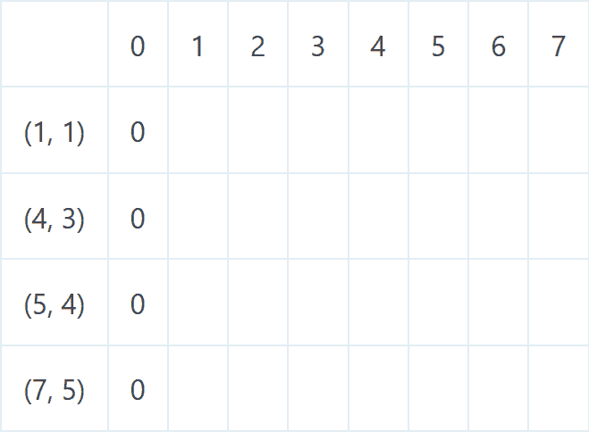](https://res.cloudinary.com/practicaldev/image/fetch/s--FdO_PVP3--/c_limit%2Cf_auto%2Cfl_progressive%2Cq_auto%2Cw_880/https://skerritt.blog/conteimg/2019/06/image-16.png)

这些柱子很重。权重为 0 时，总权重为 0。权重为 1 时，总权重为 1。很明显，我知道。但这是一个重要的区别，以后会很有用。

当我们的体重为 0 时，无论如何都不能携带任何东西。0 处所有东西的总重量是 0。

[](https://res.cloudinary.com/practicaldev/image/fetch/s--_bz0d7Cm--/c_limit%2Cf_auto%2Cfl_progressive%2Cq_auto%2Cw_880/https://skerritt.blog/conteimg/2019/06/image-17.png)

如果我们的总重量是 1，我们能拿的最好的项目是(1，1)。当我们沿着这个数组往下走的时候，我们可以得到更多的东西。在(4，3)行，我们可以选择(1，1)或(4，3)。但目前只能取(1，1)。这一行的最大收益是 1。

[](https://res.cloudinary.com/practicaldev/image/fetch/s--A6j0i15L--/c_limit%2Cf_auto%2Cfl_progressive%2Cq_auto%2Cw_880/https://skerritt.blog/conteimg/2019/06/image-18.png)

如果我们的总重量是 2，我们最多只能得到 1。每种产品我们只有一个。我们不能复制项目。所以不管我们在第 1 行的哪个位置，我们能做的绝对最好的是(1，1)。

现在开始用(4，3)吧。如果总重量是 1，但是(4，3)的重量是 3，我们就不能拿这个物品，直到我们的重量至少是 3。

[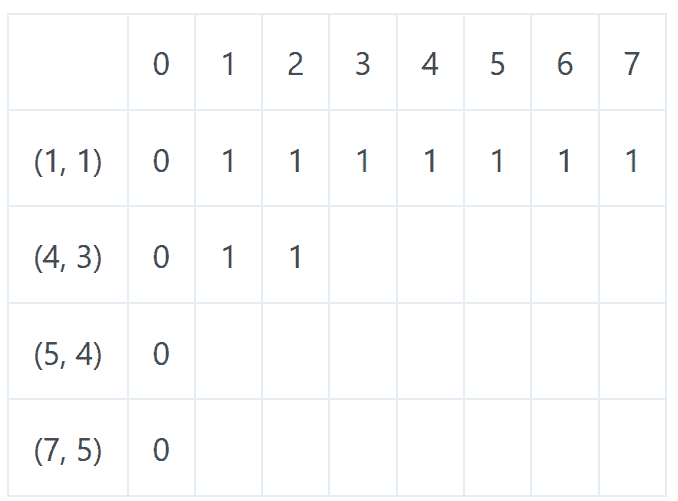](https://res.cloudinary.com/practicaldev/image/fetch/s--aG-rs8Yt--/c_limit%2Cf_auto%2Cfl_progressive%2Cq_auto%2Cw_880/https://skerritt.blog/conteimg/2019/06/image-19.png)

现在我们的权重是 3。我们来对比一些东西。我们想充分利用:

最大值(4 + T[0][0]，1)

如果我们在 2，3，我们可以从最后一行取值或者使用那一行的项目。我们往上走一行，往回数 3(因为这个物品的权重是 3)。

实际上，这个公式就是当我们减去那一行中物品的重量后剩下的重量。(4，3)的权重是 3，我们的权重是 3。3 - 3 = 0.因此，我们在 T[0][0]。t[前一行的编号][当前总重量-物品重量]。

最大值(4 + T[0][0]，1)

1 是因为前一项。这里的最大值是 4。

[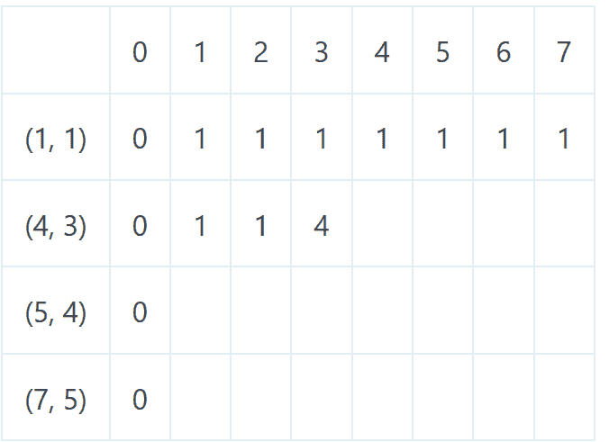](https://res.cloudinary.com/practicaldev/image/fetch/s--IdX8k3A7--/c_limit%2Cf_auto%2Cfl_progressive%2Cq_auto%2Cw_880/https://skerritt.blog/conteimg/2019/06/image-20.png)

最大值(4 + t[0][1]，1)

总重量为 4，项目重量为 3。4 - 3 = 1.前一行是 0。t[0][1]。

[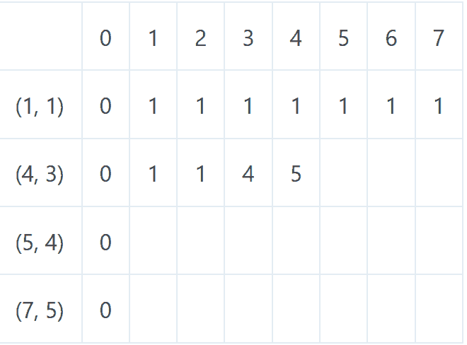](https://res.cloudinary.com/practicaldev/image/fetch/s--EXSAqKnv--/c_limit%2Cf_auto%2Cfl_progressive%2Cq_auto%2Cw_880/https://skerritt.blog/conteimg/2019/06/image-21.png)

我不会用这一排的其他人来烦你，因为没有什么令人兴奋的事情发生。我们有两个项目。我们用它们做了 5 个。因为没有新项目，所以最大值为 5。

[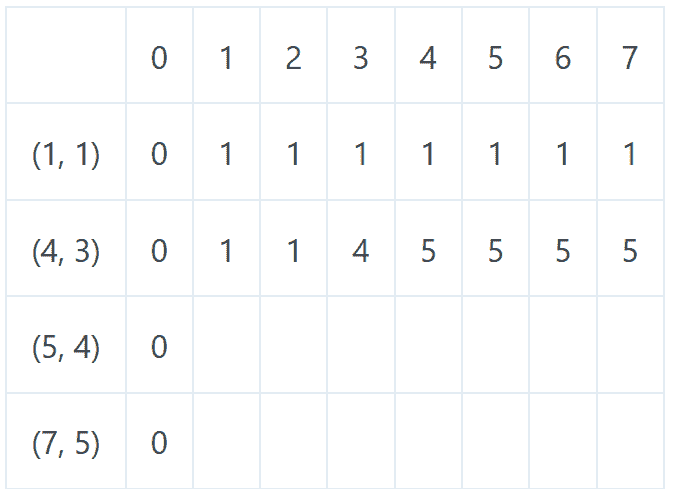](https://res.cloudinary.com/practicaldev/image/fetch/s--vfe19CPU--/c_limit%2Cf_auto%2Cfl_progressive%2Cq_auto%2Cw_880/https://skerritt.blog/conteimg/2019/06/image-22.png)

下一排:

[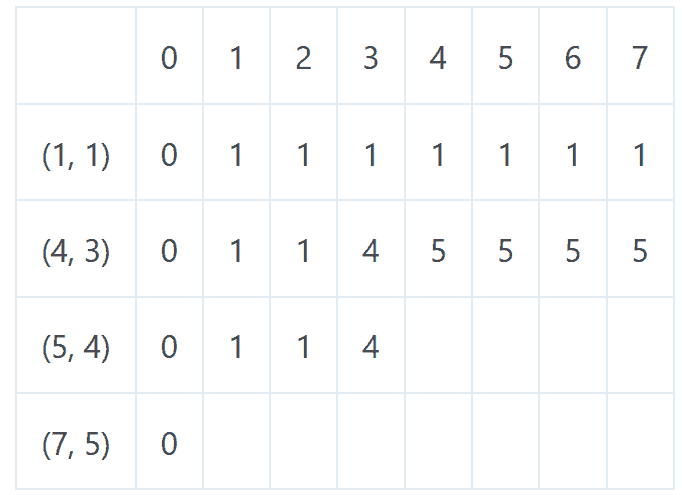](https://res.cloudinary.com/practicaldev/image/fetch/s--MNI0M21E--/c_limit%2Cf_auto%2Cfl_progressive%2Cq_auto%2Cw_880/https://skerritt.blog/conteimg/2019/06/image-23.png)

这里有个小秘密。我们的元组是按重量排序的！这意味着我们可以填充前面的数据行，直到下一个重量点。我们知道 4 已经是最大值了，所以我们可以把它填上。这就是记忆发挥作用的地方！我们已经有数据了，为什么还要重新计算呢？

我们往前走一排，然后往回走 4 步。这给了我们:

max(4 + T[2][0]，5)。

[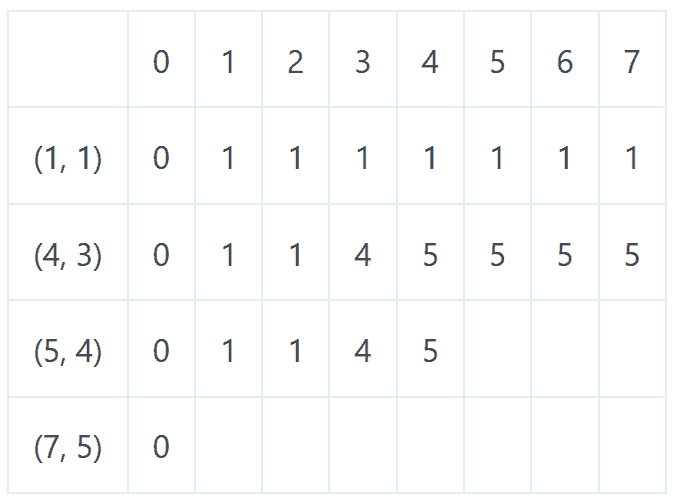](https://res.cloudinary.com/practicaldev/image/fetch/s--je4hgFH3--/c_limit%2Cf_auto%2Cfl_progressive%2Cq_auto%2Cw_880/https://skerritt.blog/conteimg/2019/06/image-24.png)

现在我们计算总重量 5。

max(5 + T[2][1]，5) = 6

[](https://res.cloudinary.com/practicaldev/image/fetch/s--naHphjTZ--/c_limit%2Cf_auto%2Cfl_progressive%2Cq_auto%2Cw_880/https://skerritt.blog/conteimg/2019/06/image-25.png)

我们只是再次做同样的事情:

max(5 + T[2][2]，5) = 6

[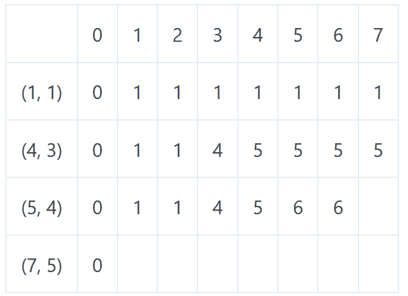](https://res.cloudinary.com/practicaldev/image/fetch/s--y5vkIwzq--/c_limit%2Cf_auto%2Cfl_progressive%2Cq_auto%2Cw_880/https://skerritt.blog/conteimg/2019/06/image-26.png)

现在我们的总重量是 7。我们选择最大值:

max(5 + T[2][3]，5) = max(5 + 4，5) = 9

[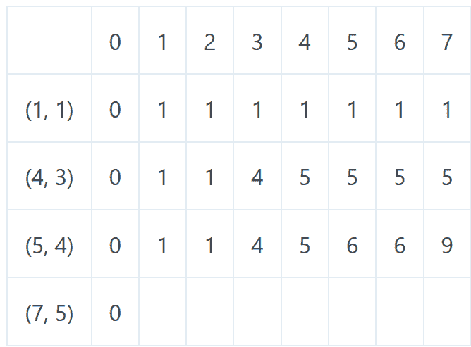](https://res.cloudinary.com/practicaldev/image/fetch/s--Oqc7p5g6--/c_limit%2Cf_auto%2Cfl_progressive%2Cq_auto%2Cw_880/https://skerritt.blog/conteimg/2019/06/image-27.png)

如果我们的总重量是 7，我们有 3 个项目(1，1)，(4，3)，(5，4)，我们能做的最好的是 9。

由于我们的新项目从权重 5 开始，我们可以从上一行复制，直到权重 5。

[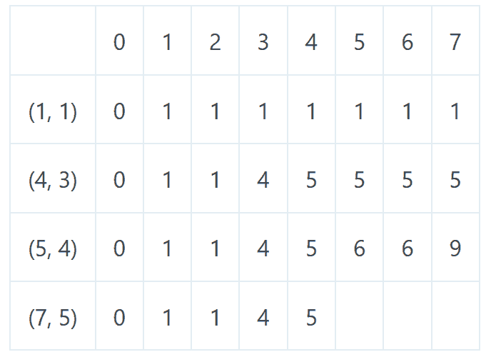](https://res.cloudinary.com/practicaldev/image/fetch/s--7wgOh5m6--/c_limit%2Cf_auto%2Cfl_progressive%2Cq_auto%2Cw_880/https://skerritt.blog/conteimg/2019/06/image-28.png)

然后我们做另一个最大值。

总重量-新物品的重量。这是 5 - 5 = 0。我们希望前一行位于位置 0。

最大值(7 + T[3][0]，6)

6 来自前一行总重量的最佳值。

最大值(7 + 0，6) = 7

[](https://res.cloudinary.com/practicaldev/image/fetch/s--ktIz2Szf--/c_limit%2Cf_auto%2Cfl_progressive%2Cq_auto%2Cw_880/https://skerritt.blog/conteimg/2019/06/image-29.png)

max(7 + T[3][1]，6) = 8

[](https://res.cloudinary.com/practicaldev/image/fetch/s--M8smfvjF--/c_limit%2Cf_auto%2Cfl_progressive%2Cq_auto%2Cw_880/https://skerritt.blog/conteimg/2019/06/image-30.png)

max(7+T[3][2]，9) = 9

[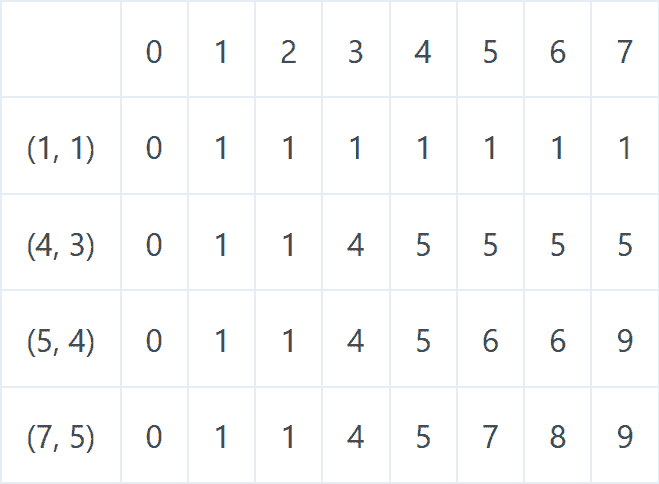](https://res.cloudinary.com/practicaldev/image/fetch/s--V_i0cHUK--/c_limit%2Cf_auto%2Cfl_progressive%2Cq_auto%2Cw_880/https://skerritt.blog/conteimg/2019/06/image-31.png)

9 是我们从物品集中挑选物品所能得到的最大值，使得总重量为 7。

### 利用动态规划寻找{0，1}背包问题的最优集合

现在，我们实际上为最优集合挑选什么项目呢？我们从这一项开始:

[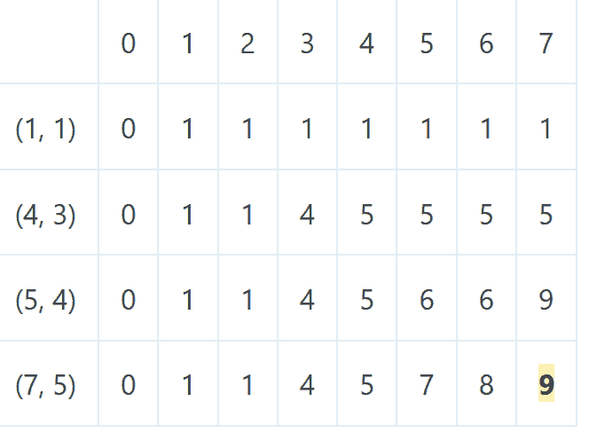](https://res.cloudinary.com/practicaldev/image/fetch/s--wdlLByFL--/c_limit%2Cf_auto%2Cfl_progressive%2Cq_auto%2Cw_880/https://skerritt.blog/conteimg/2019/06/image-32.png)

我们想知道 9 从何而来。它是从上面来的，因为第四行 9 正上方的数字是 9。因为它来自顶部，所以项目(7，5)没有用在最优集合中。

这个 9 是哪里来的？

[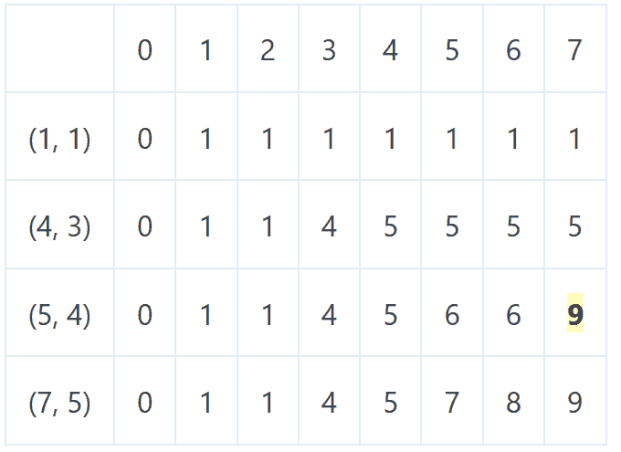](https://res.cloudinary.com/practicaldev/image/fetch/s--7w-Ap0dd--/c_limit%2Cf_auto%2Cfl_progressive%2Cq_auto%2Cw_880/https://skerritt.blog/conteimg/2019/06/image-33.png)

这个 9 不是来自上面那一排。第(5，4)项必须在最优集合中。

我们现在向上走一行，然后后退 4 步。4 个步骤，因为项目(5，4)的权重为 4。

[](https://res.cloudinary.com/practicaldev/image/fetch/s--CZ8MT0VQ--/c_limit%2Cf_auto%2Cfl_progressive%2Cq_auto%2Cw_880/https://skerritt.blog/conteimg/2019/06/image-34.png)

4 不来自上一行。项目(4，3)必须在最佳集合中。

项目(4，3)的权重是 3。我们向上走，然后后退三步，到达:

[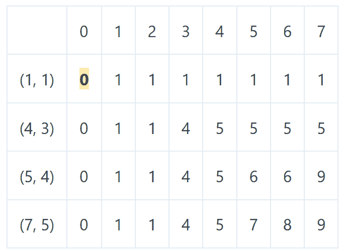](https://res.cloudinary.com/practicaldev/image/fetch/s--yNHTJuSW--/c_limit%2Cf_auto%2Cfl_progressive%2Cq_auto%2Cw_880/https://skerritt.blog/conteimg/2019/06/image-35.png)

一旦我们到达权重为 0 的点，我们就完成了。我们选择的两个项目是(5，4)和(4，3)。总权重是 7，我们总收益是 9。我们只要把两个元组加在一起就知道了。

让我们开始编码。

* * *

### 编码吧

现在我们知道它是如何工作的，并且我们已经得到了它的递归式——编写代码应该不会太难。如果我们的二维数组是 I(行)和 j(列),那么我们有:

```
if j < wt[i]: 
```

如果我们的重量 j 小于项目 I 的重量(I 对 j 没有贡献),则:

```
if j < wt[i]:
    T[i][j] = T[i - 1][j]
else:
    // weight of i >= j
    T[i][j] = max(val[i] + t[i - 1][j-wt(i), t[i-1][j])
    // previous row, subtracting the weight of the item from the total weight or without including ths item 
```

这是程序的核心部分。我从[这里](https://www.geeksforgeeks.org/0-1-knapsack-problem-dp-10/)复制了一些代码来帮助解释这一点。我不打算过多地解释这段代码，因为除了我已经解释过的内容之外，没有什么更多的了。如果你对此感到困惑，请在下面留下评论(可以匿名)或给我发电子邮件😁

```
# Returns the maximum value that can be put in a knapsack of 
# capacity W def knapSack(W , wt , val , n): 

    # Base Case 
    if n == 0 or W == 0: 
        return 0

    # If weight of the nth item is more than Knapsack of capacity 
    # W, then this item cannot be included in the optimal solution 
    if (wt[n-1] > W): 
        return knapSack(W , wt , val , n-1) 

    # return the maximum of two cases: 
    # (1) nth item included 
    # (2) not included 
    else: 
        return max(val[n-1] + knapSack(W-wt[n-1] , wt , val , n-1), 
                   knapSack(W , wt , val , n-1)) 

# To test above function val = [60, 100, 120] 
wt = [10, 20, 30] 
W = 50
n = len(val) 
print(knapSack(W , wt , val , n))
# output 220 
```

* * *

## 动态规划问题的时间复杂度

在 DP 中，[时间复杂度](https://skerritt.blog/you-need-to-understand-big-o-notation-now/)计算如下:

唯一状态的数量*每个状态花费的时间

对于我们的原始问题，加权区间调度问题，我们有 n 堆衣服。每一堆衣服都是在不变的时间里解决的。时间复杂度为:

O(n) + O(1) = O(n)

如果你想了解更多关于时间复杂性的知识，我已经写了一篇关于大 O 符号的文章。

在背包问题中，我们有 n 个项目。该表的增长取决于背包的总容量，我们的时间复杂度是:

西北方向

其中 n 是物品的数量，w 是背包的容量。

我要告诉你一个小秘密。通过算法的递归，可以计算出算法的时间复杂度。你可以用一个叫做主定理的东西来解出它。这是一个简单的定理:

<figure>[](https://res.cloudinary.com/practicaldev/image/fetch/s--DtM0UokO--/c_limit%2Cf_auto%2Cfl_progressive%2Cq_auto%2Cw_880/https://skerritt.blog/conteimg/2019/05/image-16.png) 

<figcaption>取自[此处](https://medium.com/@randerson112358/master-theorem-909f52d4364)</figcaption>

</figure>

现在，我实话实说。塞隆大师值得拥有自己的博客。目前，我觉得这个视频非常棒:

[https://www.youtube.com/embed/OynWkEj0S-s](https://www.youtube.com/embed/OynWkEj0S-s)

* * *

### 动态规划 vs 除法&征服 vs 贪婪

动态编程& [分而治之](https://dev.to/brandonskerritt/a-gentle-introduction-to-divide-and-conquer-algorithms-1ga)惊人的相似。动态规划是建立在分而治之的基础上的，只不过我们会对结果进行评估。

贪婪则不同。它旨在通过在那一刻做出最佳选择来实现优化。有时候，这并不能解决整个问题。以这个问题为例。我们有三个硬币:

1p，15p，25p

有人想让我们找 30 便士的零钱。对于贪婪，它会选择 25，然后 5 * 1，总共 6 个硬币。最优解是 2 * 15。贪婪从最大到最小。在 25 岁的时候，最好的选择是选择 25 岁。

[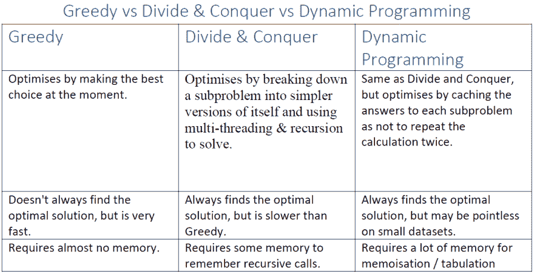](https://res.cloudinary.com/practicaldev/image/fetch/s--rEdpBiFF--/c_limit%2Cf_auto%2Cfl_progressive%2Cq_auto%2Cw_880/https://skerritt.blog/conteimg/2019/05/image-15.png)

* * *

## 制表(自下而上)vs 记忆(自上而下)

有两种类型的动态编程。制表和记忆。

### 记忆(自上而下)

我们已经计算了所有的子问题，但是不知道最优的求值顺序是什么。然后，我们将从根执行递归调用，并希望我们接近最优解或获得我们将到达最优解的证明。内存化确保您永远不会重新计算子问题，因为我们缓存了结果，因此不会重新计算重复的子树。

[](https://res.cloudinary.com/practicaldev/image/fetch/s--uMAOSfEj--/c_limit%2Cf_auto%2Cfl_progressive%2Cq_auto%2Cw_880/https://skerritt.blog/conteimg/2019/05/image-8.png)

根据前面的斐波纳契数列，我们从根节点开始。子树 F(2)不会被计算两次。

这从树的顶部开始，从叶子/子树向上到根评估子问题。记忆是自上而下的方法。

### 制表(自下而上)

我们还看到动态编程被用作“表格填充”算法。通常，这个表是多维的。这就像记忆，但有一个主要的区别。我们必须选择我们进行计算的确切顺序。我们看到的背包问题，我们从左到右——从上到下——填表格。我们知道填表格的确切顺序。

有时“桌子”不像我们见过的桌子。它可以是更复杂的结构，如树。或者特定于问题域，例如地图上飞行距离内的城市。

### 制表&制表——优缺点

一般来说，记忆比列表更容易编码。我们可以写一个“memoriser”包装函数来自动为我们做这件事。有了制表，我们必须想出一个顺序。

记忆是有记忆问题的。如果我们正在计算一些大的东西，比如 F(10 <sup>8)，</sup>每次计算都会被延迟，因为我们必须将它们放入数组中。并且阵列的大小将会非常快地增长。

如果我们发生(或试图)访问子问题的顺序不是最优的，特别是如果有不止一种方法来计算子问题(通常缓存会解决这个问题，但理论上可能在某些特殊情况下缓存可能不会)，那么这两种方法都不是时间最优的。记忆化通常会增加我们的时间复杂度和空间复杂度(例如，使用制表，我们可以更自由地丢弃计算，就像使用 Fib 制表让我们使用 O(1)空间，但是使用 Fib 记忆化使用 O(N)堆栈空间)。

[](https://res.cloudinary.com/practicaldev/image/fetch/s--ZiZoaxWq--/c_limit%2Cf_auto%2Cfl_progressive%2Cq_auto%2Cw_880/https://skerritt.blog/conteimg/2019/05/image-17.png)

## 结论

你在动态编程中遇到的大多数问题已经以某种形式存在了。通常，你的问题会建立在之前问题的答案之上。这里有一个使用动态编程的常见问题列表。

我希望每当你遇到问题的时候，你都在心里想着“这个问题能用 DP 解决吗？”试试看。
[T3】](https://b.ck.page)