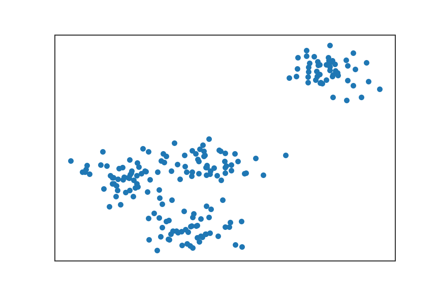
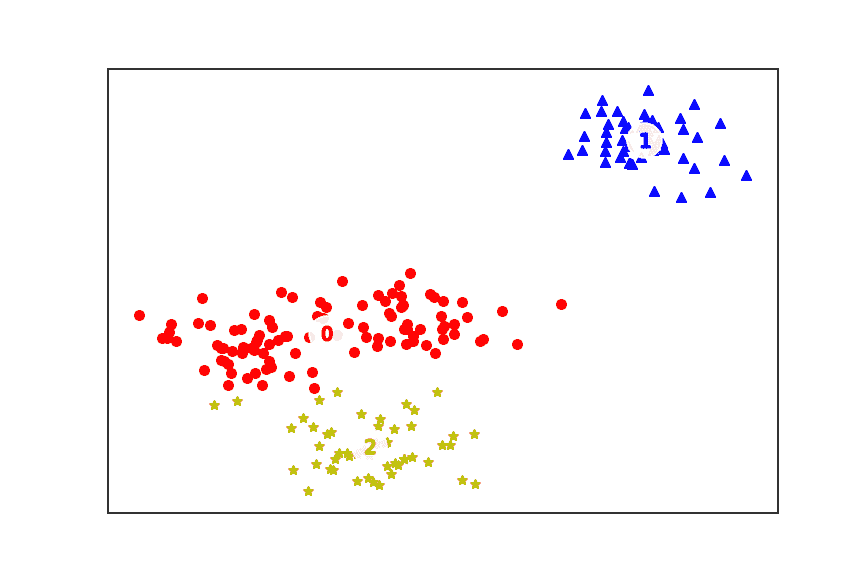

# 什么是 kmeans？

> 原文：<https://dev.to/petercour/what-is-kmeans-3e27>

kmeans 是一种用于[机器学习](https://pythonprogramminglanguage.com/python-machine-learning/)目的的聚类算法。集群是群体的另一种说法。

那么，我说的 kmeans 是什么意思呢？

### 起始情况

该算法的目标是在数据点中找到组。在机器学习的背景下，你测量数据。

例如，你可以测量身高和薪水。然后你会有二维向量(身高，薪水),你可以在二维图上画出来。

有 K 个组，或者正式地说，K 个簇。至少要有 2 组，因为 1 组不需要算法运行。

[](https://res.cloudinary.com/practicaldev/image/fetch/s--CtLFYKSz--/c_limit%2Cf_auto%2Cfl_progressive%2Cq_auto%2Cw_880/https://thepracticaldev.s3.amazonaws.com/i/kfuoau5ga91ehrpx681x.png)

### 结束目标

基于之前的输入(数据点)。那么该算法将找到 K 个组，在这种情况下 K=3。

[](https://res.cloudinary.com/practicaldev/image/fetch/s--VVV2NE-t--/c_limit%2Cf_auto%2Cfl_progressive%2Cq_auto%2Cw_880/https://thepracticaldev.s3.amazonaws.com/i/3uklv1e2xs8xcez5tkba.png)

所以现在如果你有一个新的数据点，最接近的组就是类型。哪个 K 最好？这是一个有点搜索的任务。

[](https://res.cloudinary.com/practicaldev/image/fetch/s--mfGuffO6--/c_limit%2Cf_auto%2Cfl_progressive%2Cq_66%2Cw_880/https://proxy.duckduckgo.com/iu/%3Fu%3Dhttps%253A%252F%252Fmedia.giphy.com%252Fmedia%252FpnzUNWmqaPE4w%252Fgiphy.gif%26f%3D1)

### 代码

下面的程序使用机器学习和模块 sklearn、matplotlib 来创建图并运行 kmeans 算法。它创建了本文中显示的图像。

```
#!/usr/bin/python3
from sklearn.datasets import make_blobs
from matplotlib import pyplot as plt
from sklearn.cluster import KMeans

X, y = make_blobs(n_samples=200,
                  n_features=2,
                  centers=4,
                  cluster_std=1,
                  center_box=(-10.0, 10.0),
                  shuffle=True,
                  random_state=1)

plt.figure(figsize=(6, 4), dpi=144)
plt.xticks(())
plt.yticks(())
plt.scatter(X[:, 0],X[:, 1], s=20, marker='o')
plt.show()

n_cluster = 3
k_means = KMeans(n_clusters=n_cluster)
k_means.fit(X)
print("kmean: k={}, cost={}".format(n_cluster, int(k_means.score(X))))

labels = k_means.labels_
centers = k_means.cluster_centers_

markers = ['o', '^', '*']
colors = ['r', 'b', 'y']

plt.figure(figsize=(6, 4), dpi=144)
plt.xticks(())
plt.yticks(())

for c in range(n_cluster):
    cluster = X[labels == c]
    plt.scatter(cluster[:, 0], cluster[:, 1], marker=markers[c], s=20, c=colors[c])

plt.scatter(centers[:, 0], centers[:, 1], marker='o', c='white', alpha=0.9, s=300)
for i, c in enumerate(centers):
    plt.scatter(c[0], c[1], marker='$%d$' % i, s=50, c=colors[i])

plt.show() 
```

相关链接:

*   [Sklearn 机器学习模块](https://scikit-learn.org/stable/index.html)
*   [机器学习文章](https://pythonprogramminglanguage.com/python-machine-learning/)
*   [用 kmeans 进行文本聚类](https://pythonprogramminglanguage.com/python-machine-learning/)
*   [机器学习课程及实例](https://gumroad.com/l/MnRYU)