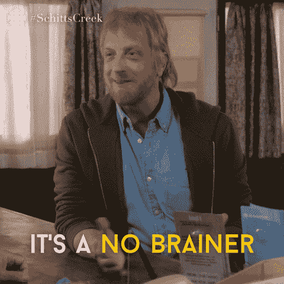

# 你的同事一直说的最讨厌的话是什么？

> 原文：<https://dev.to/dvddpl/what-is-the-most-annoying-thing-your-colleagues-say-all-the-time-15f9>

有没有一些你在办公室、饮水机旁或会议中一直听到的事情真的让你心烦意乱，或者只是“滑稽地”令人讨厌？言语模式、发音习惯、语法或发音错误、流行词汇，任何东西。

例如:

*   **低垂的果实**——被项目经理一遍又一遍地说
*   一些俄罗斯同事说你是 T1
*   每个德国人都一直在使用填充词(我的孩子现在两种都用:意大利语*嗯*和德语*嗯*...:-))
*   超级(超级令人讨厌，超级令人兴奋——这是超级的！)

但这没什么。真正让我抓狂的是，同事们总是说**、**、**、**。

这可能是一个略带棕色的爱管闲事的领导，试图通过居高临下地说

> 当然我们可以做到——这只是一个 UI 表单，很简单！

即使团队中的所有其他人都声明不应该低估该任务的复杂性。

或者，这可能是一个初级开发人员在站立时“撒谎”，说:

> 我*几乎完成了*，我*只需要*进行一些最后的润色，但这应该是*简单*和快速

当你知道——因为他请求帮助——或者你正在检查正在进行中的工作时，先生——他离完成还很远。

或者一个初级或高级开发人员，在评估会议/ [计划扑克](https://dev.to/dvddpl/do-you-play-planning-poker-4f9f)中，说:

> 哦，那应该很简单，肯定的，一张 S 票，最多几天！

当他们真的不知道自己在说什么的时候(这是一个明显的催讨克鲁格效应的例子)

我稍后会发一篇关于“站着撒谎或低估任务”的文章，现在，我只是好奇你最讨厌听到什么，当它发生时你会怎么做。

