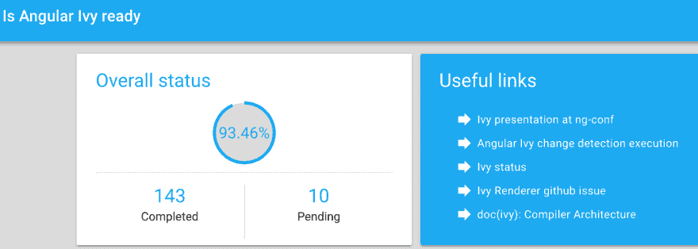
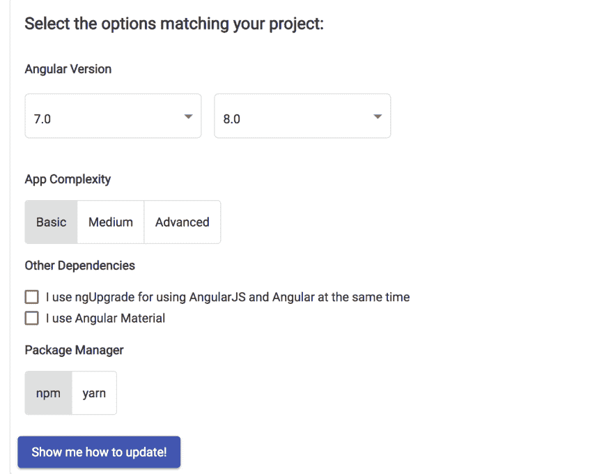

# Angular 8 的新特性:Web worker 支持等等

> 原文：<https://dev.to/bnevilleoneill/what-s-new-in-angular-8-web-worker-support-and-more-493>

[](https://res.cloudinary.com/practicaldev/image/fetch/s--_zEgojVO--/c_limit%2Cf_auto%2Cfl_progressive%2Cq_auto%2Cw_880/https://thepracticaldev.s3.amazonaws.com/i/ugq068u3rjdhw0juxtau.jpg)

随着 Angular 8 的发布，备受期待的 Angular 更新已经到来。Angular 完全由 TypeScript 构建，由谷歌的 Angular 团队和许多社区成员和组织维护，在 GitHub 上有超过 42，000 颗星。在本文中，我们将回顾版本 8 中的新特性，以及现在可用的更改和更新。

> 剧透警告:期待已久的 Ivy 渲染器没有随 v7 一起发布，据称将很快随 V8 一起发布。

这个新版本似乎触及了几乎所有构成 Angular 平台的东西，包括 Angular core、Angular Material、Angular CLI、文档，以及——以免我们忘记——合作伙伴发布。它改善了现代浏览器上的应用程序启动时间，提供了新的 API 来接入 CLI，并使 Angular 适应更广泛的生态系统和更多的 web 标准。

[](https://logrocket.com/signup/)

## 默认差分加载

这是一个很棒的特性:它让你的应用程序的用户获得完全适合他们特定设备或浏览器的 JavaScript 包。[差异加载](https://web.dev/codelab-serve-modern-code)是浏览器根据自身能力在现代或传统 JavaScript 之间进行选择的过程。

从这个新版本开始，Angular 现在默认执行两个构建:现代 ES2015 构建和传统 ES5 构建。当您将一个项目更新到版本 8 时，您的`tsconfig.json`文件会被更新以使其生效。

这里，当目标是 ES2015 时，生成两个包，在运行时，用户的浏览器将使用脚本标签上的属性来交付正确的包。

```
// Modern JS
<script type="module" src="…">
// Legacy JS
<script nomodule src="…"> 
```

社区成员的早期测试表明，根据最终用户的设备和浏览器，以及他们利用的 JS 特性的数量，可以节省高达 20%的包大小。

[](https://res.cloudinary.com/practicaldev/image/fetch/s--Pp7Ij3ba--/c_limit%2Cf_auto%2Cfl_progressive%2Cq_auto%2Cw_880/https://i0.wp.com/blog.logrocket.com/wp-content/uploads/2019/06/bundle-size-angular.io_.png%3Fresize%3D928%252C537%26ssl%3D1)

以上是对 Angular 官方主页的测试。您可以在此了解更多关于[差动加载的信息。](https://v8.angular.io/guide/deployment#differential-loading)

## 路由器配置使用动态导入

令人兴奋的变化也打破了默认的路由器配置。最初，这是 Angular 中的路由器语法:

```
{path: '/admin', loadChildren: './admin/admin.module#AdminModule'} 
```

现在，在版本 8 中，语法看起来像这样:

```
{path: `/admin`, loadChildren: () => import(`./admin/admin.module`).then(m => m.AdminModule)} 
```

这是因为通过路由的延迟加载现在可以直接从该语法中实现。Angular 现在建议开发人员使用路由器延迟加载部分应用程序。如您所见，这是通过在路线配置中使用`loadChildren`键来完成的。

VS Code 和 WebStorm 中也已经设置了对 IntelliSense 的支持，以帮助导入。该功能在更新后立即可用。

## CLI 中的构建器 API

还记得 Angular [Schematics](https://angular.io/guide/schematics) 吗，它提供了一个扩展或修改 CLI dev 命令的平台，比如`ng new`、`ng generate`、`ng add`和`ng update`？新的构建器 API 现在允许像`ng build`、`ng test`和`ng run`这样的构建命令为以生产为中心的命令提供相同的功能——这真是激动人心的时刻。这里是关于这些新 API 的官方博客文章。

Angular 已经在与云提供商合作，开始使用这些 API。你可以试试最新版本的[angular fire](https://github.com/angular/angularfire2)——它增加了一个`deploy`命令，从而使构建和部署到 Firebase 比以往任何时候都更容易:

```
ng add @angular/fire ng run my-app:deploy 
```

安装后，这个部署命令将按照 AngularFire 推荐的方式构建和部署您的应用程序。

## CLI 中的工作区 API

关于 Schematics 的更多信息:开发人员以前不得不手动修改他们的`angular.json`文件来修改工作空间配置。但是在版本 8 中情况发生了变化。现在，有了一个新的 API 来处理读取和修改`angular.json`文件。你可以在这里阅读更多关于可用的[工作区 API 的信息](https://github.com/angular/angular-cli/blob/master/packages/angular_devkit/core/README.md#workspaces)。

## Web worker 支持

当你开始处理 CPU 密集型任务时，Web workers 非常适合用来加速你的应用程序。它们让你把工作卸载到后台线程，比如图像或视频操作。

Angular 团队在 [angular.io](https://angular.io) 上使用 web workers 进行应用内搜索索引。有了这个新版本 8，您可以从您的 Angular CLI 生成新的 web workers。要向您的项目添加一个工人，您可以运行:

```
ng generate webWorker my-worker 
```

一旦你有了一个 web worker，你就可以在你的应用程序中正常使用它，CLI 将能够正确地对它进行捆绑和代码拆分:

```
const worker = new Worker(`./my-worker.worker`, { type: `module` }); 
```

你可以在 Angular CLI 阅读更多关于 [web workers 的内容，点击](https://v8.angular.io/guide/web-worker)。

## 新折旧指南

Angular 团队非常致力于维护语义版本和高度的稳定性，即使是跨主要版本。对于 Angular 的公共 API，Angular 承诺支持 N+2 版本的特性。

这意味着在 v8.1 中被弃用的特性将在以下两个主要版本(v9 和 v10)中继续工作。例如，`platform-webworker`在版本 8 中已被弃用。在 Angular 中很容易找到贬损和删除；有关所有折旧的完整列表，请参见新的[折旧指南](https://v8.angular.io/guide/deprecations)。

## 艾薇和巴泽尔？

嗯，根据[官方发布通知](https://is-angular-ivy-ready.firebaseapp.com/#/status)，你必须再等一会儿，新的渲染引擎 Ivy 和新的构建系统 [Bazel](https://github.com/bazelbuild/bazel) ，才能为 Angular 的正式使用做好准备。

这些即将到来的更新对任何想使用它们的人来说都是可选的。在撰写本文时，[Ivy 的官方状态页面](https://is-angular-ivy-ready.firebaseapp.com/#/status)显示，超过 93%的产品已经准备好随时上市。

[](https://res.cloudinary.com/practicaldev/image/fetch/s--lJY9TLsj--/c_limit%2Cf_auto%2Cfl_progressive%2Cq_auto%2Cw_880/https://i1.wp.com/blog.logrocket.com/wp-content/uploads/2019/06/angular-ivy-status.png%3Fresize%3D1600%252C570%26ssl%3D1)

## 更新到版本 8

由于 Angular 的团队和上一版本的效率，现在只需一个命令就可以将您的 Angular 应用程序更新到最新版本。只需运行下面的命令:

```
ng update @angular/cli @angular/core 
```

据报道，这次更新非常快，所以当你更新时，请在评论中告诉我们用了多长时间(不应该超过五分钟)。要了解更多详细的更新信息，您可以[访问此链接](http://update.angular.io)获得一个易于使用的、全包式角度更新应用程序。

[](https://res.cloudinary.com/practicaldev/image/fetch/s--eXn6eGpm--/c_limit%2Cf_auto%2Cfl_progressive%2Cq_auto%2Cw_880/https://i2.wp.com/blog.logrocket.com/wp-content/uploads/2019/06/angular-update-page-screenshot.png%3Fresize%3D1392%252C1076%26ssl%3D1)

[这里是角度变更日志](https://github.com/angular/angular/blob/master/CHANGELOG.md)的链接。

## 结论

280 多名贡献者使得这个新版本的发布成为可能，它带来了更快的速度和最新的网络技术。是的，Ivy renderer 版本将在几天后发布，我迫不及待地想使用它。黑客快乐！

*你最喜欢 Angular 8 的什么特点？请在评论中分享。*

* * *

## Plug: [LogRocket](https://logrocket.com/signup/) ，一款适用于网络应用的 DVR

[](https://res.cloudinary.com/practicaldev/image/fetch/s--6FG5kvEL--/c_limit%2Cf_auto%2Cfl_progressive%2Cq_auto%2Cw_880/https://i2.wp.com/blog.logrocket.com/wp-content/uploads/2017/03/1d0cd-1s_rmyo6nbrasp-xtvbaxfg.png%3Fresize%3D1200%252C677%26ssl%3D1)

LogRocket 是一个前端日志工具，可以让你回放问题，就像它们发生在你自己的浏览器中一样。LogRocket 不需要猜测错误发生的原因，也不需要向用户询问截图和日志转储，而是让您重放会话以快速了解哪里出错了。它可以与任何应用程序完美配合，不管是什么框架，并且有插件可以记录来自 Redux、Vuex 和@ngrx/store 的额外上下文。

除了记录 Redux 操作和状态，LogRocket 还记录控制台日志、JavaScript 错误、堆栈跟踪、带有头+正文的网络请求/响应、浏览器元数据和自定义日志。它还使用 DOM 来记录页面上的 HTML 和 CSS，甚至为最复杂的单页面应用程序重新创建像素级完美视频。

[免费试用](https://logrocket.com/signup/)。

* * *

文章[Angular 8 中的新特性:网络工作者支持和更多](https://blog.logrocket.com/whats-new-in-angular-8-web-worker-support-and-more/)首先出现在[日志博客](https://blog.logrocket.com)上。