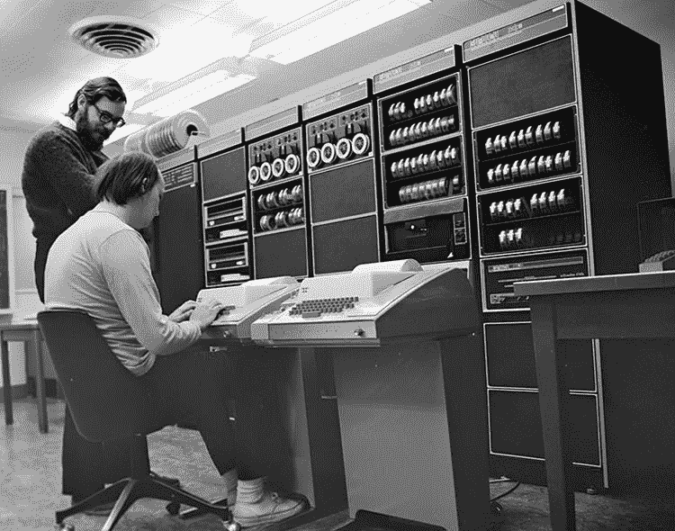
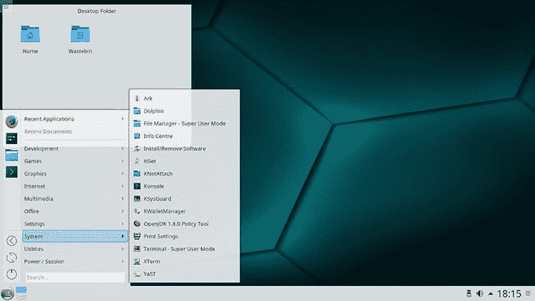
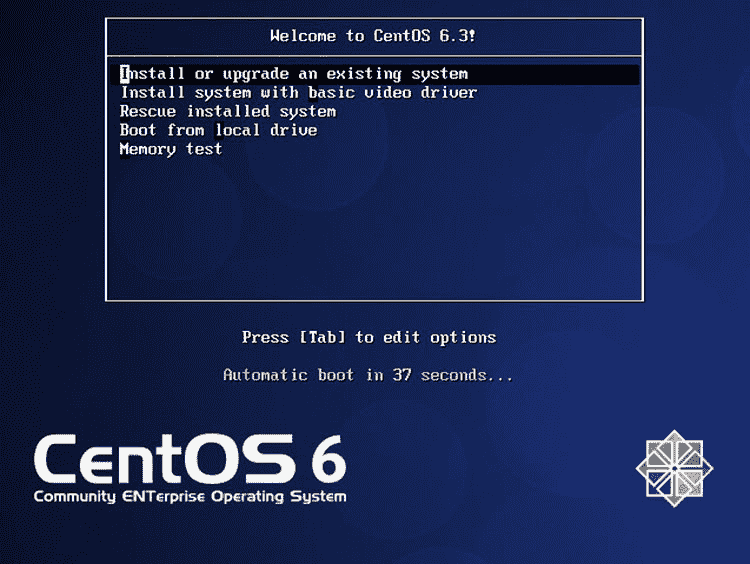
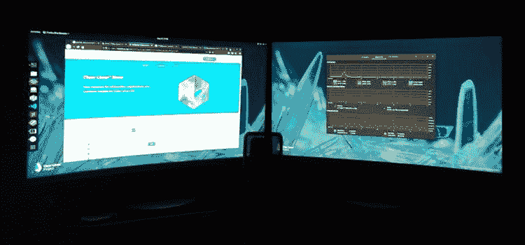
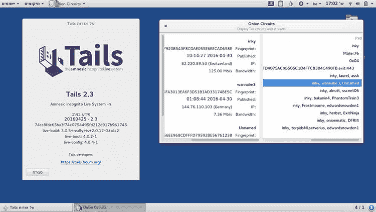

# 我应该使用 Linux 的哪个发行版？

> 原文：<https://dev.to/pluralsight/which-distribution-of-linux-should-i-use-51g7>

***如此...我应该在我的新机器上安装哪个版本的 Linux？
[点击这里投票！](http://bit.ly/WhichOSDoIChoose)***

我经常被问到这个问题:“嘿，你是 Linux 迷，对吗？应该用什么 Linux？我有个朋友推荐(此处插入发行版)想知道大家怎么看？”我一般都是用同一个问题回复:**你想做什么？**所以我决定写这篇文章来指导你应该选择什么类型的 Linux。

## 我的 Linux 历史

我可能应该以我的 Linux 历史作为这篇文章的开头，以防你在读这篇文章的时候不认识我(很可能)。不在乎的可以跳过这个。

我在 1996 年左右开始使用 Linux。我的第一个 Linux 是 Slackware 4，这是我在 Egghead Software 购买的一套 CD(是的，我老了)。我的一个朋友告诉我这个类似 Unix 的东西非常棒，我必须尝试一下，他认为我会喜欢它。

我读了很多关于 Unix 的书，对它非常好奇。我在我的网络提供商那里有一个空壳账户，我试了试，但是一开始，我有点犹豫。“我为什么需要这个？”他的回答很简单:“因为你这么讨厌 Windows 95，喜欢 DOS，你会喜欢这个的”。所以就买了。他是对的。

我拿出一个旧硬盘，安装了它。我和它斗争了几个小时，然后几天。我终于有了一台可以运行的台式机。我不知道这一次是什么驱使我这样做，但我必须弄清楚如何让这个系统工作，这很困难。

我必须对我的硬件有如此多的了解！简单的事情突然又变得困难了。但我还是挺过去了，我把我的桌面竖起来了。为了好玩，我开始编写一些愚蠢的脚本。这个系统很快，我几乎可以改变它的一切。

它有内置的 C 编译器？我刚刚买了一些非常昂贵的 Borland 包，我几乎搞不清楚。但是这个操作系统内置了编译器？一个免费的图像编辑器？我被迷住了！

在那之后的几年里，我尝试了大量的发行版。甚至 BSD Unix 的。我的“主电脑”一直是双开机，有些还是纯 Linux。在 21 世纪初的大部分时间里，我完全避开了 Windows。因此，按年，我可以将它分解为我的“主要机器”，它将是:

*   1996-1999 年:休闲服
*   1999-2002 年:Redhat(和 FreeBSD)
*   2003-2005 年:FreeBSD / Knoppix
*   2005-2009 年:巴布亚
*   2009-2011 年:Linux 作为
*   2011-2018: Arch Linux / Debian

我曾经使用过 50 个甚至更多的发行版，但这是在我的“主要机器”上运行的，我用它来工作、浏览、开发或做其他事情。显然，Arch 的运行时间是迄今为止最长的，主要是因为我可以配置它，然后在很长一段时间内忘记它。

但是在过去几年里，我“真正工作”的主要发行版是 Arch Linux。

说够了我，来说说你该用什么。

## 那么你想做什么？

我将根据共同需求把这些分类。这里有一些重叠，只要付出足够的努力，这些 Linux 发行版中的任何一个都可以满足您的需要。Linux 的一个伟大之处就是你可以随心所欲地开发它。但是有些发行版为您做了大量的工作，或者有一个更好地实现某些目标的设计。我将根据实现目标的最简单途径来分类展示这些。

* * *

## 我是一个刚入门的 Linux 新手

很长一段时间，我都是为此推荐 Ubuntu。至于易用性和兼容性，它是伟大的。但是我现在避开 Ubuntu。我仍然在我的课程和文章中使用它进行演示，因为有很多人使用它，但我不喜欢他们运行这个发行版的方式，内置的亚马逊广告软件，Unity 很烦人。

因此，如果你刚刚开始，我推荐:

*   **[Linux 薄荷下载](http://bit.ly/2kVRvdT)**
*   **[Debian 下载](http://bit.ly/2koYU54)T3】**

这是一种欺骗，因为 Linux Mint 是基于 Debian 构建的，但是 Mint 看起来更漂亮，并且有一些不错的跨平台的东西。

**如果需要，可以使用这些发行版:**

*   类似 Windows 的体验
*   安装简单的东西
*   可靠的东西
*   不偏离常规的“类似 Linux”的东西
*   “管用”的东西

好的，最后一个非常重要。它只是工作。这些发行版大多是即插即用的。撮合他们，然后忘了这件事。我越来越依赖 Debian 作为我的开发机器，因为有时候我不关心操作系统，我不想让它妨碍我。当我处于只想建造东西的状态时，这是不可战胜的。

如果你刚刚起步，这个关于 **[Linux 安装和初始配置](http://bit.ly/PSLinuxInstallation)** 的课程可能会帮到你很多。

* * *

## 我想了解更多关于 Linux 和我的硬件的知识

也许你有心情去玩，去实验。你想挑战自己，强迫自己边做边学。太好了，我就是这么做的。

**如果你想挑战自己并学习，我推荐:**

*   **[Arch Linux](http://bit.ly/2lZs4sb)**

*   **[Gentoo Linux](http://bit.ly/2kLWzSd)T3】**
*   **[FreeBSD Unix](http://bit.ly/2krditC)** ( *不是 Linux，但属于此类*)

这些发行版中的每一个都需要大量的配置、硬件发现和源代码编译。使用 Gentoo，您必须编译所有内容。这是完全控制你的操作系统的好方法。

**如果需要，可以使用这些发行版:**

*   完全控制您的计算机和操作系统
*   要了解 Linux 的内部机制
*   精益和平均优化系统

这是有代价的:主要是你的时间。完全安装这些可能需要几个小时。从好的方面来说，他们倾向于永远跑下去。

我在一台联想(Lenovo)上安装了一个 Arch，花了大半个周六的时间来配置，之后又花了 10 个小时甚至更多。它几乎毫不费力地运行了 5 年(直到笔记本电脑硬件报废)。我只需要偶尔做一些更新，但我每天都可靠地使用它 5。很长。几年。所以在某种程度上你可以把它看作一项投资。

* * *

## 我想要尖端的东西

好吧，也许你想要最新最好的软件，你不在乎它有多稳定。你想做一些内核黑客或其他一些很酷的事情，一些程序员昨天承诺。

让稳定和安全见鬼去吧，你现在就想要最新的东西。

*   **[Arch Linux](http://bit.ly/2lZs4sb)**

*   **软呢帽**
*   **[Gentoo Linux](http://bit.ly/2kLWzSd)T3】**

**如果需要，可以使用这些发行版:**

*   用风险换取最新的东西
*   最新和最棒的功能总是
*   有趣的配置工作与突破性的变化

公平地说，我个人使用过 Arch 和 Gentoo，没有明显的稳定性问题，但是我冒着在滚动发布中使用前沿技术的风险。

* * *

## 我只想完成一些工作

好吧，也许你真的不关心操作系统的细节，只想 GSD(把事情做完)。也许你有一些想要开发的 Node 或 GoLang 应用程序，并且听说 Linux 是最适合的。

**这些对完成工作很有帮助:**

*   **[德比安](http://bit.ly/2koYU54)T3】**
*   **[软呢帽](http://bit.ly/2mswNTo)**
*   **[OpenSUSE Leap](http://bit.ly/2ktoOVn)**
*   **[Ubuntu 工作室](http://bit.ly/2lZEdgK)**

**如果需要，可以使用这些发行版:**

*   低维护的平稳运行
*   最低配置
*   大部分自动工作的东西
*   硬件和软件的兼容性

正如我所说的，这些天我经常使用 Debian，因为我通常只是做一些东西，并不真的想修修补补和优化。它稳定、快速，并且不会妨碍我。我现在正在用 Debian 9 写这篇文章。

* * *

## 我想设置一个服务器

也许你想设置一个 web 服务器或虚拟主机，不知道用什么。这个列表中的第一个是虚拟主机的主流发行版，所以如果你想要模仿托管你的软件的站点，试试 CentOS(或者学习 Docker！)

**这些都是坚实可靠的虚拟主机:**

*   **[厘斯](http://bit.ly/2ktoSEB)**
*   **[红帽企业](https://red.ht/2ky3r5s)**
*   **[德比安](http://bit.ly/2koYU54)T3】**
*   **[FreeBSD](http://bit.ly/2krditC)** ( *不是 Linux，但属于此类*)

**如果需要，可以使用这些发行版:**

*   稳定性
*   安全性
*   出于同样原因使用它的其他人的支持

我相信任何 Linux 发行版都可以有效地用于虚拟主机，但是有些发行版比其他发行版需要更多的工作。

* * *

## 我想要尽可能高的性能

因此，如果你是那种想要充分发挥性能的人(我也经历过)，这些对你来说很好。其中一些需要编译所有源代码，以生成针对您的处理器优化的二进制文件。有趣的东西！

*   **[清除 Linux](http://bit.ly/ClearLinux)**
*   **[Arch Linux](http://bit.ly/2lZs4sb)**
*   **[Gentoo Linux](http://bit.ly/2kLWzSd)T3】**
*   **[FreeBSD](http://bit.ly/2krditC)** ( *不是 Linux，但属于此类*)

**如果需要，可以使用这些发行版:**

*   快速性能
*   高负载计算

请记住，硬件已经达到了一个性能点，在这个点上，它们不再像过去那样重要。15 年前，你可以黑进一个内核，拨入你的服务，看到一个大的提升。如今，这种差异可以忽略不计。任何 Linux 都将非常快。

* * *

## 我想要一台安全的台式机

也许你想建立一个难以侵入的系统，不管是什么原因。有几个发行版把安全性放在了首位。如果你真的关心锁定你的主机，这些都是很好的选择。

*   **[尾 Linux](http://bit.ly/TailsLinuxDownload)**
*   **[阿尔卑斯 Linux](http://bit.ly/2m6o74G)**
*   **[CoreOS](http://bit.ly/2m6fKpO)**
*   **[TENS Linux](http://bit.ly/2mtFUDi)**
*   **[锡帽子 Linux](http://bit.ly/2kVS73b)**
*   **[OpenBSD](http://bit.ly/2kN3L0n)** ( *不是 Linux，但属于这一类*)

**如果需要，可以使用这些发行版:**

*   安全性
*   匿名

* * *

## 我想要一个最小的计算机系统

好吧，有时候你只是想要一些简单明了的东西来完成某项工作。这个我绝对理解。也许你有一个旧奔腾你想重新利用。有时候，操作系统只是你目标的一小部分，你想要最少的。

*   **[阿奇邦](http://bit.ly/2m1i7u8)T3】**
*   **[鲁本图](http://bit.ly/2muhklN)T3】**
*   **[小狗 Linux](http://bit.ly/2mtBfkN)**
*   **[微型内核 Linux](http://bit.ly/2kN3RoL)**
*   **[菩提 Linux](http://bit.ly/2msxKuW)**

**如果需要，可以使用这些发行版:**

*   可以在旧硬件上运行的东西
*   越少越好

* * *

## 结论

我不想听起来像一个坏掉的唱片，但是你可以从这些 Linux 发行版中挑选一个，然后把它变成你想要的样子。这就是 Linux 的本质，它可以在最大程度上进行定制。但是这些都是快速入门的好发行版。

如果你想了解更多关于 Linux 的知识， [Pluralsight 有大量的 Linux 课程](http://bit.ly/PSLinuxCourses)，包括一门非常好的入门课程， [Linux 安装和初始配置](http://bit.ly/PSLinuxInstallation)

如果你认为我没有注意到或者遗漏了一个发行版，请在评论中给我留言，或者在推特上对我大喊。

无论你做什么，如果你是因为对 Linux 好奇而来到这个页面，那就试试吧！！现在！如今，你可以下载像 [VirtualBox](http://bit.ly/2kwj90X) 这样的东西(免费)，并在真正做出任何承诺之前试用一下。绝对值得你花时间去看看！