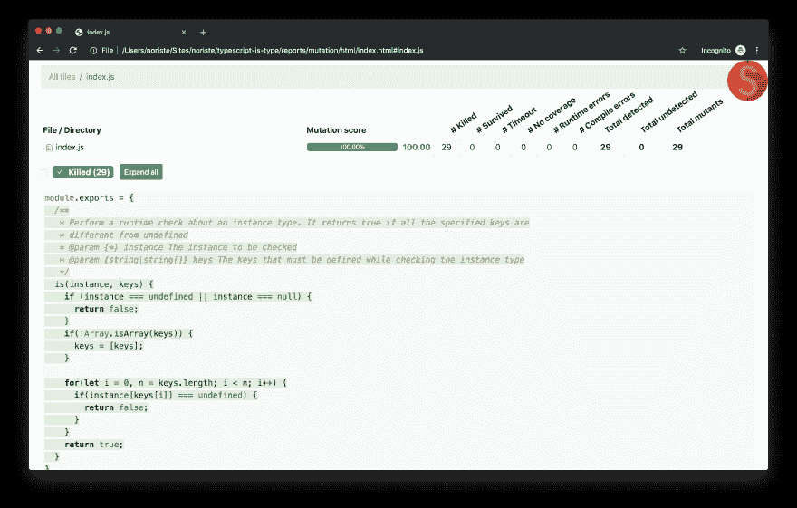

# 谁看着守望者？突变测试正在进行

> 原文：<https://dev.to/noriste/who-watches-the-watchmen-mutation-testing-in-action-3889>

*测试有效性测量。* *冠军的荣誉归于[约尼·戈德堡](http://goldbergyoni.com)。我喜欢它，因为它的谐音和[令人惊叹的漫画小说](https://it.wikipedia.org/wiki/Watchmen)浮现在我的脑海里。* 

所以，你正在开发一个新函数，它需要大量的单元测试(比如我的[比特币地址正则表达式验证](https://github.com/NoriSte/bitcoin-address-soft-regex-validation))。告诉我:你如何判断你的测试的有效性？你确定你在用所有必要的极限情况测试每一个特性吗？是什么让你如此自信？

我知道答案:[代码覆盖](https://www.wikiwand.com/en/Code_coverage)和经验。

两个考虑因素:

*   代码覆盖率并不能衡量测试的有效性。代码覆盖可以帮助你找到未测试的案例，它在这方面做得很好。但是它不能告诉你任何关于你的代码的质量的信息。您可以在源代码中留下大量的 bug，代码覆盖率只能帮助您通过所有这些 bug，而不能解决它们。你可以争辩说错误必须通过测试来发现，但是...
*   测试需要经验，当你开始做测试时，你不会写出最好的测试。你获得的经验越多，你脑海中就会出现越多的疑问，问自己“我确定这些测试真的在测试我的功能吗？”

别担心，这是一条已经走过的路。你获得的经验越多，你就越知道你的代码并不完美，这就是你开始测试的原因...你测试的越多，你就越想确定你的测试是有效的。

引用我一个同事的话(嗨[米尔科](https://www.linkedin.com/in/fcracker79/)👋):

> 有时我引入突变来对我的测试有信心

## 突变检测

检查您的测试是否有效非常简单:在您的代码中放置一些 bug 并启动测试。如果测试没有失败，它们对捕获 bug 是无用的。这是变异测试！你改变了源代码(这个新的和被窃听的源代码被称为“一个突变体”)，并且你启动了针对它的测试套件。

事实上，[突变测试](https://en.wikipedia.org/wiki/Mutation_testing)的主要目标是:

*   识别弱测试的代码片段(突变体不会被杀死的代码片段)
*   识别弱测试(那些从不杀死突变体的测试)

【 [](https://res.cloudinary.com/practicaldev/image/fetch/s--ANYnZLZ7--/c_limit%2Cf_auto%2Cfl_progressive%2Cq_auto%2Cw_880/https://thepracticaldev.s3.amazonaws.com/i/oflwmo2vixplu2834v4p.png) *突变检测*

如果你认为我们在谈论一些测试怪胎...前进😊

## 举个例子

我选择用我的一个旧包来玩突变测试: [Typescript 是 Type](https://github.com/NoriSte/typescript-is-type) 。整个包相当小，下面是源代码

```
module.exports = {
  /**
   * Perform a runtime check about an instance type. It returns true if all the specified keys are
   * different from undefined
   * @param {*} instance The instance to be checked
   * @param {string|string[]} keys The keys that must be defined while checking the instance type
   */
  is(instance, keys) {
    if (instance === undefined || instance === null) {
      return false;
    }
    if(!Array.isArray(keys)) {
      keys = [keys];
    }

    for(let i = 0, n = keys.length; i < n; i++) {
      if(instance[keys[0]] === undefined) {
        return false;
      }
    }
    return true;
  }
} 
```

Enter fullscreen mode Exit fullscreen mode

你看到那只巨大的虫子了吗？

我安装了 Stryker，它管理我的源代码的所有变更过程，并自动启动测试套件。

请注意:Stryker 的安装非常简单，然后你只需要通过 [Stryker 配置](https://github.com/stryker-mutator/stryker/tree/master/packages/core#mutate-string)添加你想让它变异的文件。对我来说，它只是`mutate: ["index.js"]`。

有一次用`npx styker run`发射了 Styker 我发现了一个惊喜，一个变异人居然活了下来

[](https://res.cloudinary.com/practicaldev/image/fetch/s--IFlekenf--/c_limit%2Cf_auto%2Cfl_progressive%2Cq_auto%2Cw_880/https://thepracticaldev.s3.amazonaws.com/i/ztoorjeyoyt42h3npx8v.png)

史赛克告诉我，从测试的角度来看，如果它用`i <= n`突变了`i < n`，没有任何变化。测试没有杀死这种突变体(测试通过了`i < n`或`i <= n`突变)。怎么可能呢？循环条件怎么可能不影响测试呢？🤔因为一只巨大的虫子！看一看`instance[keys[0]]`！它没有使用`i`变量！！！

好了，倒楣的事情发生了，我们来分析一下:

*   代码覆盖率并没有帮助找到 bug，因为正如我在文章开始时所说的，它不能检查代码的质量，它只是检查测试是否通过了所有的代码行
*   毕竟，我的测试不是很好。在源代码和测试中都可能出现错误

## 我是怎么修好的

变异测试的主题不是源代码，而是测试本身。如果我的测试允许一个像发现的那样的巨大错误，我需要改进它们。

我添加了更多的测试和期望来真正测试缺失的特性(检查所有的键，而不仅仅是第一个键)。不改变源代码，我现在有一些失败的测试，正如所料！然后，我修复了错误，测试通过了，完美！我再次运行 Stryker，现在一切正常

[](https://res.cloudinary.com/practicaldev/image/fetch/s--Jats95hF--/c_limit%2Cf_auto%2Cfl_progressive%2Cq_auto%2Cw_880/https://thepracticaldev.s3.amazonaws.com/i/khpcevv6v1g7cp86ipm4.png)

突变测试寿命长😊

## 结论

你测试的越多，你就越需要知道你的测试是否有效。Stryker 还不完美(例如:你现在不能忽略一些行，比如一些不同的`console.log`)，但它是一个捕捉 bug、提高你的测试信心、让你的代码得到更好测试的好工具。

我是在关注 [Yoni Goldberg](http://goldbergyoni.com) 和观看他的[Advanced node . js Testing:beyond unit&integration tests(2019)](https://youtu.be/-2zP494wdUY)视频时发现这个突变测试话题的，看看他的内容😉