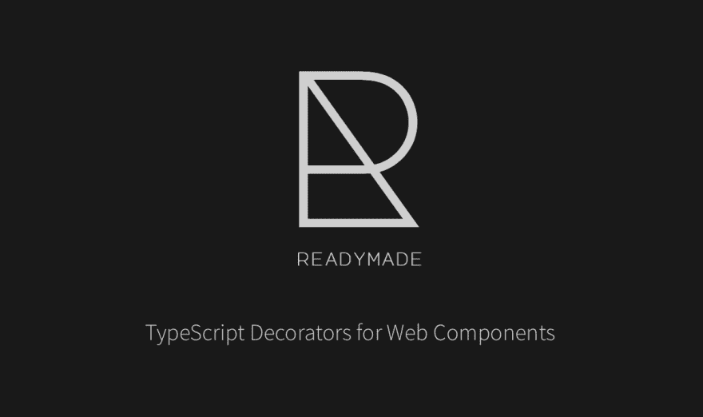

# 为什么我为 Web 组件编写了一个微库

> 原文：<https://dev.to/steveblue/why-i-coded-a-micro-library-for-web-components-46ig>

我知道似乎每个人都在建造微型的这个，微型的那个。

微服务、微前端和现在的微库？！

已经有了开发 Web 组件的优秀解决方案。

*   [模板](https://stenciljs.com/docs/introduction)
*   [发光元件](https://github.com/Polymer/lit-element)
*   [混血儿](https://hybrids.js.org)
*   [slim.js](http://slimjs.com/#/getting-started)
*   [SkateJS](http://skatejs.netlify.com)

一些主要的 JavaScript 框架，如 Svelte 和 Angular，甚至可以编译成定制元素。尽管考虑到将现代 JavaScript 框架编译成 Web 组件所需要的工具数量，这可能有点大材小用。

那么我为什么要编写另一个库呢？

[](https://i.giphy.com/media/4oexCrqXVKAnu/giphy.gif)

# 挑战自我

建立一个现代的，但是没有依赖性的框架。我想要一个只使用浏览器中的 API 的解决方案。这意味着某些特征需要聚合填充，但这没关系。原来浏览器中存在几个 API，允许您为 UI 构建一个微库，支持数据绑定、高级事件处理、动画等等！

*   客户元素
*   createTreeWalker
*   代理人
*   客户事件
*   广播频道
*   网络动画

# 带走痛苦

开发 Web 组件是这个项目的另一个目标。编码定制元素涉及到许多样板文件，可以减少这些文件。在允许`ShadowDOM`的定制元素和不允许`ShadowDOM`的定制元素之间切换可能很困难。自治自定义元素与自定义内置元素的处理方式不同。事件处理和典型的 DOM 一样好，需要调用`addEventListener`和`dispatchEvent`，即使这样，你还是会被事件通常是如何冒泡的所困扰。还有更新定制元素模板的问题，需要选择 DOM 并更新属性和内部内容。这为工程师做出不那么高性能的选择提供了机会。如果图书馆可以处理所有这些事情会怎么样？

# 完全控制

是我所追求的。如果我想改变图书馆的行为方式，我可以。Readymade 可以构建它来支持 SVG，但是如果我想支持的话，它也可以呈现 GL 对象。所有需要发生的是交换状态引擎和 boom，WebGL 支持。我一直在尝试不同的用户界面，需要一些有延展性的东西。

# 分布

是我已经工作了很长时间的另一个项目的关键方面。我想要一种方法来分发 UI 组件库，而不依赖于任何框架。该项目的目标是提供一个小于 20Kb 的 UI 库。现成的本身约 3Kb，所有的铃铛和哨子都是进口的。如果框架支持定制元素，用现成的组件可以像用任何 JavaScript 框架构建的项目中的任何其他 DOM 元素一样使用。

# 装修工

在 Angular 中我认为是理所当然的，我想知道这些高阶函数是如何工作的。我构建的微库高度依赖于这个未来的规范，但这也没关系。使用 TypeScript 从头构建库还提供了类型检查、智能感知的额外好处，并使我能够使用优秀的 TypeScript 编译器。

[](https://res.cloudinary.com/practicaldev/image/fetch/s--KIzy7MSf--/c_limit%2Cf_auto%2Cfl_progressive%2Cq_auto%2Cw_880/https://thepracticaldev.s3.amazonaws.com/i/yyavfza6i1tb8dxc4e46.png)

# 进入现成

Readymade 是一个微型库，用于处理开发 Web 组件的常见任务。API 类似于 Angular 或 Stencil，但是内部是不同的。Readymade 使用上面列出的浏览器 API 为您提供丰富的开发人员体验。

*   🎰为 CSS 和 HTML ShadowDOM 模板声明元数据
*   “自主定制”和“定制内置”元素的☕️单一界面
*   🏋《Hello World》的️‍重约 1Kb
*   1️⃣单向数据绑定
*   🎤事件发射器模式
*   🌲摇树

# 举个例子

下面这个按钮的例子展示了一些现成的优点。

```
 import { ButtonComponent, Component, Emitter, Listen } from '@readymade/core';

@Component({
    template:`
    <span>{{buttonCopy}}</span>
    `,
    style:`
        :host {
            background: rgba(24, 24, 24, 1);
            cursor: pointer;
            color: white;
            font-weight: 400;
        }
    `,
})
class MyButtonComponent extends ButtonComponent {
    constructor() {
        super();
    }
    @State() 
    getState() {
      return {
        buttonCopy: 'Click'
      }
    } 
    @Emitter('bang')
    @Listen('click')
    public onClick(event) {
        this.emitter.broadcast('bang');
    }
    @Listen('keyup')
    public onKeyUp(event) {
        if (event.key === 'Enter') {
            this.emitter.broadcast('bang');
        }
    }
}

customElements.define('my-button', MyButtonComponent, { extends: 'button'}); 
```

Enter fullscreen mode Exit fullscreen mode

*   `ButtonComponent`是一个预定义的 ES2015 类，它扩展了`HTMLButtonElement`，链接了一些支持`Component`装饰器中定义的`template`和`style`所需的函数，并调用其他装饰器添加到该类原型中的任何方法。这里有趣的部分是`ButtonComponent`是可组合的。下面是一个定义。

```
export class ButtonComponent extends HTMLButtonElement {
  public emitter: EventDispatcher;
  public elementMeta: ElementMeta;
  constructor() {
    super();
    attachDOM(this);
    attachStyle(this);
    if (this.bindEmitters) { this.bindEmitters(); }
    if (this.bindListeners) { this.bindListeners(); }
    if (this.onInit) { this.onInit(); }
  }
  public onInit?(): void;
  public bindEmitters?(): void;
  public bindListeners?(): void; public bindState?(): void;
  public setState?(property: string, model: any): void;
  public onDestroy?(): void;
} 
```

Enter fullscreen mode Exit fullscreen mode

*   `State`允许你定义一个按钮实例的本地状态，并且在状态中定义的任何属性都可以绑定到一个模板。在引擎盖下，现成产品使用`document.createTreeWalker`和`Proxy`来观察变化，并分别更新`attributes`和`textContent`。

*   `Emitter`定义了一个可以使用`BroadcastChannel API`的 EventEmitter 模式，因此事件不再只是冒泡，它们甚至可以跨浏览器上下文发出。

*   `Listen`是一个为你连接`addEventListener`的装饰者，因为谁想一直打字呢？

# 现成品是 v1

所以去 GitHub 上看看吧。文档门户是用现成的构建的，可以在 [Github 页面](https://readymade-ui.github.io/readymade/)上获得。

[](https://i.giphy.com/media/BaSHs78BU2ZYQ/giphy.gif)