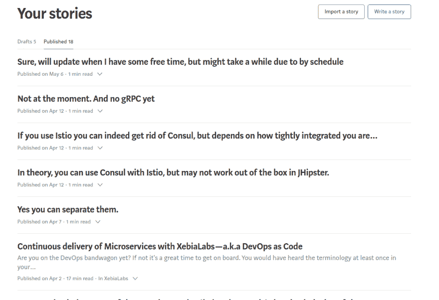
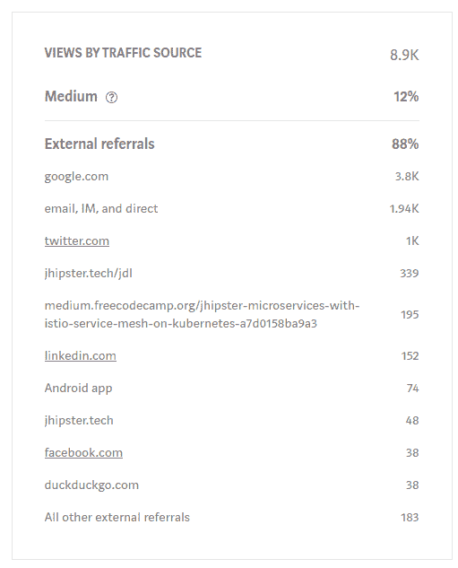

# 为什么我要离开媒体

> 原文：<https://dev.to/deepu105/why-i-m-moving-away-from-medium-13ki>

*最初发布于[deepu . tech](https://deepu.tech/why-im-moving-away-from-medium/)T3。*

经过深思熟虑后，我决定将我的博客从[媒介](https://medium.com/@deepu105)中移走。我曾考虑和[雨果](https://gohugo.io/)一起建立自己的博客，但后来决定和[戴夫一起去](https://dev.to/deepu105)。以下是我决定离开 Medium 和选择 Dev.to 的原因。

所有的考虑都纯粹是从技术写作的角度出发，因为我使用媒体来发布技术内容。

### 爱恨交加中

当我开始在这里写作时，我喜欢媒介，原因是:

*   一个简单简洁的 UI——它仍然是最好的之一

*   易于创作和发布

*   社区和可见性

*   出版物

*   易于定制

但是也有一些我不太喜欢的东西慢慢变得很烦人

*   怪异的评论机制(每个评论都是一篇文章，它们会把你的故事列表页面搞得一团糟)

*   Medium 有一个怪异的 WYSIWYG 编辑器界面，对于普通的内容创建来说很棒，但是对于技术内容创建来说就不那么棒了。它有一些类似快捷方式的降价功能，但它永远比不上使用合适的降价编辑器的便捷性。

*   只导出 HTML 格式(咄！！)

但是这些烦恼并不是我决定换平台的主要原因。以下是我认为中号不适合我的主要原因。

Medium 一直在积极推动将内容放在付费墙后面，他们已经明确表示，不选择加入的内容将不会在平台内部得到任何推动。这意味着社区和可见性部分仅在您选择加入付费墙时适用。我明白为什么 Medium 会这样做，我认为它对知名作者来说是一个巨大的资金来源，但它对像我这样的凡人不起作用。

由于上述原因，与外部来源相比，你从媒体本身获得的流量非常低。请看下面我的一个故事作为例子。对于较新的故事，它甚至更低。

因此，在媒体上写作似乎没有其他平台的好处，因为我可以从外部来源获得类似的观点，并可能在其他地方获得更好的写作体验。

**更新**
所以在搬到 Dev 社区一周后，下面是我的统计数据，令人难以置信的是，我有大约 50000 的浏览量，大约 10000 的反应和大约 300 名追随者，我的一篇帖子[出现在本周前 7 名](https://dev.to/devteam/the-7-most-popular-dev-posts-from-the-past-week-5ahf)中，而这一切都发生在短短一周内。我一年都没有从 Medium 得到任何与此有丝毫关系的东西。

### 输入开发目标

当我试图寻找一个不同的平台时，我考虑的一些最重要的方面如下

*   社区:一个没有付费墙的社区和一个你的博客获得知名度和流量的社区。

*   创作的便利性:创作经验是重要的，因此最低限度的降价支持是必须的。这样，我可以在我最喜欢的编辑器(这里是 VsCode)中撰写文章，而不必受平台能力的限制。此外，这确保了我可以在将来需要时轻松地将我的帖子转移到另一个平台。

Dev.to 满足了这些需求，并在上面提供了一个漂亮干净的 UI 和 descent 发布体验。

### 结论

我认为 Medium 对于普通博客和内容创作者来说仍然是完美的，即使他们把文章放在付费墙后面，也有订户愿意付费。但对于那些不希望自己的内容处于付费墙后的技术内容创作者来说，有更好的平台。我可能仍会不时在 Dev.to 和 Medium 之间交叉发布，但 Dev.to 将是我的主要博客平台。

原载于[媒体](https://medium.com/@deepu105/why-im-moving-away-from-medium-f9153a01247e)2019 . 6 . 13

封面图片来源:由[米尔科维](https://unsplash.com/@milkovi?utm_source=unsplash&utm_medium=referral&utm_content=creditCopyText)在 [Unsplash](https://unsplash.com/search/photos/writing?utm_source=unsplash&utm_medium=referral&utm_content=creditCopyText) 上拍摄的照片