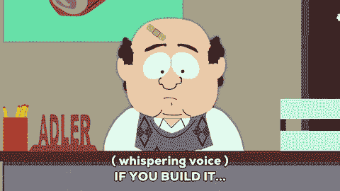

# 为什么在 SaaS 创业对开发者和非开发者来说都很难

> 原文：<https://dev.to/nilkanthjp/why-starting-a-saas-business-is-hard-for-developers-and-non-developers-3ao6>

在 SaaS 创业很难。

如果你是一名程序员，关于销售和市场营销有很多东西要学。编码应该相对容易(除非是硬技术)，但即使这样，也可能需要数周的准备工作来为你的 SaaS 应用程序整合基础。

如果你不是程序员，我想你已经做好了销售和/或营销工作，但是如果没有技术合伙人，你会陷入深深的外包地狱。

我和我的朋友杰伊非常适合前一组。我们是开发者。他是后端工程师，我做前端。我们对可以用软件解决的问题感到兴奋(真的很兴奋)，并且倾向于过快地跳到编写代码。我们经常忽视我们想象中的产品的正确上市策略。一旦代码写好了，我们就会发现自己陷入了一个窠臼。事实上，在我们的第一个项目中，在找到前 10 个客户之前，我们对我们的产品做了 616 次真正的承诺。

我们犯了两次这样的错误，然后意识到关于构建产品的一个永恒的教训:首先消除你最大的缺点。

[马蒂·卡甘的咨询集团](https://svpg.com/author/marty/)，一个在技术世界著名的产品智囊团，准确地描述了创业公司面临的挑战为[四种风险的组合](https://svpg.com/four-big-risks/):

1.  价值风险(你提供了足够的价值让人们去尝试吗？)

2.  可用性风险(你的用户能理解如何使用它吗？)

3.  可行性风险(你有能力建造它吗？)

4.  商业生存风险(你能从产品中赚到足够的钱吗？)

我们擅长写代码。我们也非常擅长与客户交流和迭代。这意味着我们可能能够计算出我们工作的大多数产品的可用性和可行性。

我们不擅长的是营销和寻找对我们持续有效的增长渠道。我们也不擅长评估如何从产品中获得最大收益。这意味着我们需要从降低我们所构建的价值和业务可行性的风险开始。

最好的创始团队的成员一开始就能回答所有这些问题，但这对绝大多数初创公司来说可能是一个很高的要求。

因此，我们从了解如何为客户创造最大价值开始。很元，但我们的客户是其他人，希望建立 SaaS 产品，我们希望为其他开发商(或非开发商)创造价值，寻找开始自己的 SaaS 业务。

我们希望在不牺牲长期可扩展性的情况下，帮助人们构建和推出 SaaS 产品。我们正在为 SaaS 开发一个后端，需要几分钟才能开始使用(有代码或没有代码——感谢 Webflow！)，但是可以比 Firebase 或外包整个项目持续更长时间。类似这样的事情会帮助我们在工程上花费更少的时间，这样我们就可以消除业务中最有问题的部分的风险。

对你来说，SaaS 建设过程中最困难的部分是什么？我们能帮你什么？