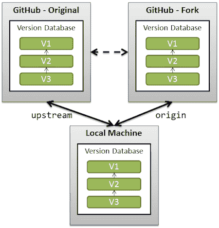
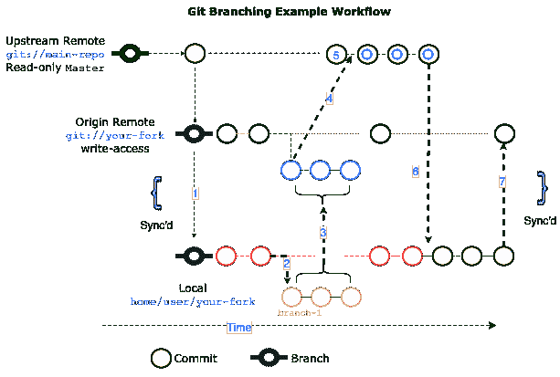

# 使用上游回购

> 原文：<https://dev.to/rowland007/working-with-upstream-repos-3g5a>

一个下游的存储库(又名“ *fork* ”)维护者通常需要与上游的工作(又名“ *original* ”)保持同步。情况是，当你在你自己的起源分叉上工作时，上游回购的开发在继续。您希望获取上游更改并将其应用到原点，这样就不会产生冲突。

[](https://res.cloudinary.com/practicaldev/image/fetch/s--pHOr6y6s--/c_limit%2Cf_auto%2Cfl_progressive%2Cq_auto%2Cw_880/https://i.stack.imgur.com/LtFGa.png)

以下步骤允许您在本地 git 存储库中的命令行上实现这一点。

## 添加远程上游知识库

这一步定义了 fork 的上游存储库。首先是语法，后面是一个例子。

```
git remote add <any_name_you_choose> [Upstream git URL]
git remote add upstream https://github.com/QubesOS/qubes-doc.git 
```

Enter fullscreen mode Exit fullscreen mode

## 取上游分支

```
git fetch <the_name_you_chose_earlier>
git fetch upstream 
```

Enter fullscreen mode Exit fullscreen mode

## 将上游的变更合并到下游的储存库中

在您的主分支中，使用下面的 merge 命令将上游主分支的更改合并到您的本地源代码中:

```
git checkout origin/master
git merge upstream/master 
```

Enter fullscreen mode Exit fullscreen mode

然后，您可以合并到您之前工作的分支，或者开始一个新的分支。因为开始一个新分支很容易，所以这个示例将主分支合并到开发分支中。

```
git checkout origin/develop
git merge origin/master 
```

Enter fullscreen mode Exit fullscreen mode

# 工作流示例

[](https://res.cloudinary.com/practicaldev/image/fetch/s--4eZT9BI8--/c_limit%2Cf_auto%2Cfl_progressive%2Cq_auto%2Cw_880/https://docs.rhodecode.com/RhodeCode-Enterprise/_images/git-flow-diagram.png)

1.  您使用克隆从上游回购中*派生*，然后在您的计算机上创建一个*本地*副本。
2.  您在主分支上创建了一个新的分支 branch-1 来处理您的工作。
3.  您将这些提交从 branch-1 推送到您自己的原始回购。
4.  然后，您创建一个 *pull 请求*，将上游回购发送到主分支。
5.  您的*拉动请求*被合并到主分支中，开发在上游主分支上继续，经过您的*本地*和原始回购。
6.  然后，您必须在继续工作之前获取上游回购，以避免冲突
7.  然后，您将上游更改推送到您的 origin repo，使 origin 与上游保持同步。

# 图例

| 接近 | 向上游 | 起源 | 当地的 |
| --- | --- | --- | --- |
| 自己的 | 不 | 是 | 是 |
| 阅读 | 是 | 是 | 是 |
| 写 | 不 | 是 | 是 |
| 遥远的 | 是 | 是 | 不 |