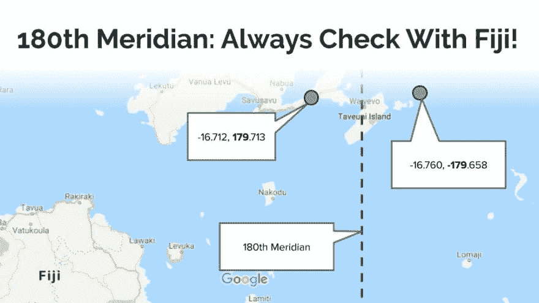

# 编写好的单元测试:一步一步的教程

> 原文：<https://dev.to/itnext/writing-good-unit-tests-a-step-by-step-tutorial-1l4f>

*这篇文章最初发表在我的博客[smartpuffin.com](http://smartpuffin.com/unit-tests-tutorial/)上。*

* * *

假设我们刚刚编写了一个计算地球上两点之间距离的方法。让我们想象我们想要尽可能好地测试它。我们如何提出测试用例？我们到底需要测试什么？

额外收获:了解一个关于斐济群岛的惊人事实。🇫🇯

### 先决条件

我假设你已经熟悉了单元测试的概念。我将使用 Java 和 JUnit，但是如果您不熟悉它们也不用担心:本教程的目的是学习编写更完整的测试套件。您将在运行中获得特定于平台的东西。

这里有一个到库的链接[，我把这篇文章的完整源代码放在这里。可以下载下来边看边看，也可以事后再看。](https://github.com/ice-lenor/ExampleUnitTests)

这是我之前关于单元测试主题的文章，更广泛地解释了单元测试中的最佳实践。

我们走吧！

# 阳性病例

让我们从把我们的方法想象成一个黑盒开始。

我们有这个 API:

```
// Returns distance in meters using haversine formula
double getDistance(double latitude1, double longitude1, double latitude2, double longitude2);

```

我们可以测试什么？

## 让自己处于测试心态

你现在需要从一个开发人员转变成一个测试人员。这意味着你必须停止相信自己。如果你没有测试过，你不可能知道你的代码在工作！

如果你手工测试它，你不知道下次有人修改你的代码或者接近修改时它是否还能工作。

此外，您可以确信，无论您在这个经过充分测试的部分上构建什么代码，您都少了一个需要担心的问题。

当你的代码经过良好的测试时，你会有一种难以置信的安全感。您可以自由地重构并进一步开发新特性——并且确保您的旧代码不会崩溃。

如果你发现了一个 bug，答应给自己一个奖励。但是一定要小心:太多的饼干对你的健康有害。

## 首次测试

好了，我们准备测试了！我们应该先测试什么？

我首先想到的是:

> 计算两点之间的距离，并与手动计算的真实数进行比较。如果它们匹配，一切都好！

这是一个很好的测试策略。让我们为此编写一些测试。

我会选择几个点:一个在荷兰的最北部，一个在最南部。实际上，我想从上到下衡量这个国家。

我点击了地图上的几个点，得到了这个:

```
Point 1: latitude = 53.478612, longitude = 6.250578.
Point 2: latitude = 50.752342, longitude = 5.916981.

```

我曾经用外部网站计算过距离，得到 304001.021046 米。这意味着荷兰有 304 公里长！

现在，我们如何使用它？

## 关于领域的思考

我们需要考虑特定领域的事情。从代码中并不是所有的都是显而易见的:有些依赖于地区，有些依赖于未来的计划。

在我们的例子中，返回的距离以米为单位，并且是双精度的。

我们知道双精度容易产生舍入误差。此外，我们知道这个计算中使用的方法-哈弗辛公式-对我们如此复杂的星球来说有些不精确。这对于我们现在的应用程序来说已经足够了，但是也许我们会希望用更高精度的计算来代替它。

所有这些都使我们认为，我们应该比较我们的计算值和我们的预期值有一定的精度。

让我们挑选一些对我们的领域有益的值。为此，我们可以再次记住我们的领域和需求。1 毫米可以吗？可能会。

这是我们的第一个测试！

```
double Precision = 0.001; // We are comparing calculated distance using 1mm precision
...
@test

void distanceTheNetherlandsNorthToSouth() {
    double distance = GeometryHelpers.getDistance(53.478612, 6.250578, 50.752342, 5.916981);
    assertEquals(304001.0210, distance, Precision);
}

```

让我们运行这个测试，确保它通过。耶！

## 更多测试

我们计算了穿越荷兰的距离。但是，当然，这是一个很好的想法，以双重检查和三重检查。

您的测试应该有所不同——这有助于您为这些讨厌的 bug 撒下更大的网！

让我们找到一些更好的点。我们来看看澳大利亚有多宽怎么样？

```
@test

void distanceAustraliaWestToEast() {
    double distance = GeometryHelpers.getDistance(-23.939607, 113.585605, -28.293166, 153.718989);
    assertEquals(4018083.0398, distance, Precision);
}
```

Or how far is it from Capetown to Johannesburg?

```
@test

void distanceFromCapetownToJohannesburg() {
    double distance = GeometryHelpers.getDistance(-33.926510, 18.364603,-26.208450, 28.040572);
    assertEquals(1265065.6094, distance, Precision);
}
```

Now that we think about that: are we sure that the distance doesn't depend on the direction in which we are calculating? Let's test that as well!

```
@test

void distanceIsTheSameIfMeasuredInBothDirections() {
    // testing that distance is the same in whatever direction we measure
    double distanceDirection1 = GeometryHelpers.getDistance(-33.926510, 18.364603,-26.208450, 28.040572);
    double distanceDirection2 = GeometryHelpers.getDistance(-26.208450, 28.040572, -33.926510, 18.364603);
    assertEquals(1265065.6094, distanceDirection1, Precision);
    assertEquals(1265065.6094, distanceDirection2, Precision);
}

```

# 角落案例

太好了，我们已经介绍了一些基本案例——该方法的主要功能似乎是有效的。

我们现在可以吃一块饼干了——为了中途通过。🍪

现在，让我们将代码发挥到极限！

考虑领域区域也有所帮助。

我们的星球与其说是一个平面，不如说是一个球体。这就意味着纬度从 180°到-180°有一个地方，留下了一个“缝”，我们要小心。这方面的数学通常[包含错误](https://smartpuffin.com/little-geo-stories-a-tale-of-180th-meridian/)。我们的代码处理得好吗？

一个好主意是为它写一个测试，你认为呢？

[](https://res.cloudinary.com/practicaldev/image/fetch/s--gGiFLG9c--/c_limit%2Cf_auto%2Cfl_progressive%2Cq_auto%2Cw_880/https://thepracticaldev.s3.amazonaws.com/i/h8fnrkw57iiz0k39a20s.jpg) 
与 geo 合作？[一定要和斐济商量！](http://smartpuffin.com/geo-crash-course/)

```
@test

void distanceAround180thMeridianFiji() {
    double distance = GeometryHelpers.getDistance(-17.947826, 177.221232, -16.603513, -179.779055);
    assertEquals(351826.7740, distance, Precision);
}
```

Upon further thinking, I discovered one more tricky case - distance between two points which have the same latitude; but the longitude is 180 in one point and -180 in the other.

```
double distance = GeometryHelpers.getDistance(20, -180, 20, 180);
// Question to you, my reader: what is this distance?
```

Okay, we're done with that weird 180th meridian. We are sure about the 0th meridian though... right? Right? Let's test it too.

```
@test

void distanceAround0thMeridianLondon() {
    double distance = GeometryHelpers.getDistance(51.512722, -0.288552, 51.516100, 0.068025);
    assertEquals(24677.4562, distance, Precision);
}
```

What other cases can we come up with? I thought a bit and listed these:

*   波兰人怎么样？让我们计算一下北极和南极的距离。
*   从一极到另一极怎么样？
*   地球上的最大距离是多少？
*   一小段距离怎么样？
*   如果两点完全相同，我们得到的是 0 米的距离吗？

I'm not adding all these tests here, as it would take too much space. You can find them [in the repo](https://github.com/ice-lenor/ExampleUnitTests). You get the point. Try to think creatively. It's a game of coming up with as many ideas as possible. And don't be afraid with coming up with "too many ideas". The code is never "tested too well".

## 里面是什么

At this point, it can also help to [peek inside the code](https://github.com/ice-lenor/ExampleUnitTests/blob/master/src/main/java/smartpuffin/com/GeometryHelpers.java). Do you have the full coverage? Maybe there are some "ifs" and "elses" in the code that may give you a hint? Do google "haversine formula" and look at its limitations. We already know about precision. Is there something else that could break? Is there some combination of arguments which can make the code return an invalid value? Brainstorm about it.

# 负面案例

Negative cases are cases when the method is supposed to refuse to do its job. It is a controlled failure! Again, we should remember about the domain area. Latitude and longitude are special values. Latitude is supposed to be defined in exactly [-90, 90] degrees range. Longitude - in [-180, 180] range. This means that in case when we passed an invalid value, our method throws an exception. Let's add some tests for that!

```
@test

void invalidLatitude1TooMuch() {
    assertThrows(IllegalArgumentException.class, () -> {
        GeometryHelpers.getDistance(666, 0, 0, 0);
    });
}

```

```
@test

void invalidLatitude1TooLittle() {
    assertThrows(IllegalArgumentException.class, () -> {
        GeometryHelpers.getDistance(-666, 0, 0, 0);
    });
}

```

我们将为纬度 2 和经度参数添加相同的测试。

我们这里写的是 Java， *double* 参数不能为空。但是如果你使用的是他们能使用的语言，那就测试一下吧！

如果您使用的是动态类型语言，并且您可以传递一个字符串而不是数字，请测试它！

补充一点:动态类型的语言比静态类型的语言需要更多的测试。对于后者，编译器负责许多事情。有了前者，一切都在你的掌握之中。

# 包扎

你可以在这里看到并下载这个教程[的源代码。看看它，试着想出一些更有用的测试场景。](https://github.com/ice-lenor/ExampleUnitTests/)

## [ice-lenor](https://github.com/ice-lenor)/[ExampleUnitTests](https://github.com/ice-lenor/ExampleUnitTests)

<article class="markdown-body entry-content p-5" itemprop="text">

# 示例单元测试

这是关于编写好的单元测试套件的教程的源代码。

# 辅导的

参见此处的教程:

[http://smartpuffin.com/unit-tests-tutorial/](http://smartpuffin.com/unit-tests-tutorial/)

## 这个怎么处理

1.  打开教程。
2.  打开`GeometryHelpers.java`。
3.  打开`GeometryHelpersTest1.java`。检查测试结构。运行测试。
4.  打开`GeometryHelpersTest2.java`。
5.  将`GeometryHelpersTest1.java`中的首次测试与`GeometryHelpersTest2.java`中的首次测试进行比较。看到即使是最小的领域知识也很重要了吗？
6.  想想你还能测试什么。我肯定有我错过的东西！
7.  在您自己的项目中应用最佳实践。
8.  喜欢教程？分享，喜欢，订阅，说谢谢。我会很高兴知道的！

## 如何运行测试

我用 Intellij IDEA 和 Java 1.8+运行这个。

1.  下载源代码。
2.  用 Intellij IDEA 中的代码打开文件夹。
3.  打开文件`GeometryHelpersTest1.java`。你会在行号旁边看到绿色的“运行测试”按钮。按下一个…

</article>

[View on GitHub](https://github.com/ice-lenor/ExampleUnitTests)

这里有[一些后续阅读](https://dev.to/ice_lenor/unit-testing-best-practices-27ec)来学习单元测试中的最佳实践。

[](/ice_lenor) [## 单元测试:最佳实践

### Elena Mar 21 ' 186 分钟读数

#unittesting #codequality #testing](/ice_lenor/unit-testing-best-practices-27ec)

对于您自己的项目，选择将从测试中获益最多的部分——并尝试用测试来覆盖它。创造性地思考！把它变成一个挑战，一场与自己的竞争！

单元测试很有趣！