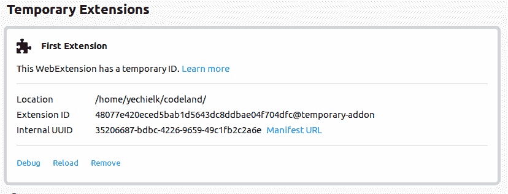
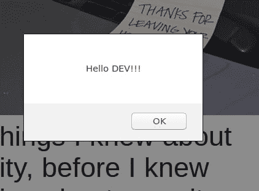

# 编写您的第一个浏览器扩展教程-第 1 部分

> 原文：<https://dev.to/yechielk/writing-your-first-browser-extension-part-1-d5e>

*本教程基于我在 2019 年纽约 Codeland 会议上举办的研讨会。*

出于本教程的目的，我们将使用 Firefox，尽管大多数概念也适用于其他浏览器。

*本教程的代码可以在[这里](https://github.com/achasveachas/codeland)找到*

## 什么是浏览器扩展？

就其最基本的形式而言，浏览器扩展只是一个 JavaScript 文件，它在您的浏览器中运行代码来修改/改善您的浏览体验。

你是否曾经看着一个网页，希望你能改变它？也许是广告太多了？也许你不喜欢这种字体？可能是颜色主题太亮了？

不管是什么情况，如果您希望看到的变化是可以在浏览器中发生的(即，它是前端的变化，不涉及任何后端)，那么您可以编写一个浏览器扩展来实现它。

有些更改比其他的更容易实现，但是一般来说，如果更改是 web 开发人员可以使用 JavaScript 实现的，那么您可以自己编写一个扩展来实现它！

## 浏览器扩展的结构

浏览器扩展的规模和复杂性各不相同，但本质上，它们都共享相同的基本模板。

下面是一个简单的扩展:

```
sample-extension  
└───images
│   └───icon-48.png
│   └───icon-96.png
│   └───image1.jpg
│   └───image2.jpg
│
└───manifest.json
└───sample-extnsion.js 
```

Enter fullscreen mode Exit fullscreen mode

这个扩展位于一个我称为`sample-extension`的文件夹中。

扩展的核心是一个名为`manifest.json`的文件。清单是一个 JSON 文件，它包含浏览器需要的信息，以便知道何时以及如何运行您的扩展。我们一会儿会仔细看看清单。

扩展的实际代码位于一个 JavaScript 文件中，我称之为`sample-extension.js`。

随着您的扩展变得越来越复杂，您可能希望将您的代码拆分到子目录中的多个文件中，但是这是一个相当简单的扩展。

最后，你希望包含的任何图像，包括你将用来在浏览器插件商店中推广你的扩展的图标，都可以放入我称为`images`的子文件夹中。

## 载货单。

清单是你扩展的核心；这就是你的浏览器如何知道运行哪个代码，以及何时和如何运行它。

让我们来看一个简单扩展的样本清单:

```
{  "manifest_version":  2,  "name":  "<EXTENSION-NAME>",  "version":  "1.0",  "description":  "<A USEFUL DESCRIPTION>",  "icons":  {  "48":  "<URL TO AN ICON>",  "96":  "<URL TO AN ICON>"  },  "content_scripts":  [  {  "matches":  ["<URL MATCHER>"],  "js":  ["<RELATIVE PATH TO A JS FILE>"]  }  ]  } 
```

Enter fullscreen mode Exit fullscreen mode

那看起来很多！我们来看看相关部分:

*   `"name"`:是您的扩展的名称(用于在浏览器的附加商店中列出它)。

*   是您的扩展版本。随着您的改进，您将提高这个数字，这样人们就可以确保他们运行的是最新版本。

*   是对你的浏览器功能的一种人类可读的描述，所以在附加商店里碰到它的人知道它是什么。

*   `"icons"`:您可以在这里提供图标，这些图标将与您的扩展一起显示在附加商店中(这两种尺寸分别用于附加商店描述和缩略图)。

*   这是清单的主要部分；它告诉你的浏览器运行哪个代码，什么时候运行。它包含两个键:

    *   `"matches"`:获取一个 URL 数组，您的扩展应该在其中运行。
    *   `"js"`:获取 JavaScript 文件的路径数组，当浏览器遇到`"matches"`中的某个 URL 时，应该运行这些文件。

您还可以提供其他键来表示您的扩展可以执行的不同功能。它们在这里列出[。](https://developer.mozilla.org/en-US/docs/Mozilla/Add-ons/WebExtensions/manifest.json)

现在我们已经有了所有需要的信息，让我们开始编码吧！

## 我们开始吧！

### 你好 DEV！

我们将从我能想到的最简单的扩展开始，可以说是浏览器扩展的“Hello World”。

*   让我们首先为我们的扩展创建一个目录。在您的终端中键入:

```
mkdir first-extension
cd first-extension 
```

Enter fullscreen mode Exit fullscreen mode

*   在`first-extension`目录中，让我们创建我们的清单:

```
touch manifest.json 
```

Enter fullscreen mode Exit fullscreen mode

*   现在，使用您最喜欢的编辑器打开我们刚刚创建的清单，并粘贴到下面的 JSON 中(我通常不喜欢从教程中复制/粘贴代码；我认为，通过花时间把东西打出来，你可以建立肌肉记忆，更好地保留信息，但我不会让你自己打出所有这些 JSON):

```
{  "manifest_version":  2,  "name":  "first-extension",  "version":  "1.0",  "description":  "Our very first browser extension!",  "content_scripts":  [  {  "matches":  ["*://*.dev.to/*"],  "js":  ["first-extension.js"]  }  ]  } 
```

Enter fullscreen mode Exit fullscreen mode

*   我们从前面看到的通用清单中更改的部分是:

    *   我们添加了一个名字和描述。
    *   我们去掉了`icons`键，因为我们没有在扩展中使用图标。
    *   我们给了`matches`键一个数组，包含 dev.to 的 URL，我们的扩展将在这个网站上运行。
        *   这三个星号是通配符，将匹配:1)任何协议(HTTP 和 HTTPS)，2)dev . to 的任何子域(例如 shop.dev.to)，以及 3)dev . to 上的任何页面(例如[https://dev.to/yechielk](https://dev.to/yechielk))。
    *   我们给了`js`键一个包含文件名`first-extension.js`的数组，我们将在这个文件中编写扩展代码。
*   换句话说，我们的清单说的是，当我们的浏览器访问任何匹配我们提供的模式的 URL(即 dev.to 上的任何页面)时，它应该运行文件`first-extension.js`中的代码。

*   此时，确保我们确实有一个`first-extension.js`文件可能是个好主意。让我们回到我们的终点站:
    T2

```
touch first-extension.js 
```

Enter fullscreen mode Exit fullscreen mode

*   完美！我们现在(技术上)有了一个可用的浏览器扩展。

*   我们需要做的下一件事是告诉我们的浏览器加载我们的扩展。

*   在 Firefox 中，进入以下页面:“关于:调试”。

[](https://res.cloudinary.com/practicaldev/image/fetch/s--o1dhf9VF--/c_limit%2Cf_auto%2Cfl_progressive%2Cq_auto%2Cw_880/https://thepracticaldev.s3.amazonaws.com/i/te6rimi9iz88w3zs94h4.png)

*   在右上角附近，单击“加载临时加载项...”按钮

*   导航到我们为扩展创建的文件夹，并选择`manifst.json`文件。

*   您应该看到我们的`first-extension`扩展出现在“临时扩展”下。

[](https://res.cloudinary.com/practicaldev/image/fetch/s---qPTjCQY--/c_limit%2Cf_auto%2Cfl_progressive%2Cq_auto%2Cw_880/https://thepracticaldev.s3.amazonaws.com/i/a9ggw2vjcltep4qd2dd9.png)

*   我们的扩展现在已经加载完毕，可以开始运行了。如果我们导航到 dev.to，我们的浏览器将执行`first-extension.js`中的代码。当然，我们不能说，因为在`first-extension.js`中有**和**没有代码，所以让我们来解决这个问题。

*   大多数人会放一个`console.log()`来看看他们是否能在他们的控制台上看到什么，但我认为`alert`更酷，所以让我们这么做吧！

*   打开`first-extension.js`并添加以下内容:

```
alert("Hello DEV!") 
```

Enter fullscreen mode Exit fullscreen mode

*   如果刷新 dev.to，什么也不会发生；我们的浏览器仍然运行我们加载的旧代码。每次我们修改代码时，都需要重新加载扩展。

*   回到“关于:调试”,看看我们加载的临时扩展。靠近底部应该有一个小链接，上面写着“重新加载”。点击它，然后刷新开发到。你应该看到我们的警告弹出！

[](https://res.cloudinary.com/practicaldev/image/fetch/s--iikXmNo_--/c_limit%2Cf_auto%2Cfl_progressive%2Cq_auto%2Cw_880/https://thepracticaldev.s3.amazonaws.com/i/w0r6drgm2p9sqnyy2klw.png)

*   恭喜你！你现在有一个工作的浏览器扩展！

#### 故障排除

*如果你不能弹出警告，甚至不能加载扩展，请仔细检查你的清单是否是没有语法错误的有效 JSON(你可以使用在线验证器，比如 [jsonlint](https://jsonlint.com/) 来确保你没有遗漏任何逗号等等。).确保`"js"`文件名中没有拼写错误，并且清单中的名称与文件的实际名称匹配。*

*一些参与者在研讨会中遇到的一个问题是他们忘记从清单中取出`"icons"`钥匙。如果它在那里，并且该值不是一个有效的文件路径，浏览器将会在试图加载图标时崩溃。*

### 下推特！

*   太酷了。但是让我们写一个真正有用的扩展。有没有一种扩展功能，可以在你在 Twitter 上呆了 10 分钟后给你发信号，提醒你休息一下。

*   让我们回到清单，将 DEV 网站上的`"matches"`键的值改为 Twitter:

```
 "content_scripts": [
        {
-            "matches": ["*://*.dev.to/*"], +            "matches": ["*://*.twitter.com/*"],
             "js": ["first-extension.js"]
        }
    ] 
```

Enter fullscreen mode Exit fullscreen mode

*   如果我们在“about:debugging”中重新加载我们的扩展，并前往 Twitter.com，我们应该看到我们的警告在那里弹出。这只是为了确保一切都还在工作。

*   让我们修改我们的`first-extension.js`来添加我们想要的功能。

*   我们可以使用 JavaScript 内置的`setInterval`函数，它以设定的时间间隔运行回调函数。

*   `setInterval`函数有两个参数。要运行的函数，以及运行该函数的时间间隔，以毫秒为单位。

*   让我们先把我们的间隔设置为 10 分钟。我们可以这样做:

```
const interval = 600000 // 600,000 milliseconds = 10 minutes 
```

Enter fullscreen mode Exit fullscreen mode

但是我发现把音程分成几个组成部分更有可读性。这将使你在几个星期后回到代码时更容易理解:

```
const interval = 1000 * 60 * 10 // 1000ms = 1 second * 60 = 1 minute * 10 = 10 minutes 
```

Enter fullscreen mode Exit fullscreen mode

*   接下来让我们编写每十分钟运行一次的函数。我们想要一个功能，弹出警告，告诉我们离开 Twitter。它应该是这样的:

```
function reminder() {
    alert("Get off Twitter!")
} 
```

Enter fullscreen mode Exit fullscreen mode

*   现在我们有了所有需要的零件。剩下的唯一事情就是把它们放在一起并调用我们的`setInterval`函数:

```
setInterval(reminder, interval) 
```

Enter fullscreen mode Exit fullscreen mode

*   我们现在有了一个可以做我们想做的事情的浏览器扩展。唯一的问题是，为了测试它，我们必须等待 10 分钟，并且:所以现在让我们将间隔时间从 10 分钟改为 10 秒钟:

```
- const interval = 1000 * 60 * 10 + const interval = 1000 * 10 
```

Enter fullscreen mode Exit fullscreen mode

*   让我们在“关于:调试”中重新加载我们的扩展，前往 Twitter.com。

*   如果我们等待 10 秒钟，我们应该看到我们的警报弹出！

*   如果我们解除警报，我们应该看到它在 10 秒钟后再次弹出。

*   我们可以回到`first-extension.js`，将间隔切换回 10 分钟:

```
- const interval = 1000 * 10 + const interval = 1000 * 60* 10 
```

Enter fullscreen mode Exit fullscreen mode

*   恭喜，我们完成了！

## 接下来是什么？

所以现在我们有了一个实际的、有用的浏览器扩展，但是当你想到有趣的浏览器扩展时，你想到的是那些实际上改变了网页的扩展。

浏览器扩展通过使用 DOM 操纵(一类 JavaScript 函数，允许它与网页交互并操纵网页)来实现这一点。

在本系列的第二部分中，我们将构建一个有趣的扩展，在尝试修复科技领域破碎的招聘系统的同时，还将包括猫！