# 使用 Azure 函数和 Face API 的移动应用后端

> 原文：<https://dev.to/humbertojaimes/xamarin-azure-functions-in-action-3afn>

##### 温贝托·詹姆思-【humberto@humbertojaimes.net·T2】

> 本文是 [#ServerlessSeptember](https://dev.to/azure/serverless-september-content-collection-2fhb) 的一部分。在这个无服务器的内容集合中，您可以找到其他有用的文章、详细的教程和视频。9 月份，每天都有来自社区成员和云倡导者的新文章发布，没错，每天都有。
> 
> 在[https://docs.microsoft.com/azure/azure-functions/](https://docs.microsoft.com/azure/azure-functions/?WT.mc_id=servsept_devto-blog-cxa)了解更多关于微软 Azure 如何实现你的无服务器功能。

认知定位器项目，公开称为“Busca.me”，是一个致力于报告和寻找失踪人员的项目。该项目是由于 2017 年 9 月 19 日影响墨西哥多个州的地震相关灾害而创立的。起初，这个项目只是专注于寻找或报告因地震而失踪的人。然而，现在该项目已经发展壮大，它不仅旨在支持当时受影响的人，而且旨在支持任何正在经历这一灾难性情况的人。

认知定位器项目的源代码在[https://github.com/humbertojaimes/cognitive-locator](https://github.com/humbertojaimes/cognitive-locator)的麻省理工学院许可下

项目后端是使用 Azure 函数创建的。这是项目架构

[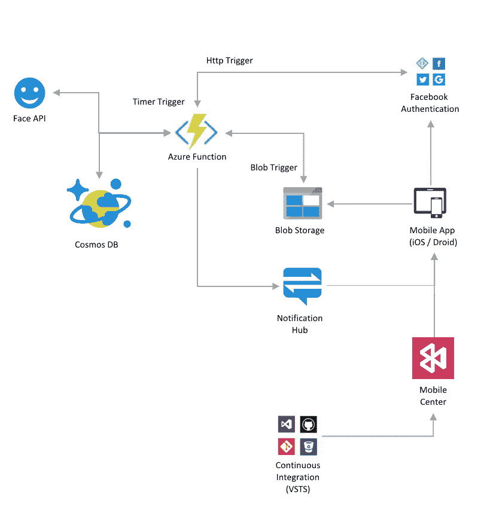](https://res.cloudinary.com/practicaldev/image/fetch/s--nppGiA3T--/c_limit%2Cf_auto%2Cfl_progressive%2Cq_auto%2Cw_880/https://thepracticaldev.s3.amazonaws.com/i/t6n2losoz9xlxw2al1uf.png)

这篇文章将解释如何创建两个函数。这两个功能将具有与认知定位器后端核心功能相似的功能。

*   在 Azure 通知中心注册设备 HTTP 功能。

*   一种 Blob 存储功能，分析照片并使用推送通知将结果报告给设备。

[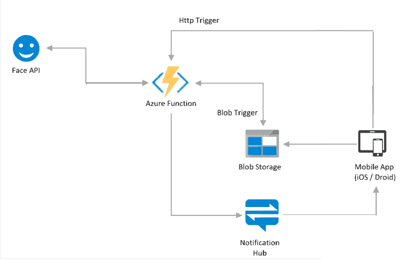](https://res.cloudinary.com/practicaldev/image/fetch/s--WWMcR-MS--/c_limit%2Cf_auto%2Cfl_progressive%2Cq_auto%2Cw_880/https://thepracticaldev.s3.amazonaws.com/i/lejevc9hvp0nx29nzd20.png)

注意:在这个时候，这篇文章只是为了解释 Azure 的功能部分。将来，我可以创建 Azure 通知中心配置和 Xamarin 帖子。

*原项目有 Xamarin 样本*

先决条件:

*   蓝色账户
*   提供了一个已配置的 Azure 通知中心实例
*   提供了 Azure Face API 服务

### 设备注册功能

#### 创建新项目

对于本教程，我将使用面向 Mac 的 Visual Studio 2019。

1.  创建新项目

[](https://res.cloudinary.com/practicaldev/image/fetch/s--Z4et5RTF--/c_limit%2Cf_auto%2Cfl_progressive%2Cq_auto%2Cw_880/https://thepracticaldev.s3.amazonaws.com/i/2oy8wwl4tte9ir4shpko.png)

1.1 在“云”选项卡中选择“Azure 功能”

[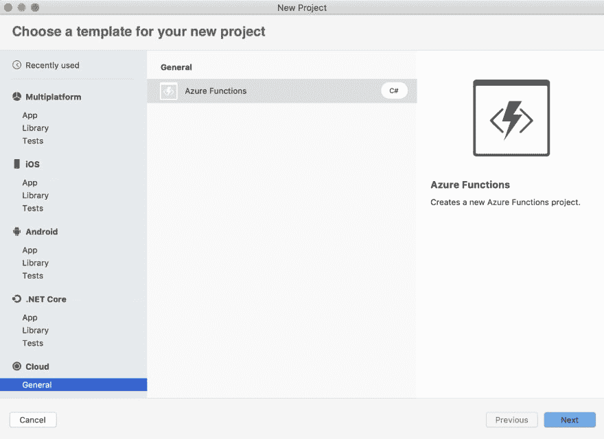](https://res.cloudinary.com/practicaldev/image/fetch/s--LdHzfFLb--/c_limit%2Cf_auto%2Cfl_progressive%2Cq_auto%2Cw_880/https://thepracticaldev.s3.amazonaws.com/i/zs7yzwegxw3onjnfcxy6.png)

1.  编写“DeviceInstallationRegistration”作为函数名，并选择“HttpTrigger”

[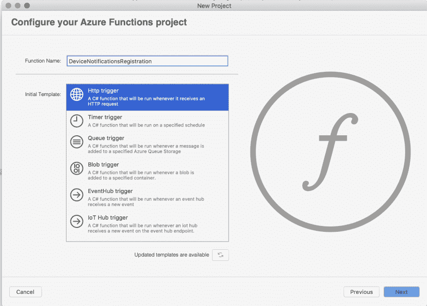](https://res.cloudinary.com/practicaldev/image/fetch/s--_f_BVVx4--/c_limit%2Cf_auto%2Cfl_progressive%2Cq_auto%2Cw_880/https://thepracticaldev.s3.amazonaws.com/i/s0cpg8dx77kpehcyuysz.png)

1.  对于本演示，选择“匿名”访问级别。

[](https://res.cloudinary.com/practicaldev/image/fetch/s--RorxgiJE--/c_limit%2Cf_auto%2Cfl_progressive%2Cq_auto%2Cw_880/https://thepracticaldev.s3.amazonaws.com/i/vez7eqm5ep99b2gse9jo.png)

1.  要完成项目的创建，请使用“ServelessSeptember”作为项目和解决方案的名称。

[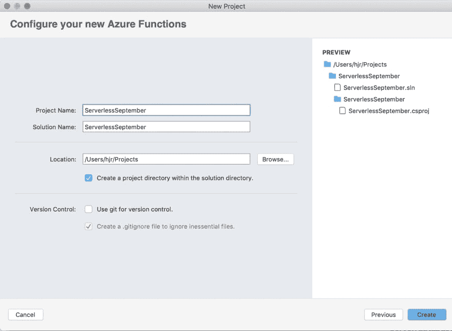](https://res.cloudinary.com/practicaldev/image/fetch/s--JHGxSQs0--/c_limit%2Cf_auto%2Cfl_progressive%2Cq_auto%2Cw_880/https://thepracticaldev.s3.amazonaws.com/i/vtyg8vdxd51l8au1fe5u.png)

1.  在新项目中创建一个包含以下内容的“设置”类。

```
public class Settings
    {
        public static string AzureWebJobsStorage = Environment.GetEnvironmentVariable("AzureWebJobsStorage");

        public static string FaceAPIKey = Environment.GetEnvironmentVariable("Vision_API_Subscription_Key");
        public static string Zone = Environment.GetEnvironmentVariable("Vision_API_Zone");

        public static string NotificationAccessSignature = Environment.GetEnvironmentVariable("NotificationHub_Access_Signature");
        public static string NotificationHubName = Environment.GetEnvironmentVariable("NotificationHub_Name");

    } 
```

该类旨在从 Azure Functions 门户配置中获取键和连接字符串。

#### 编程功能

1.  在编写代码之前，我们需要安装“微软。Azure.NotificationHubs" NuGet 包。

[](https://res.cloudinary.com/practicaldev/image/fetch/s--gXJYjdc---/c_limit%2Cf_auto%2Cfl_progressive%2Cq_auto%2Cw_880/https://thepracticaldev.s3.amazonaws.com/i/1zgg2sk7hbj4spsi14cf.png)

1.  我们需要一个包含设备信息的类。

创建一个文件夹“Domain”并在其中创建一个类“DeviceInformation”。

```
public class DeviceInstallation
    {
        public string InstallationId { get; set; }

        public string Platform { get; set; }

        public string PushChannel { get; set; }

    } 
```

1.  在“Helpers”文件夹中创建一个类“NotificationsHelper”。

这是上课的内容

```
 public static class NotificationsHelper
    {

        //Notification Hub settings
        public static string ConnectionString = Settings.NotificationAccessSignature;
        public static string NotificationHubPath = Settings.NotificationHubName;

        // Initialize the Notification Hub
        static NotificationHubClient hub = NotificationHubClient.CreateClientFromConnectionString(ConnectionString, NotificationHubPath);

        /// <summary>
        /// Receive the information to register a new mobile device in the Azure Notification Hub
        /// </summary>
        /// <param name="deviceUpdate">The device information</param>
        /// <param name="log"></param>
        /// <returns></returns>
        public static async Task RegisterDevice(DeviceInstallation deviceUpdate, ILogger log)
        {
            Installation installation = new Installation();
            installation.InstallationId = deviceUpdate.InstallationId;
            installation.PushChannel = deviceUpdate.PushChannel;
            switch (deviceUpdate.Platform)
            {
                case "apns":
                    installation.Platform = NotificationPlatform.Apns;
                    break;
                case "fcm":
                    installation.Platform = NotificationPlatform.Fcm;
                    break;
                default:
                    throw new Exception("Invalid Channel");
            }
            installation.Tags = new List<string>();
            await hub.CreateOrUpdateInstallationAsync(installation);
            log.LogInformation("Device was registered");
        }

        /// <summary>
        /// Register a device to receive specific notifications related to a report
        /// </summary>
        /// <param name="installationId">Identifier of the device</param>
        /// <param name="requestId">The report identifier</param>
        /// <param name="log"></param>
        /// <returns></returns>
        public static async Task AddToRequest(string installationId, string requestId, ILogger log)
        {
            await AddTag(installationId, $"requestId:{requestId}", log);
            log.LogInformation($"Device was registered in the request {requestId}");
        }

        /// <summary>
        /// Remove a device from the notificartions related to a report
        /// </summary>
        /// <param name="installationId">Identifier of the device</param>
        /// <param name="requestId">The report identifier</param>
        /// <param name="log"></param>
        /// <returns></returns>
        public static async Task RemoveFromRequest(string installationId, string requestId, ILogger log)
        {
            await RemoveTag(installationId, $"requestId:{requestId}", log);
            log.LogInformation($"Device was removed from the request {requestId}");
        }

        /// <summary>
        /// Remove a device from an specific tag in the Azure Notification Hub
        /// </summary>
        /// <param name="installationId">The device identifier</param>
        /// <param name="tag">The Azure Notification Hub Tag</param>
        /// <param name="log"></param>
        /// <returns></returns>
        private static async Task RemoveTag(string installationId, string tag, ILogger log)
        {
            try
            {
                Installation installation = await hub.GetInstallationAsync(installationId);
                if (installation.Tags == null)
                {
                    if (installation.Tags.Contains(tag))
                        installation.Tags.Remove(tag);
                    await hub.CreateOrUpdateInstallationAsync(installation);
                }
            }
            catch (Exception ex)
            {
                log.LogInformation(ex.Message);
            }
        }

        /// <summary>
        /// Add a device to an specific tag in the Azure Notification Hub
        /// </summary>
        /// <param name="installationId">The device identifier</param>
        /// <param name="tag">The Azure Notification Hub Tag</param>
        /// <param name="log"></param>
        /// <returns></returns>
        private static async Task AddTag(string installationId, string newTag, ILogger log)
        {
            try
            {
                Installation installation = await hub.GetInstallationAsync(installationId);
                if (installation.Tags == null)
                    installation.Tags = new List<string>();
                installation.Tags.Add(newTag);
                await hub.CreateOrUpdateInstallationAsync(installation);
            }
            catch (Exception ex)
            {
                log.LogInformation(ex.Message);
            }
        }

        /// <summary>
        /// Remove a device from the Azure Notification Hub
        /// </summary>
        /// <param name="installationId">The device identifier</param>
        /// <returns></returns>
        public static async Task RemoveDevice(string installationId)
        {
            await hub.DeleteInstallationAsync(installationId);
        }

        /// <summary>
        /// Send a push notification about an specific report id. At this moment is only supported 1 device per report
        /// </summary>
        /// <param name="text">The notification message that will be displayed by the mobile device</param>
        /// <param name="requestId">the report identifier</param>
        /// <param name="installationId">The device identifier</param>
        /// <param name="log"></param>
        /// <returns></returns>
        public static async Task SendNotification(string text, string requestId, string installationId, ILogger log)
        {
            try
            {
                Installation installation = await hub.GetInstallationAsync(installationId);

                if (installation.Platform == NotificationPlatform.Fcm)
                {
                    var json = string.Format("{{\"data\":{{\"message\":\"{0}\"}}}}", text);
                    await hub.SendFcmNativeNotificationAsync(json, $"requestid:{requestId}");
                    log.LogInformation($"FCM notification was sent");
                }
                else
                {
                    var json = string.Format("{{\"aps\":{{\"alert\":\" {0}\"}}}}", text);
                    await hub.SendAppleNativeNotificationAsync(json, $"requestid:{requestId}");
                    log.LogInformation($"Apple notification was sent");
                }
            }
            catch (Exception ex)
            {
                log.LogInformation(ex.Message);
            }
        }

        /// <summary>
        /// Send a notification to all Apple and Firebase devices in the notification hub
        /// </summary>
        /// <param name="text">The notification message that will be displayed by the mobile device </param>
        /// <param name="log"></param>
        /// <returns></returns>
        public static async Task SendBroadcastNotification(string text, ILogger log)
        {
            try
            {
                var json = string.Format("{{\"data\":{{\"message\":\"{0}\"}}}}", text);
                await hub.SendFcmNativeNotificationAsync(json);
                log.LogInformation($"FCM notification was sent");

            }
            catch (Exception ex) //If there aren't FCM devices registered in the hub, it throws an error
            {
                log.LogInformation(ex.Message);
            }

            try
            {
                var json = string.Format("{{\"aps\":{{\"alert\":\" {0}\"}}}}", text);
                await hub.SendAppleNativeNotificationAsync(json);
                log.LogInformation($"Apple notification was sent");
            }
            catch (Exception ex) //If there aren't Apple devices registered in the hub, it throws an error
            {
                log.LogInformation(ex.Message);
            }
        }
    } 
```

1.  最后是函数的代码。

```
[FunctionName("DeviceNotificationsRegistration")]
        public static async Task<HttpResponseMessage> Run([HttpTrigger(AuthorizationLevel.Anonymous, "put", Route = "devicenotificationsregistrations/")]HttpRequestMessage req, ILogger log)
        {
            try
            {
                log.LogInformation("New device registration incoming");
                var content = await req.Content.ReadAsStringAsync();
                DeviceInstallation deviceUpdate = await req.Content.ReadAsAsync<DeviceInstallation>();
                await NotificationsHelper.RegisterDevice(deviceUpdate, log);
                log.LogInformation("New device registered");
                return req.CreateResponse(HttpStatusCode.OK);
            }
            catch (Exception ex)
            {
                log.LogInformation($"Error during device registration: {ex.Message}");
            }
            return req.CreateErrorResponse(HttpStatusCode.InternalServerError, "Error during device registration");
        } 
```

### 人物注册功能

1.  在“Helpers”文件夹中创建一个“FaceClientHelper”。

在最初的项目中，helper 包含几个与 Face API 交互的方法。出于演示的目的，这个示例只有一个方法。

https://github . com/humbertojaimes/cognitive-locator/blob/master/source/cognitive locator。functions/Client/face Client . cs

```
public class FaceClientHelper
    {
        private string FaceAPIKey = Settings.FaceAPIKey;
        private string Zone = Settings.Zone;

        /// <summary>
        /// Analyze a photo using the Face API
        /// </summary>
        /// <param name="url">The image url</param>
        /// <returns></returns>
        public async Task<List<JObject>> DetectFaces(String url)
        {
            using (var client = new HttpClient())
            {
                var service = $"https://{Zone}.api.cognitive.microsoft.com/face/v1.0/detect";
                client.DefaultRequestHeaders.Add("Ocp-Apim-Subscription-Key", FaceAPIKey);
                byte[] byteData = Encoding.UTF8.GetBytes("{'url':'" + url + "'}");
                using (var content = new ByteArrayContent(byteData))
                {
                    content.Headers.ContentType = new MediaTypeHeaderValue("application/json");
                    var httpResponse = await client.PostAsync(service, content);

                    if (httpResponse.StatusCode == HttpStatusCode.OK)
                    {
                        List<JObject> result = JsonConvert.DeserializeObject<List<JObject>>(await httpResponse.Content.ReadAsStringAsync());
                        return result;
                    }
                }
            }
            return null;
        }

    } 
```

1.  在项目中创建新函数

[](https://res.cloudinary.com/practicaldev/image/fetch/s--e7mNj0Fh--/c_limit%2Cf_auto%2Cfl_progressive%2Cq_auto%2Cw_880/https://thepracticaldev.s3.amazonaws.com/i/uo7491ml95u8cf4rzyr7.png)

1.  选择 blob 触发器，并将“PersonRegistration”作为函数名。

设置 blob 的连接字符串，对于此示例，我们使用函数附带的相同存储，因此连接字符串为“AzureWebJobsStorage”

[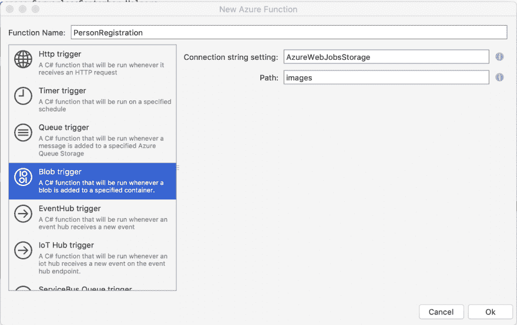](https://res.cloudinary.com/practicaldev/image/fetch/s--L5MkQ2Uf--/c_limit%2Cf_auto%2Cfl_progressive%2Cq_auto%2Cw_880/https://thepracticaldev.s3.amazonaws.com/i/xqqxzygbxh9p6ipz3hfq.png)

1.  该函数的代码如下

```
private static FaceClientHelper client_face = new FaceClientHelper();

        [FunctionName("PersonRegistration")]
        public static async Task Run([BlobTrigger("images/{name}.{extension}")]CloudBlockBlob blobImage, string name, string extension, ILogger log)
        {

            log.LogInformation($"Image: {name}.{extension}");
            string notificationMessage = "Error";
            string json = string.Empty;
            var deviceId = blobImage.Metadata["deviceid"];

            try
            {

                await NotificationsHelper.AddToRequest(deviceId, name, log);
                log.LogInformation($"uri {blobImage.Uri.AbsoluteUri}");
                log.LogInformation($"Zone {Settings.Zone}");

                //determine if image has a face
                List<JObject> list = await client_face.DetectFaces(blobImage.Uri.AbsoluteUri);

                //validate image extension 
                if (blobImage.Properties.ContentType != "image/jpeg")
                {
                    log.LogInformation($"no valid content type for: {name}.{extension}");
                    await blobImage.DeleteAsync();

                    notificationMessage = "Incorrect Image Format";
                    await NotificationsHelper.SendNotification(notificationMessage, name, deviceId, log);
                    return;
                }

                //if image has no faces
                if (list.Count == 0)
                {
                    log.LogInformation($"there are no faces in the image: {name}.{extension}");
                    await blobImage.DeleteAsync();
                    notificationMessage = "The are not faces in the photo";
                    await NotificationsHelper.SendNotification(notificationMessage, name, deviceId, log);
                    return;
                }

                //if image has more than one face
                if (list.Count > 1)
                {
                    log.LogInformation($"multiple faces detected in the image: {name}.{extension}");
                    await blobImage.DeleteAsync();
                    notificationMessage = "Multiple faces detected in the image";
                    await NotificationsHelper.SendNotification(notificationMessage, name, deviceId, log);
                    return;
                }

            }
            catch (Exception ex)
            {
                // await blobImage.DeleteAsync();

                log.LogInformation($"Error in file: {name}.{extension} - {ex.Message}");
                notificationMessage = "Error in file registration";
                await NotificationsHelper.SendNotification(notificationMessage, name, deviceId, log);
                return;
            }

            log.LogInformation("person registered successfully");
            notificationMessage = "Person registered successfully";
            await NotificationsHelper.SendNotification(notificationMessage, name, deviceId, log);
        }
    } 
```

### 发布功能

1.  使用 Visual Studio For Mac Wizzard，我们可以发布我们的函数。

[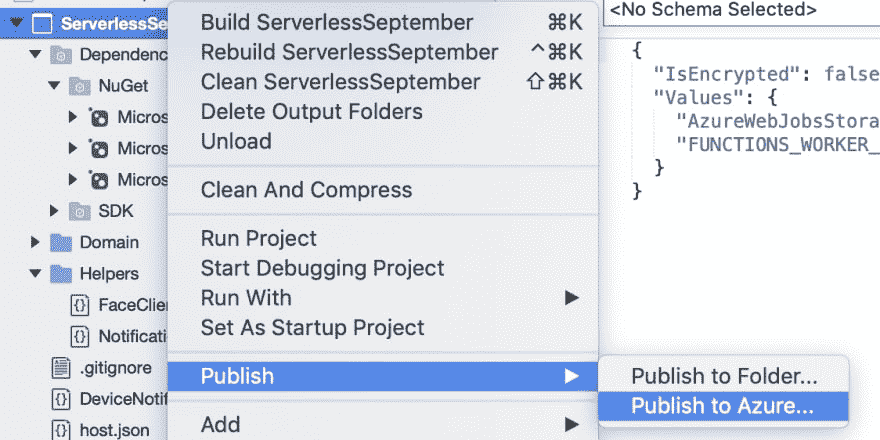](https://res.cloudinary.com/practicaldev/image/fetch/s--Ts0esFm7--/c_limit%2Cf_auto%2Cfl_progressive%2Cq_auto%2Cw_880/https://thepracticaldev.s3.amazonaws.com/i/lnm30fai2ryx3ckynarz.png)

[](https://res.cloudinary.com/practicaldev/image/fetch/s--SK75cOIO--/c_limit%2Cf_auto%2Cfl_progressive%2Cq_auto%2Cw_880/https://thepracticaldev.s3.amazonaws.com/i/pradepp1jmvttcsl8qxf.png)

[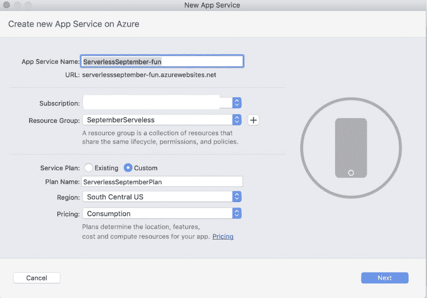](https://res.cloudinary.com/practicaldev/image/fetch/s--BmvYXWl8--/c_limit%2Cf_auto%2Cfl_progressive%2Cq_auto%2Cw_880/https://thepracticaldev.s3.amazonaws.com/i/g07yfkjqabk3ybk47ho4.png)

1.  使用 Azure 存储浏览器([https://Azure . Microsoft . com/es-MX/features/Storage-Explorer/](https://azure.microsoft.com/es-mx/features/storage-explorer/))为“图像”创建一个新的 blob 容器。

[](https://res.cloudinary.com/practicaldev/image/fetch/s--5Czf-oD---/c_limit%2Cf_auto%2Cfl_progressive%2Cq_auto%2Cw_880/https://thepracticaldev.s3.amazonaws.com/i/u1e54v68jdfod4cderhf.png)

[](https://res.cloudinary.com/practicaldev/image/fetch/s--6EZ3GGWE--/c_limit%2Cf_auto%2Cfl_progressive%2Cq_auto%2Cw_880/https://thepracticaldev.s3.amazonaws.com/i/u7kzcxf9lgpwx5p70ol6.png)

出于演示目的，我们将访问级别设置为 public。

[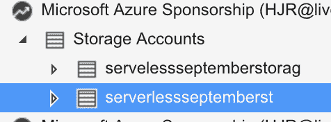](https://res.cloudinary.com/practicaldev/image/fetch/s--g6V_6rBy--/c_limit%2Cf_auto%2Cfl_progressive%2Cq_auto%2Cw_880/https://thepracticaldev.s3.amazonaws.com/i/749nxszvundrau6kkvfy.png)

[](https://res.cloudinary.com/practicaldev/image/fetch/s--22sC5P3d--/c_limit%2Cf_auto%2Cfl_progressive%2Cq_auto%2Cw_880/https://thepracticaldev.s3.amazonaws.com/i/pc4ksay9ulf90z9ia79p.png)

[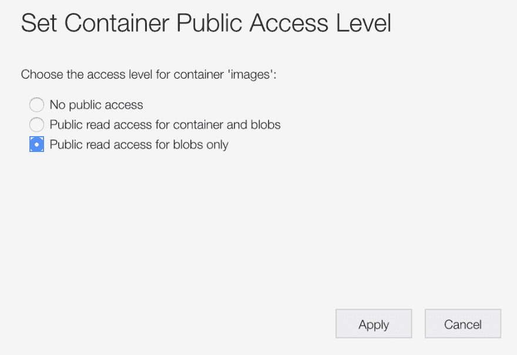](https://res.cloudinary.com/practicaldev/image/fetch/s--lyFNTx69--/c_limit%2Cf_auto%2Cfl_progressive%2Cq_auto%2Cw_880/https://thepracticaldev.s3.amazonaws.com/i/dcl1taa2tqhsqphoegm3.png)

### 配置功能设置

1.  使用 azure 门户，在已发布的功能“平台功能”选项中选择“配置”

[](https://res.cloudinary.com/practicaldev/image/fetch/s--WhQMQFQN--/c_limit%2Cf_auto%2Cfl_progressive%2Cq_auto%2Cw_880/https://thepracticaldev.s3.amazonaws.com/i/9kwc5b14qxbbnj8iki50.png)

在应用程序设置部分添加以下设置。

*   “Vision _ API _ Subscription _ Key”-Face API 访问密钥
*   “Vision _ API _ Zone”-Face API Azure 区域
*   “通知中心访问签名”-通知中心连接字符串
*   “通知中心名称”-通知中心名称

[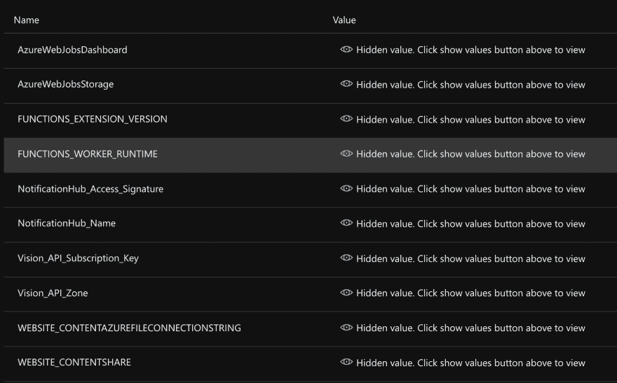](https://res.cloudinary.com/practicaldev/image/fetch/s--Xb7LJJO8--/c_limit%2Cf_auto%2Cfl_progressive%2Cq_auto%2Cw_880/https://thepracticaldev.s3.amazonaws.com/i/lr5nhr442l7li1p85g5p.png)

### 测试功能

1.  我们可以使用 PostMan([https://www.getpostman.com/](https://www.getpostman.com/))注册一个新设备。

从 Azure 门户获取函数 URL

[](https://res.cloudinary.com/practicaldev/image/fetch/s--dj5h8_T9--/c_limit%2Cf_auto%2Cfl_progressive%2Cq_auto%2Cw_880/https://thepracticaldev.s3.amazonaws.com/i/oup3qeh4so34fyy6n50m.png)

[](https://res.cloudinary.com/practicaldev/image/fetch/s--0cyVynQS--/c_limit%2Cf_auto%2Cfl_progressive%2Cq_auto%2Cw_880/https://thepracticaldev.s3.amazonaws.com/i/378049gpp2uqhnb5xce7.png) 
下面的 json 包含函数
所期望的结构

```
{
    "InstallationId": "87653f8dc8e80kiuy",
    "Platform": "fcm",
    "PushChannel": "Cafg:APA91bFPcN01WnfXqRMQhsSySWVY6fgIggW3lpZ_E1tPL94pdChZb0-dIxdhyh9WxNyoxIWggDPctYyOTqRKpssqG5mjr-7nOJxKwBdDPJrmz8b-xt-B5Xna66S4IZRJpAcqNea6biv_"
} 
```

在 PostMan 中，使用 URL 和 json 主体发送 Put 请求

[](https://res.cloudinary.com/practicaldev/image/fetch/s--MXaF5ULd--/c_limit%2Cf_auto%2Cfl_progressive%2Cq_auto%2Cw_880/https://thepracticaldev.s3.amazonaws.com/i/n3o5kh4nhqp2ltz2w2qx.png)

如果一切按预期运行，我们可以在 Azure 门户中看到的功能控制台中看到这个结果。

[](https://res.cloudinary.com/practicaldev/image/fetch/s--87YM5tiL--/c_limit%2Cf_auto%2Cfl_progressive%2Cq_auto%2Cw_880/https://thepracticaldev.s3.amazonaws.com/i/cx5ia8vy33k5e6s5mcb8.png)

1.  对于 blob 函数测试，最简单的方法是使用 Azure Storage Explorer。

上传一张新的人脸照片。

[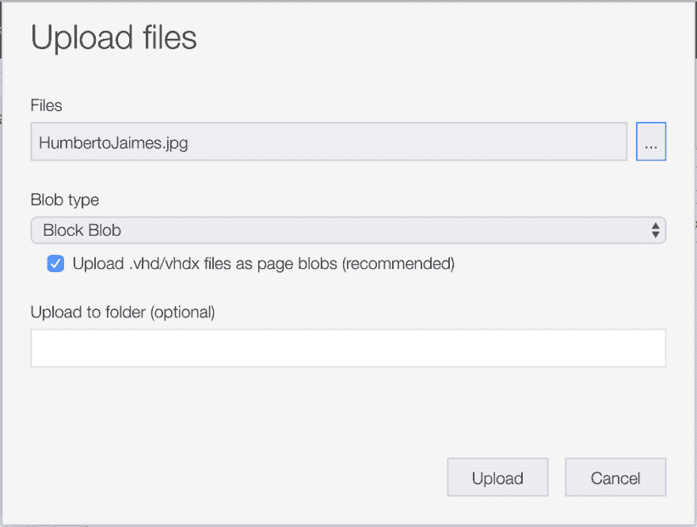](https://res.cloudinary.com/practicaldev/image/fetch/s--hJTCxS22--/c_limit%2Cf_auto%2Cfl_progressive%2Cq_auto%2Cw_880/https://thepracticaldev.s3.amazonaws.com/i/u1ley0xrsvu9ut6o6ol2.png)

由于缺少元数据，第一次上传将导致函数出错。

[](https://res.cloudinary.com/practicaldev/image/fetch/s--ttJLZobL--/c_limit%2Cf_auto%2Cfl_progressive%2Cq_auto%2Cw_880/https://thepracticaldev.s3.amazonaws.com/i/ilkqtghf016gd6spbelz.png)

使用 blob 属性中的将元数据添加到 blob 中。使用与 postman json 中相同的设备 id。

[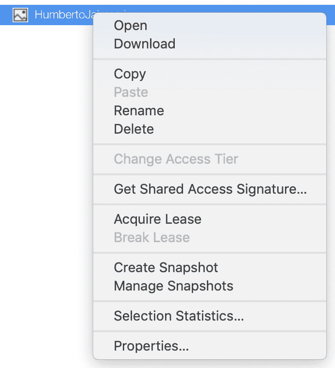](https://res.cloudinary.com/practicaldev/image/fetch/s--VXJpmMrk--/c_limit%2Cf_auto%2Cfl_progressive%2Cq_auto%2Cw_880/https://thepracticaldev.s3.amazonaws.com/i/2y4o7vd59lv8ozosrt0a.png)

[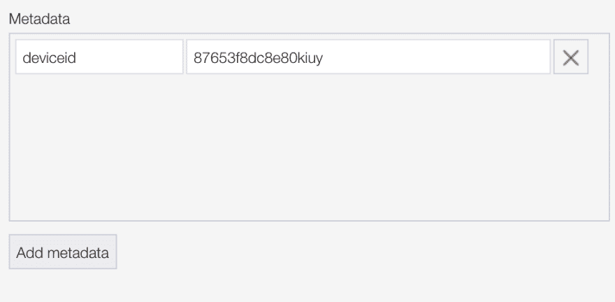](https://res.cloudinary.com/practicaldev/image/fetch/s--y4dg-4lI--/c_limit%2Cf_auto%2Cfl_progressive%2Cq_auto%2Cw_880/https://thepracticaldev.s3.amazonaws.com/i/za2h5trgyhtez3aji9tq.png)

复制 blob 并粘贴它。然后覆盖原始 blob

[](https://res.cloudinary.com/practicaldev/image/fetch/s--o-RSZJoz--/c_limit%2Cf_auto%2Cfl_progressive%2Cq_auto%2Cw_880/https://thepracticaldev.s3.amazonaws.com/i/tumogx63lr5s0ho5dkr5.png)

[](https://res.cloudinary.com/practicaldev/image/fetch/s--GLS1sbNA--/c_limit%2Cf_auto%2Cfl_progressive%2Cq_auto%2Cw_880/https://thepracticaldev.s3.amazonaws.com/i/avopodlk8f1hfu3i8xsy.png)

[](https://res.cloudinary.com/practicaldev/image/fetch/s--9H59utr0--/c_limit%2Cf_auto%2Cfl_progressive%2Cq_auto%2Cw_880/https://thepracticaldev.s3.amazonaws.com/i/llrsqjr1iwu9589knj4b.png)

因为该副本包含元数据，所以该函数将显示一条成功消息。

[](https://res.cloudinary.com/practicaldev/image/fetch/s--mfTO95Io--/c_limit%2Cf_auto%2Cfl_progressive%2Cq_auto%2Cw_880/https://thepracticaldev.s3.amazonaws.com/i/1oickng3nmyme7zzit8y.png)