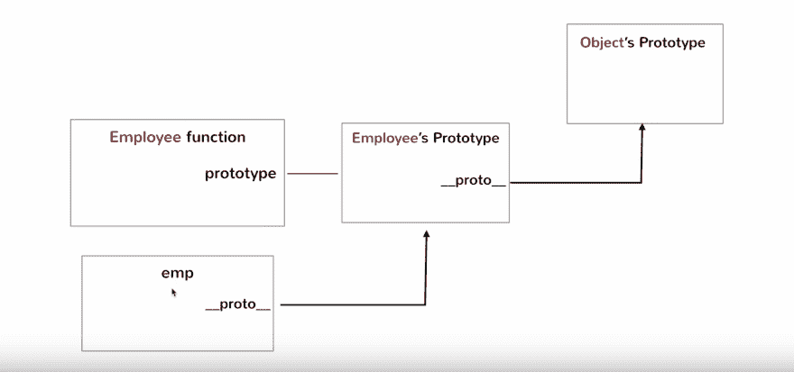
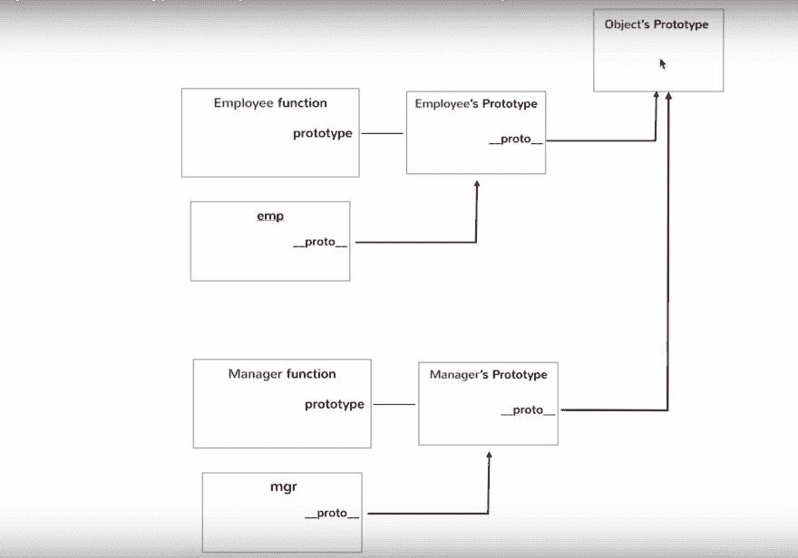
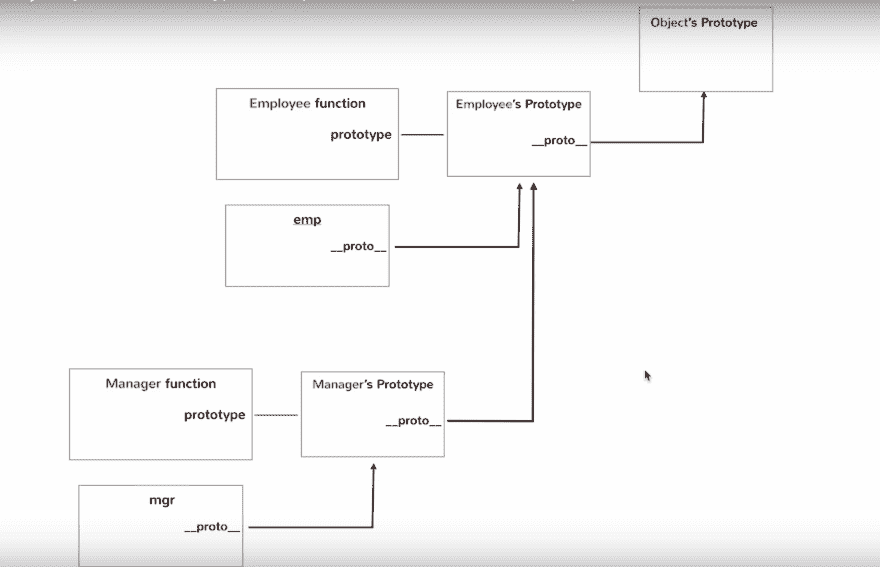

# YDKJS —对象和原型—第 4 部分

> 原文：<https://dev.to/nabendu82/ydkjs-objects-and-prototypes-part4-2g5i>

欢迎来到本系列的第 4 部分。

这个系列全部来自于 **Kyle Simpson** 的学习，也来自于 **Kaushik Kothagul** 来自 [Javabrains](https://www.youtube.com/user/koushks/playlists?view=50&shelf_id=1&sort=dd) 的令人惊叹的 youtube Javascript 系列，它也受到了**你不知道的 JS** 的影响。

在本系列的第 3 部分结束时，我们发现了如何在 prototype 对象上声明变量。然后通过使用 new 关键字创建的每个对象访问变量。

让我们在这个例子中看到它的真正好处。我们创建一个**雇员**构造函数。然后有两个员工。

我们希望有一个通用功能 **drinkCoffee** ，所有员工都可以使用。现在，一种方法是将它添加到**雇员**的构造函数中。但是如果我们这样做，每个新员工都将拥有一个新的 drinkCoffee 功能。我们不希望那样，因为那是资源的浪费。因此，更好的方法是将函数 drinkCoffee 添加到 prototype 对象中，这样每个使用 new 关键字创建的新员工都可以访问它。我们只有一个 **drinkCoffee** 函数的副本。

 *真实受益的原型对象*

我们将看到一个额外的属性。让我们再次检查 foo 示例。我们有一个 foo 函数，它有一个原型对象。然后我们用 new 关键字创建了一个对象 a，所以现在它有了一个 ****proto**** 属性，这是对原型对象的引用。
现在原型对象有了一个名为**构造函数**的属性，它指向函数。

 *建造师属性*

下图可以更好地解释这一点。

 *建造师示意图*

## 原型物体

现在原型对象也有了一个 ****proto**** 属性，它指向一个全局对象。查看下图，了解更多信息。

 *原型物体*

我们将以雇员为例来理解这一点。我们有一个 **Employee** 函数，它有一个使用 new 关键字创建的 emp 对象。我有一个可变的**道具**，也就是**“我是员工”**。所以我们可以通过 **emp.prop** 来访问它。

让我们使用`emp.__proto__.parentProp = “Parent of Employee”;`
在 employees 原型上设置一个变量，现在我们可以通过 **emp.parentProp** 来访问它，因为 JavaScript 编译器会链接并在 employees 原型中找到它。

现在让我们在全局对象原型上有一个变量**grandparenprop**，它的值是“每个人的祖父母”。现在 **emp** 对象可以通过**EMP . grandparenprop**来访问它

> 但它实际上是每个人的祖父，因为任何其他函数的新对象如例子中的 foo 也访问它。这意味着我们有一个全局变量叫做 grandparentProp，每个人都可以访问。

 *格兰德母*

## Javascript 中的继承

我们将使用经典的雇员经理问题来研究继承。假设有一个构造函数 **Employee** ，它接受 name 参数。它的原型有一个 **getName** 函数，该函数返回名称。

然后我们有一个构造函数 **Manager** ，它接受 name 和 dept 参数。经理原型有一个返回部门的 **getDept** 函数。

如下图所示，我们不能做一个 **mgr.getName()** ，因为经理没有访问那个 **getName** 函数的权限。

 *经理问题。*

> 我们当前的设置如下。员工和经理的**原型**都指向全局对象的原型。

 *当前设置*

**getName** 的管理器问题可以通过在全局对象上放置 getName 函数来解决。但这并不是完美的解决方案，因为这样一来，我们范围内的所有其他 JavaScript 函数都可以访问它。

我们可以通过让经理的原型指向雇员的原型来解决这个问题，雇员的原型具有 **getName** 函数。

 *解。*

让我们通过更改经理原型来实现，指向雇员原型。

 *经理问题解决了。*