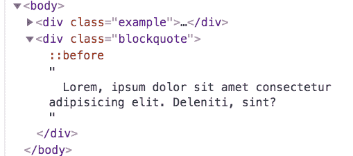

# 如果你知道 CSS 是如何工作的，你会做得更好

> 原文：<https://dev.to/kevinpowell/you-d-be-better-at-css-if-you-knew-how-it-worked-38jn>

*本文最初发表在[我的博客](https://www.kevinpowell.co/article/get-better-at-css/)上。

* * *

CSS 看起来好简单。它给人这样的印象是因为**语法是如此简单易懂**。

给从未见过 CSS 的人看下面的片段，我敢打赌他们至少能对正在发生的事情有个大概的了解。

```
.textbox {
  background: pink;
  border-width: 5px;
  border-color: red;
  border-style: solid;
} 
```

Enter fullscreen mode Exit fullscreen mode

语法如此基础的一个问题是，它给人的印象是它是一种简单的语言。它的编写方式很简单，但是它的实际工作方式却非常复杂。

人们被骗以为它很简单，然后当它不工作时，他们期望它，他们说它坏了。

即使是精通“真正的”编程语言的人也会对此感到沮丧。他们被它欺骗了，就像那些一生中没有写过一行代码的人一样。

尽管他们希望我们这么想，但 CSS 并没有坏。他们不知道 CSS 是如何工作的，他们也不会花时间去弄清楚，因为“它太基础了”。

## 一个普通的黑客不懂的人

例如，很多人会在一个父元素上使用`overflow: auto`来阻止一些子元素使用 float 时奇怪的事情发生。

他们知道这行得通，但他们不知道*为什么*行得通。

你知道它为什么有效吗？

[https://codepen.io/kevinpowell/embed/gEZmXy?height=600&default-tab=result&embed-version=2](https://codepen.io/kevinpowell/embed/gEZmXy?height=600&default-tab=result&embed-version=2)

或者，当你像这样将边距或填充顶部设置为一个百分比时会怎么样呢？

[https://codepen.io/kevinpowell/embed/pYqPKV?height=600&default-tab=result&embed-version=2](https://codepen.io/kevinpowell/embed/pYqPKV?height=600&default-tab=result&embed-version=2)

也许你知道衬垫顶部是基于宽度而不是高度。你知道它不是基于元素的宽度吗？

再去看看上面那支笔。蓝色的盒子宽度是 300 像素。调整窗口大小。垫顶的增长和收缩几乎就像是用大众汽车设定的。

## 这不违反直觉，你不知道它是怎么运作的

你可能会认为我是个混蛋，但我并不想这么刻薄。

我在教室里教 CSS，也在我的 YouTube 频道上教数万人。当我深入研究某些话题时，人们总是回答“哦，这就是它的工作原理。”

有时这是他们已经使用多年的东西。这些年来它一直有效，但是他们不知道*为什么*会有效。

许多初学者开始弄清楚它是如何工作的，然后他们试图在没有任何教程帮助的情况下自己创建第一个网站，他们感到恐慌。这不再像看起来那么容易了！

通过更多的练习和学习更多地计划事情，他们会做得更好。但是他们会陷入自以为知道的比实际多的陷阱。

对于计算机专业出身的人也是一样。语言给人的感觉是非常基础的，所以肯定是！

在这两种情况下，他们都不会一头扎进去，真正了解它应该如何工作。

**这也意味着他们不能利用它的工作方式**！我敢肯定你已经看到了一些可笑的可怕的 CSS 黑客。人们不会凭空把它们拉出来，他们会把它们弄清楚，因为他们理解规范。

在这篇文章中，我们将看一个例子，根据我的经验，很多人并不真正理解。更重要的是，我还将探索如何让你了解事物在未来是如何工作的。

我先给你一条鱼，然后可以说我会教你如何钓鱼。

## 你真的知道伪元素是怎么工作的吗？

看一下这段代码。

```
.blockquote::before {
  content: "";
  position: absolute;
  left: -2em;
  top: 0;
  bottom: 0;
  width: 10px;
  background: #42d7f4;
} 
```

Enter fullscreen mode Exit fullscreen mode

那个`::before`伪元素在哪里？

[](https://res.cloudinary.com/practicaldev/image/fetch/s--tr3sIwQx--/c_limit%2Cf_auto%2Cfl_progressive%2Cq_auto%2Cw_880/https://thepracticaldev.s3.amazonaws.com/i/6qy6zwgujh17g710tri8.jpg)

你知道有多少人选择 A 吗？我一直认为它是 A。我的视频评论中的人经常告诉我，他们认为它是 A。直觉上，A 是有道理的，因为...嗯，我们在之前*。*

但这是不对的。我们在之前去`.blockquote`里面的内容*。同样适用于`::after`。它在*之后*了它的父节点的所有内容，但是它存在于它的父节点中。*

[](https://res.cloudinary.com/practicaldev/image/fetch/s--V3axo2wI--/c_limit%2Cf_auto%2Cfl_progressive%2Cq_auto%2Cw_880/https://thepracticaldev.s3.amazonaws.com/i/g5vdyyuwsgsqug2d0qfe.png)

这当然是好事。如果没有，这将是一场噩梦。

知道它存在于父元素的*中，意味着如果我们在父元素上声明一个 static 以外的位置，我们可以使用`position: absolute`并在我们想要的地方得到我们的伪元素。*

人们一直在使用伪元素，就像我上面描述的那样使用它们，然而他们认为 A 仍然是答案。

如果你选了 A，我也建议**你没有充分使用你的开发工具**。进去看看事情发生的原因和方式(我在这里也有很长一段时间的负罪感)！

## 如何更好地理解 CSS

[](https://res.cloudinary.com/practicaldev/image/fetch/s--uamwC_kV--/c_limit%2Cf_auto%2Cfl_progressive%2Cq_auto%2Cw_880/https://thepracticaldev.s3.amazonaws.com/i/8omx16s06sd7z99hathb.jpg)

自从我开始教 CSS 以来，我不得不一头扎进去，更好地学习东西。它改变了我对 CSS 的看法和态度。

如果你能找到时间去教书，那太棒了，但是我意识到对很多人来说这不是一个选项(或者愿望)。没关系，还有其他方法可以解决问题。

我最大的建议是**停止过多使用 stack overflow**。

别误会，StackOverflow 很牛逼。里面全是*惊人的*信息。能够快速得到答案真是太好了。我希望我在 90 年代末刚开始做网站的时候有 StackOverflow 这样的东西(是的，我老了)。

问题是，当你从那里复制粘贴一个解决方案时，你什么也没学到。老实说，你大部分时间都是这么做的。

当我试图更好地理解某些东西时，我最依赖的资源是 MDN Web 文档或实际的规范。我发现 MDN 更容易，所以我从那里开始，如果有必要，我会进入实际的规范。

我真的在谷歌上搜索我要找的东西，然后把 MDN 放在最后，以确保它是第一个结果。

如果我们对`::before`这样做，你会看到这是*的第一句话:*

> 在 CSS 中，::before 创建一个伪元素，它是所选元素的第一个子元素。

事情并不总是那么清楚，有时你需要深入研究他们的例子，或者更深入地阅读更复杂的问题，但是他们在以一种组织良好和简洁的方式将信息放在那里方面做得非常好。

## 付诸实践

[](https://res.cloudinary.com/practicaldev/image/fetch/s--nQ0c8gZc--/c_limit%2Cf_auto%2Cfl_progressive%2Cq_auto%2Cw_880/https://thepracticaldev.s3.amazonaws.com/i/jyjdyrlnykkg1pkywd2s.jpg)

让我们用上面的`padding-top`例子作为案例研究。

比方说，你像我上面做的那样放置`padding-top`,它实际上并不像你期望的那样运行。你有点生气。

下一步？谷歌“padding-top mdn”。

原来他们有[一个专用于](https://developer.mozilla.org/en-US/docs/Web/CSS/padding-top) [填充顶部](https://developer.mozilla.org/en-US/docs/Web/CSS/padding-top#Values)的实际页面，而不仅仅是一些普通的“填充”页面。太酷了。

当你点击并向下滚动一点点后，你会发现[有一部分是关于可能值](https://developer.mozilla.org/en-US/docs/Web/CSS/padding-top#Values)的。

在这里，它提到了固定长度，我们来看一下，*百分比*。那很方便。您阅读了以下内容:

> 相对于包含块的宽度，以百分比表示的填充大小。必须是非负的。

这就是你的答案。**相对于包含块**的宽度。

现在我们知道了它是如何计算的，我们可以正确地使用它(或者在这种情况下，也许使用一个单位而不是百分比)。

在这种情况下，这是旅程的结束。

有时医生也会解释为什么事情会有那样的表现。其他时候，像这样，他们不会真的谈论为什么。在这种情况下，它最终会创建一个可能会破坏页面的循环。如果你想了解更多，这篇文章做了很好的分解。

## 你不需要对每一个属性都这样做

我知道我们不能深入研究所有的 CSS 属性，否则你永远没有时间写一行代码，另外我想我们都知道`color`是如何工作的。但是，使用 flexbox 却不知道 flex-basis 如何工作的人可能占使用 flexbox 的人的 90%。

当你理解了一个属性是如何工作的，你就能更有效地使用它，并写出更好的代码，每次都能按照你期望的方式工作。

那不是很好吗？

所以下一次你写代码的时候，如果有什么东西不工作，不要直接跳到 StackOverflow 上，或者找一些拼凑的答案粘贴到你自己的代码中，然后希望它能工作。

花额外的 5 到 10 分钟，找出这个特性实际上是如何运作的。从长远来看，这些额外的时间将为你节省十倍的时间。

## 你还是会被卡住

最重要的是继续努力。你写的代码越多，你使用的工具就越多，一切就变得越容易。但是有一点我可以保证:你还是会时不时的被卡住。

无论你做什么，如果你遇到真正难倒你的事情，不要烦恼。**找一个人，或者一个团体，在那里你可以放心地问问题**，无论是一个社区还是一个你可以拍摄 DM 的人，这都会有所不同。

如果你没有这个选择，StackOverflow 永远都在。正如我前面所说的，这是一个令人惊奇的资源，我希望在我开始的时候就能获得它！最大的问题是，人们经常想要解决他们的问题，而不是试图找出问题的根源。

## 理解问题 vs 获得解决方案

当你在 StackOverflow(或其他任何地方)上得到一个解决方案时，你会超级高兴，因为你复制并粘贴了一些代码，它就工作了！

你刚刚把头撞在墙上两个小时，现在已经好了，哇哦！

但你什么都没学到，因为你继续前进了。问题终究还是解决了！

真正的诀窍是问问题，而不是问解决方案，而是问首先是什么导致了问题。使用高质量的问题，首先询问人们是什么导致了这个问题，这样可以获得更多的知识。

当人们面临这样的问题时，他们也会给你解决方案，但大多数时候会更详细、更有见地。

我知道它们有用，因为我一直在回答人们的问题。

如果这是一个低价值的问题，我会快速回答并继续，如果他们以正确的方式提问，我最终会提供更多的价值，因为虽然我想快速回答，但我仍然想实际回答他们的问题！

你赢了两次，因为**你带走了一个解决方案，但更重要的是，你带走了更多的理解**。这意味着下一次发生这种情况时，你会知道为什么会发生这种情况，以及如何修复它，这太棒了。

## 不确定如何问高价值问题？

我有一份免费的 PDF 文件，可以更深入地了解这个主题，你可以在这里找到。

它对低价值和高价值的问题进行了更详细的探讨，并给出了具体的例子，说明你可以如何问同样的问题，但如何获得最大价值。